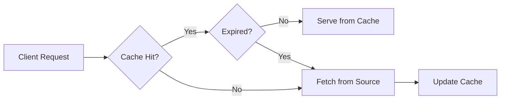

import Tabs from '@theme/Tabs';
import TabItem from '@theme/TabItem';

# Cache Invalidation Strategies

There are only two hard things in Computer Science: cache invalidation and naming things. **Cache Invalidation** is the process of declaring a cached copy of data as stale or invalid, forcing the system to fetch a fresh version from the source.

:::info[Core Philosophy]
**Consistency vs. Performance**. The faster you cache, the more likely you are to serve stale data. Invalidation is the lever that balances these two competing forces.
:::

---

## 1. Easy: TTL and Cache-Control

The simplest form of invalidation is **Implicit Invalidation** via Time-to-Live (TTL). You tell the browser or CDN: "Keep this for 1 hour, then throw it away."

-   `max-age`: Seconds to keep the resource.
-   `no-cache`: Must re-validate with the server before using.
-   `no-store`: Do not cache anything at all.



---

## 2. Medium: Explicit Invalidation (Purging)

When data changes on the server (e.g., a blog post is updated), you don't want to wait for the TTL to expire. You send a **Purge** request to the CDN.

-   **Purge by URL**: Delete one specific file.
-   **Purge by Tag**: Delete all files associated with a category (e.g., "blog-posts").
-   **Soft Purge**: Mark as stale but serve anyway while fetching new data (SWR).

---

## 3. Hard: Implementation and Versioning

<Tabs groupId="lang" queryString>
<TabItem value="js" label="JavaScript">

```javascript
// Manual cache busting via URL Versioning
const getResource = (filename, version) => {
  // Changing the query string forces the browser
  // to think it is a completely new resource.
  return fetch(`/assets/${filename}?v=${version}`);
};

// Clearing specific keys in the Cache API
const invalidateCache = async (cacheName, pattern) => {
  const cache = await caches.open(cacheName);
  const keys = await cache.keys();
  for (const request of keys) {
    if (request.url.includes(pattern)) {
      await cache.delete(request);
    }
  }
};
```

</TabItem>
<TabItem value="ts" label="TypeScript">

```typescript
// ETag Logic on the Client (Conceptual)
const fetchWithValidation = async (url: string): Promise<Response> => {
  const etag = localStorage.getItem(`etag-${url}`);
  
  const response = await fetch(url, {
    headers: etag ? { 'If-None-Match': etag } : {}
  });

  if (response.status === 304) {
    console.log("Resource not modified, using cache.");
    return response;
  }
  
  const newEtag = response.headers.get('ETag');
  if (newEtag) localStorage.setItem(`etag-${url}`, newEtag);
  
  return response;
};
```

</TabItem>
</Tabs>

---

## 4. Advanced: The Thundering Herd Problem

When a highly popular resource (like a viral video) has its cache invalidated simultaneously across all edge servers, every incoming request hits the origin server at once. 
1.  **Request Collapsing**: The CDN only allows 1 request to hit the origin; others wait for that result.
2.  **Probabilistic Invalidation**: Invalidate the cache *before* it strictly expires to spread the load over time.

---

## 5. Interview Prep: 4 Key Questions

### Q1: What is the "Cache-Busting" technique?
**A:** Cache-busting is the practice of appending a unique version identifier (like a hash `styles.a1b2c3.css` or a query string `?v=1.2`) to a filename. Since the browser treats every unique URL as a separate resource, changing the version forces a fresh download even if the old version had a "long-lived" TTL (like 1 year).

### Q2: Explain the difference between `no-cache` and `no-store`.
**A:** `no-store` instructs the browser and all intermediate caches to never store any version of the response. `no-cache` allows the browser to store the response, but requires it to **re-validate** with the server (using ETags or Last-Modified) before ever using the cached copy to ensure it is still the latest version.

### Q3: What are "Cache Tags" (Surrogate Keys)?
**A:** Cache tags allow you to group related resources under a single identifier. For example, all images in a gallery could be tagged with `gallery-101`. When that gallery is updated, a single invalidation request for the tag `gallery-101` will clear all involved images from the CDN simultaneously, without needing to list every URL.

### Q4: How does an ETag work?
**A:** An ETag is a unique hash generated by the server for a specific version of a resource. The client stores this ETag. On the next request, the client sends it back via `If-None-Match`. If the resource hasn't changed, the server returns a `304 Not Modified` status with no body, saving massive amounts of bandwidth and computation.
