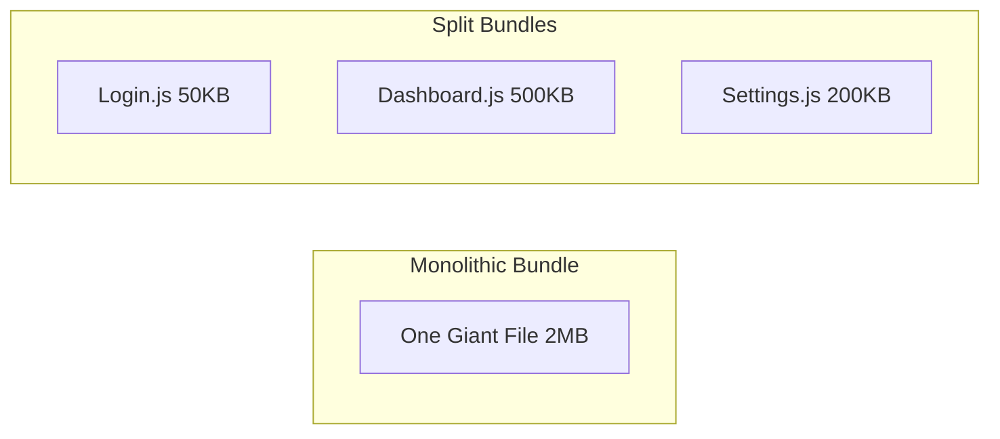

import Tabs from '@theme/Tabs';
import TabItem from '@theme/TabItem';

# Code Splitting Strategies

**Code Splitting** is the practice of breaking your application into multiple smaller JavaScript files (chunks) instead of one massive bundle. This ensures that users only download the code they need for the current page, significantly improving initial load times.

:::info[Core Philosophy]
**Load on Demand**. Performance is not about making your code smaller; it is about making the *initial* payload smaller. Code splitting trades off a single large download for multiple smaller, parallelizable downloads.
:::

---

## 1. Easy: The Monolith vs. Chunks

In a traditional application, the entire app (Login, Dashboard, Settings) is bundled into one `main.js`. A user visiting the Login page is forced to download the Dashboard code too.

With **Code Splitting**, we split the code by feature or routes.



---

## 2. Medium: Common Splitting Types

There are three primary ways to split code:

1.  **Vendor Splitting**: Moving external libraries (React, Lodash, etc.) into a separate `vendor.js`. Since libraries change less often than your app code, the user can keep the `vendor.js` in their browser cache for weeks.
2.  **Route Splitting**: Only loading the code for the current URL. When the user navigates from `/home` to `/dashboard`, the browser fetches the dashboard chunk on the fly.
3.  **Component Splitting**: Splitting out heavy components that aren't visible immediately (e.g., a Modal or a heavy Chart).

---

## 3. Hard: Granular Chunking (The Next.js Strategy)

Old-school splitting often grouped all vendors into one file. If you added a new library, the entire `vendor.js` cache was invalidated. 

**Granular Chunking** (popularized by Next.js and Webpack 5) creates a unique chunk for every large library. 
- `react.chunk.js`
- `lodash.chunk.js`
- `framework.chunk.js`

This maximizes **Cache Reuse**. If you update your App code, the user's browser keeps the React and Lodash chunks untouched in its cache.

<Tabs groupId="lang" queryString>
<TabItem value="js" label="JavaScript">

```javascript
// Webpack SplitChunks Configuration (Pseudo)
optimization: {
  splitChunks: {
    chunks: 'all',
    cacheGroups: {
      reactVendor: {
        test: /[\\/]node_modules[\\/](react|react-dom)[\\/]/,
        name: 'react-vendor',
      },
    },
  },
}
```

</TabItem>
<TabItem value="ts" label="TypeScript">

```typescript
// Route-based splitting in React
import React, { Suspense, lazy } from 'react';

const Dashboard = lazy(() => import('./pages/Dashboard'));

const App = () => (
  <Suspense fallback={<div>Loading...</div>}>
    <Dashboard />
  </Suspense>
);
```

</TabItem>
</Tabs>

---

## 4. Advanced: The Dependency Waterfall Problem

Code splitting can introduce a "Waterfall" delay. If `main.js` loads `Dashboard.js`, and `Dashboard.js` then realizes it needs `Chart.js`, the browser has to make 3 sequential network requests.

**The Solution**: **Prefetching**. We tell the browser: "The user is on the Login page, but they will probably go to the Dashboard soon. Start downloading the Dashboard and Chart chunks in the background while the user is typing their password."

```html
<link rel="prefetch" href="dashboard.chunk.js">
```

---

## 5. Interview Prep: 4 Key Questions

### Q1: What is the main benefit of "Vendor Splitting"?
**A:** Improved **Cache Persistence**. Since third-party libraries (React, D3, etc.) change far less frequently than application code, splitting them into their own chunk allows that chunk to stay in the user's browser cache across multiple deployments of the app.

### Q2: How does `React.lazy` work under the hood?
**A:** `React.lazy` uses the dynamic `import()` statement, which tells the bundler (like Webpack) to create a separate entry point for that component. When the component is about to be rendered, `React.lazy` triggers the network download and uses `Suspense` to show a fallback UI until the chunk is ready.

### Q3: Explain the "Granular Chunking" strategy.
**A:** Instead of bundling all node_modules into one large `vendor.js`, granular chunking creates separate chunks for major libraries. This prevents a "Total Cache Invalidation"—if you change one library, only that library's chunk hash changes, leaving the other library chunks (like React) valid in the user's browser cache.

### Q4: When can code-splitting actually HURT performance?
**A:** If over-used. Splitting an app into too many tiny chunks (e.g., hundreds of 1KB files) can be slower than one large file due to the overhead of many HTTP requests and the "Waterfall" problem, where the browser must parse one chunk to discover it needs another, creating sequential delays.
