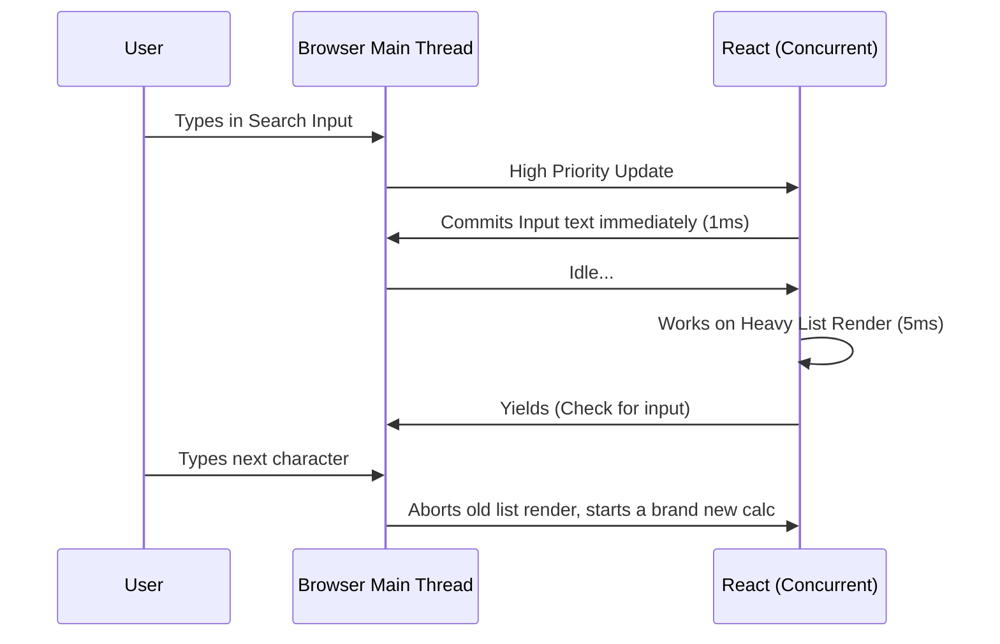

import Tabs from '@theme/Tabs';
import TabItem from '@theme/TabItem';

# Concurrent Rendering

Concurrent Rendering is a massive foundational shift introduced in React 18 that alters how the React runtime processes UI updates. It solves the biggest problem of modern web apps: input lag caused by heavy component calculations.

:::info[Core Philosophy]
**Interruptible Work**. Concurrent rendering decouples the "calculation" phase (Render) from the "mutation" phase (Commit). This allows React to prepare multiple versions of the UI simultaneously in the background without blocking the main event thread.
:::

---

## 1. Easy: The Synchronous Problem

Historically, React's rendering process was **synchronous** and **uninterruptible**. 
If your app needed to calculate 10,000 DOM nodes because the user typed a letter into a search box, the browser would completely freeze until all 10,000 nodes were calculated. The user's cursor would stop blinking, and the physical keystrokes would lag.

**Concurrent Rendering fixes this** by turning the monolithic block of work into tiny 5-millisecond chunks. 

---

## 2. Medium: Yielding and Time Slicing

React achieves concurrency through a mechanism called **Time Slicing**. React works on a background render for a few milliseconds, and then explicitly stops itself to ask the browser: *"Did the user type anything? Did they click?"* 

If yes, React handles the fast user input. If no, it resumes the background work.



---

## 3. Hard: The `useTransition` API

To actually use this feature, you have to tell React which state updates are "Urgent" (like typing) and which are "Transitions" (like showing the results). You do this with the `useTransition` hook.

<Tabs groupId="lang" queryString>
<TabItem value="js" label="JavaScript">

```javascript
import { useState, useTransition } from 'react';

export default function Search() {
  const [isPending, startTransition] = useTransition();
  const [query, setQuery] = useState('');
  const [list, setList] = useState([]);

  function handleChange(e) {
    const val = e.target.value;
    
    // 1. High Priority Update: Input responds instantly
    setQuery(val);

    // 2. Low Priority Update (Transition): Render the heavy list in the background
    startTransition(() => {
      setList(generateMassiveDataset(val)); 
    });
  }

  return (
    <div>
      <input value={query} onChange={handleChange} />
      {/* isPending allows you to show a stale UI with a loading spinner while React calculates */}
      {isPending ? <p>Calculating...</p> : <List items={list} />}
    </div>
  );
}
```

</TabItem>
<TabItem value="ts" label="TypeScript">

```typescript
import { useState, useTransition, ChangeEvent } from 'react';

export default function Search() {
  const [isPending, startTransition] = useTransition();
  const [query, setQuery] = useState<string>('');
  const [list, setList] = useState<string[]>([]);

  function handleChange(e: ChangeEvent<HTMLInputElement>) {
    const val = e.target.value;
    
    setQuery(val);
    startTransition(() => {
      setList(generateMassiveDataset(val)); 
    });
  }

  return (
    <div>
      <input value={query} onChange={handleChange} />
      <div style={{ opacity: isPending ? 0.5 : 1 }}>
        <List items={list} />
      </div>
    </div>
  );
}
```

</TabItem>
</Tabs>

---

## 4. Advanced: Tearing and External Stores

When rendering is interruptible, a dangerous bug called **Tearing** can occur. 
Imagine React renders the top half of a page using a Redux store value `theme: "light"`. Then React yields to the browser. While paused, a Redux action fires changing `theme: "dark"`. React resumes and renders the bottom half using the new `"dark"` value. The page is now torn in half visually.

React 18 solved this by enforcing that all external stores use the `useSyncExternalStore` hook, which forces React to either bail out of the render or fall back to synchronous calculation if the store mutates mid-render.

---

## 5. Interview Prep: 4 Key Questions

### Q1: Does Concurrent React run on multiple OS threads like Web Workers?
**A:** No. "Concurrent" is technically a misnomer in standard OS terms. React still strictly runs on a single thread (the JavaScript main event loop). It achieves concurrency through *cooperative multitasking*—manually chunking work using the `MessageChannel` API to yield control back to the browser queue so it can paint.

### Q2: Will `startTransition` help if the calculation itself takes 5 seconds (like a heavy `for`-loop)?
**A:** No. `startTransition` only splits up *React's reconciliation math* (calculating the Virtual DOM). If you execute a synchronous block of pure JavaScript logic (like a massive `reduce` aggregation) inside `startTransition`, it will still completely block the main thread. Heavy JS logic still belongs in a Web Worker.

### Q3: What is the difference between `useDeferredValue` and `useTransition`?
**A:** `startTransition` wraps a *state setter function*. You use it when you own the state update logic (e.g., in an `onChange` handler). `useDeferredValue` wraps an actual *value* (a prop or state variable). You use it deeply nested in the tree when you receive a prop from a parent and want to tell React: "It is okay to render the old version of this prop while you calculate the new one."

### Q4: Can a UI be visibly observed in an inconsistent "half-rendered" state during concurrent rendering?
**A:** No. A core promise of React's concurrency is "Tearing Prevention". While the **Render phase** is heavily interrupted and worked on in pieces over dozens of milliseconds, the **Commit phase** (where actual physical DOM nodes are changed in the browser) is strictly monolithic, synchronous, and uninterruptible. The DOM updates all at once.
