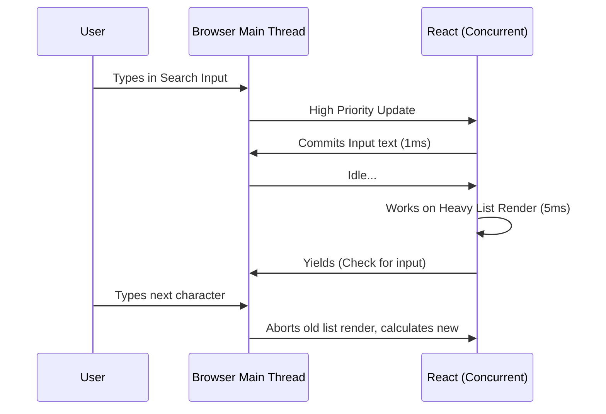

import Tabs from '@theme/Tabs';
import TabItem from '@theme/TabItem';

# Concurrent Rendering

Concurrent Rendering is a massive foundational shift introduced in React 18 that alters how the React runtime processes UI updates.

Historically, React's rendering process was **synchronous** and **uninterruptible**. Once an update started, nothing could stop it until the DOM was mutated. Concurrent Rendering breaks updates into smaller, interruptible chunks.

:::info[Core Mechanism]
Concurrent rendering decouples the "calculation" phase (Render) from the "mutation" phase (Commit). This allows React to prepare multiple versions of the UI simultaneously in the background without blocking the main event thread.
:::

---

## 1. Time Slicing

If an application is processing a massive list of data, synchronous rendering locks the browser, making inputs freeze and hover states fail.

With Concurrent Rendering (Time Slicing), React works on the background render for purely 5ms (a single frame). If there is high-priority work (like a user typing or clicking), React **yields to the browser**, handles the input, and then resumes rendering the background task.



---

## 2. API Usage (`useTransition`)

The primary hook for interacting with Concurrent rendering is `useTransition`. It allows developers to mark state updates as "Low Priority" (Transitions), meaning they will not block the UI.

<Tabs groupId="lang" queryString>
<TabItem value="js" label="JavaScript">

```javascript
import { useState, useTransition } from 'react';

export default function Search() {
  const [isPending, startTransition] = useTransition();
  const [query, setQuery] = useState('');
  const [list, setList] = useState([]);

  function handleChange(e) {
    const val = e.target.value;
    
    // 1. High Priority update: Input responds instantly
    setQuery(val);

    // 2. Low Priority update: Render the heavy list in the background
    startTransition(() => {
      setList(generateMassiveDataset(val)); 
    });
  }

  return (
    <div>
      <input value={query} onChange={handleChange} />
      {isPending ? <p>Calculating...</p> : <List items={list} />}
    </div>
  );
}
```

</TabItem>
<TabItem value="ts" label="TypeScript">

```typescript
import { useState, useTransition, ChangeEvent } from 'react';

export default function Search() {
  const [isPending, startTransition] = useTransition();
  const [query, setQuery] = useState<string>('');
  const [list, setList] = useState<string[]>([]);

  function handleChange(e: ChangeEvent<HTMLInputElement>) {
    const val = e.target.value;
    
    setQuery(val);
    startTransition(() => {
      setList(generateMassiveDataset(val)); 
    });
  }

  return (
    <div>
      <input value={query} onChange={handleChange} />
      {isPending ? <p>Calculating...</p> : <List items={list} />}
    </div>
  );
}
```

</TabItem>
</Tabs>

---

## 3. Interview Prep: 4 Key Questions

### Q1: Does Concurrent React run on multiple OS threads?
**A:** No. "Concurrent" is technically a misnomer in standard OS logic. React is still strictly single-threaded (JavaScript running on the main event loop). It achieves concurrency through *cooperative scheduling*—manually chunking work and utilizing `postMessage` or `MessageChannel` to yield control back to the browser queue.

### Q2: Can a UI be observed in an inconsistent state during concurrent rendering?
**A:** No. A core promise of React's concurrency is "Tearing Prevention". While the Render phase is heavily interrupted and worked on in pieces, the Commit phase (where actual DOM nodes are changed) is strictly monolithic and synchronous.

### Q3: What is "Tearing," and why did `useSyncExternalStore` get introduced?
**A:** "Tearing" occurs when a shared external variable (like a Redux store) changes *while* React is in the middle of an interrupted concurrent render. The top half of the UI sees value A, but the bottom half mounts seeing value B. `useSyncExternalStore` forces React to fall back to synchronous rendering or bail out if external stores mutate mid-render.

### Q4: How does `useDeferredValue` differ from `useTransition`?
**A:** `useTransition` wraps a *state setter function*. You use it when you own the state. `useDeferredValue` wraps a *value*. You use it when you receive a prop from above and want to tell React, "It is okay to render the old version of this prop while you calculate the new one."
