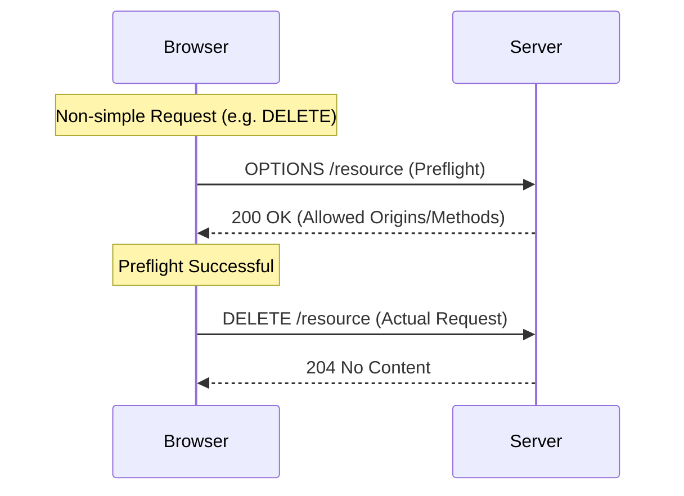

import Tabs from '@theme/Tabs';
import TabItem from '@theme/TabItem';

# CORS Preflight

**CORS (Cross-Origin Resource Sharing)** is a browser security mechanism that restricts how a web application loaded from one origin can interact with resources from a different origin. A **Preflight** is a preliminary check the browser performs to see if the server allows a specific "non-simple" request.

:::info[Core Philosophy]
**Verify Before You Execute**. The preflight ensures that a server won't be hit with a complex or potentially destructive request (like a `DELETE` or a custom header) without first opting into that behavior.
:::

---

## 1. Easy: Simple vs. Preflighted Requests

Not every request triggers a preflight.
-   **Simple Requests**: `GET`, `POST` (with specific content types like `text/plain`), and `HEAD` do not trigger a preflight.
-   **Preflighted Requests**: Requests with custom headers (e.g., `Authorization`, `X-Custom-Header`) or methods like `PUT` or `DELETE` trigger an **OPTIONS** request first.



---

## 2. Medium: Common CORS Headers

To allow cross-origin requests, the server must respond with specific headers:
-   `Access-Control-Allow-Origin`: Which domains can access the resource.
-   `Access-Control-Allow-Methods`: Which HTTP methods are allowed.
-   `Access-Control-Allow-Headers`: Which custom headers can be sent.
-   `Access-Control-Allow-Credentials`: Whether the browser should send cookies.

---

## 3. Hard: Implementation and Optimization

<Tabs groupId="lang" queryString>
<TabItem value="js" label="JavaScript">

```javascript
// Troubleshooting a Preflight Failure
// If your server doesn't handle OPTIONS, the browser 
// will block the actual request even if the URL is correct.
async function deleteUser(id) {
  try {
    const response = await fetch(`https://api.example.com/users/${id}`, {
      method: 'DELETE', // Triggers Preflight
      headers: {
        'Authorization': 'Bearer token' // Triggers Preflight
      }
    });
    return response.ok;
  } catch (err) {
    console.error("CORS Error: Likely missing OPTIONS support on server.");
  }
}
```

</TabItem>
<TabItem value="ts" label="TypeScript">

```typescript
// Optimizing Preflight with Caching
// You can avoid the 'Double Request' penalty by 
// telling the browser to cache the OPTIONS result.
const corsHeaders = {
  'Access-Control-Allow-Origin': 'https://myapp.com',
  'Access-Control-Allow-Methods': 'GET, POST, DELETE',
  // Cache the preflight result for 2 hours (in seconds)
  'Access-Control-Max-Age': '7200' 
};
```

</TabItem>
</Tabs>

---

## 4. Advanced: The Wildcard Pitfall

Using `Access-Control-Allow-Origin: *` is common but dangerous and limited.
1.  **Credentials**: You **cannot** use a wildcard `*` if `Access-Control-Allow-Credentials` is set to `true`. You must specify the exact origin.
2.  **Security**: Wildcards expose your API to every website on the internet. A more secure approach is to check the `Origin` header of the incoming request against an "Allow List" and reflect it back in the response.

---

## 5. Interview Prep: 4 Key Questions

### Q1: What is the purpose of the `OPTIONS` request in CORS?
**A:** The `OPTIONS` request is the **Preflight**. It is an HTTP request sent by the browser to the server *before* the actual request to determine if the server supports the requested cross-origin method, headers, and credentials. If the server does not respond with the correct `Access-Control-*` headers, the browser will block the actual request from being sent.

### Q2: Why does `Authorization: Bearer ...` trigger a preflight?
**A:** The `Authorization` header is considered a "Non-Simple" header. Browser security assumes that standard web requests (Simple Requests) shouldn't be sending custom security tokens or complex data without the server's explicit consent. This prevents CSRF-style attacks where an attacker might try to send an authenticated request from a different origin.

### Q3: How do you optimize CORS for a high-traffic API?
**A:** The best optimization is using the `Access-Control-Max-Age` header. This tells the browser to cache the result of the `OPTIONS` preflight for a specific duration (e.g., 24 hours). This eliminates the "double request" penalty for subsequent requests from the same user to the same origin, significantly reducing latency.

### Q4: Can CORS be used to secure a private API from server-side bots?
**A:** **No.** CORS is a **browser-level** security policy. It relies on the browser to enforce the restrictions. A server-side bot (like a Python script using `requests` or `curl`) can easily ignore CORS headers and hit your API directly. To secure an API from bots, you must use authentication (API Keys, JWTs) and rate-limiting.
