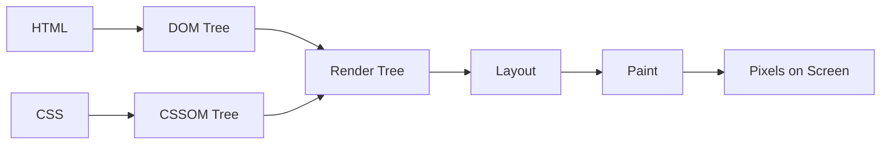

import Tabs from '@theme/Tabs';
import TabItem from '@theme/TabItem';

# Critical Rendering Path (CRP)

The **Critical Rendering Path (CRP)** is the sequence of steps the browser goes through to convert HTML, CSS, and JavaScript into actual pixels on the screen. Optimizing the CRP is the single most effective way to improve the "perceived performance" of a website.

:::info[Core Philosophy]
**Fastest Path to Pixels**. The goal of CRP optimization is to prioritize the delivery and rendering of the "Above the Fold" content, ensuring the user sees something meaningful as quickly as possible.
:::

---

## 1. Easy: The 5 Stages of Rendering

Think of the browser as a factory. The raw materials (HTML/CSS) enter at one end, and the final product (the webpage) comes out the other.

1.  **DOM (Document Object Model)**: Browser parses HTML and builds a tree of nodes.
2.  **CSSOM (CSS Object Model)**: Browser parses CSS and builds a tree of styles.
3.  **Render Tree**: The DOM and CSSOM are combined. This tree only contains nodes that will actually be visible (e.g., no `display: none`).
4.  **Layout (Reflow)**: Browser calculates the exact position and size of every node in the tree.
5.  **Paint**: The browser converts the calculated geometry into actual pixels on the screen.



---

## 2. Medium: Parallel Construction

The browser is smart: it doesn't wait for the DOM to be fully finished before it starts working on the CSSOM. It parses HTML line-by-line. 

However, **CSS is Render Blocking**. The browser will not render anything to the screen until the CSSOM is ready. This prevents the "Flash of Unstyled Content" (FOUC).

**JavaScript is Parser Blocking**. When the browser finds a `<script>` tag, it must stop building the DOM, download the script, and execute it, because the script might use `document.write()` to change the HTML.

---

## 3. Hard: The Render Tree vs. The DOM

The Render Tree is **NOT** the same as the DOM tree. 

Nodes that are hidden via CSS (`display: none`) are included in the DOM, but they are completely removed from the Render Tree. Consequently, they skip the Layout and Paint stages. However, nodes with `visibility: hidden` **ARE** included in the Render Tree because they still occupy physical space in the layout.

<Tabs groupId="lang" queryString>
<TabItem value="js" label="JavaScript">

```javascript
// Measuring CRP timing using the Navigation Timing API
window.addEventListener('load', () => {
  const perfData = performance.getEntriesByType("navigation")[0];
  
  // DOM is ready (interactive)
  const domInteractive = perfData.domInteractive;
  
  // All resources (CSS, Images) are finished
  const completeLoad = perfData.loadEventEnd;
  
  console.log(`Time to Interactive: ${domInteractive}ms`);
});
```

</TabItem>
<TabItem value="ts" label="TypeScript">

```typescript
const getCRPMetrics = (): void => {
  const [navigation] = performance.getEntriesByType('navigation') as PerformanceNavigationTiming[];
  
  const metrics = {
    domLoading: navigation.domInteractive - navigation.startTime,
    renderBlockingResources: navigation.domContentLoadedEventStart - navigation.startTime,
    fullyLoaded: navigation.loadEventEnd - navigation.startTime
  };
  
  console.table(metrics);
};
```

</TabItem>
</Tabs>

---

## 4. Advanced: Optimizing the Path

To achieve a "presto" load time, you must focus on three variables:
1.  **Critical Resources**: The number of resources that block the initial render (less is better).
2.  **Critical Path Length**: The round-trips required to fetch all blocking resources.
3.  **Critical Bytes**: The total payload size of the blocking resources.

**Techniques**:
- **Inline Critical CSS**: Put the styles for the top of the page directly in the `<head>` to avoid a network request.
- **Preload/Preconnect**: Use `<link rel="preload">` to tell the browser about a high-priority resource (like an LCP image or a font) before the parser actually finds it.

---

## 5. Interview Prep: 4 Key Questions

### Q1: Why is CSS considered "Render Blocking"?
**A:** Because the browser cannot calculate the layout of the page until it knows the styles. If it rendered the DOM before the CSSOM was ready, it would produce a "Flash of Unstyled Content" (FOUC), where raw text and links appear briefly before the colors and fonts are applied.

### Q2: What is the difference between `display: none` and `visibility: hidden` in the Render Tree?
**A:** `display: none` removes the element from both the Render Tree and the Layout stage—it takes up zero space. `visibility: hidden` keeps the element in the Render Tree and the Layout stage because it still occupies its allocated physical space, but it simply isn't painted onto the screen.

### Q3: How does JavaScript affect the Critical Rendering Path?
**A:** By default, JavaScript is "Parser Blocking". When the browser hits a script tag, it halts DOM construction to download and execute the JS. This delays the `domInteractive` event and pushes back the final render, significantly increasing CRP length.

### Q4: Explain "Reflow" vs "Repaint".
**A:** **Reflow** (Layout) is the expensive calculation of the geometry (width, height, position) of elements. A change to one element can trigger a chain reaction requiring the whole page to reflow. **Repaint** is the simpler step of drawing the pixels (colors, shadows). All reflows cause a repaint, but not all repaints require a reflow (e.g., changing a background color).
