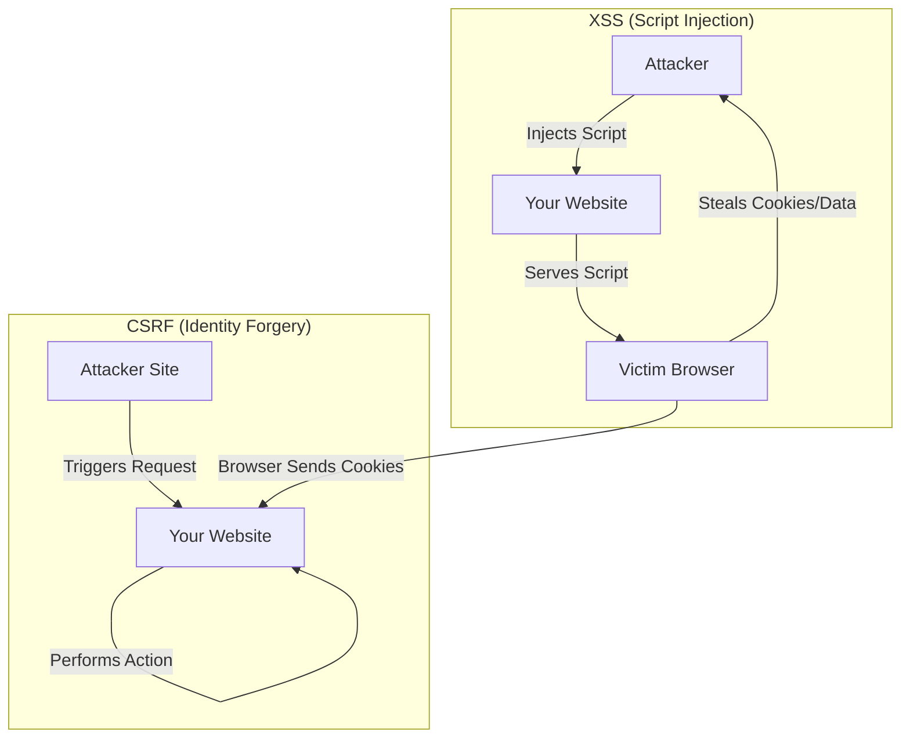

import Tabs from '@theme/Tabs';
import TabItem from '@theme/TabItem';

# CSRF vs. XSS Mitigation

Two of the most common web vulnerabilities are **CSRF** (Cross-Site Request Forgery) and **XSS** (Cross-Site Scripting). While they both involve cross-site interactions, they attack the user and the application in fundamentally different ways.

:::info[Core Philosophy]
**Identity vs. Integrity**. CSRF attacks the user's **Identity** (tricking them into performing an action). XSS attacks the application's **Integrity** (injecting malicious code to run in the user's browser).
:::

---

## 1. Easy: What is the Difference?

-   **XSS (Injection)**: The attacker injects code (usually JavaScript) into a page. The browser thinks the script is part of the site and executes it. 
-   **CSRF (Forgery)**: The attacker tricks a logged-in user into clicking a link or submitting a form that sends a request to your server. The browser automatically attaches the user's cookies, making the request look legitimate.



---

## 2. Medium: Common Mitigation Tactics

-   **Mitigating XSS**:
    -   **Sanitization**: Cleaning user input before rendering.
    -   **CSP**: Content Security Policy to block unknown scripts.
-   **Mitigating CSRF**:
    -   **Anti-CSRF Tokens**: A unique token sent with every form/request.
    -   **SameSite Cookies**: Preventing cookies from being sent on cross-site requests.

---

## 3. Hard: Implementation and CSP

<Tabs groupId="lang" queryString>
<TabItem value="js" label="JavaScript">

```javascript
// A simple Content Security Policy header (Node/Express)
// This tells the browser: "Only trust scripts from my own domain"
app.use((req, res, next) => {
  res.setHeader(
    'Content-Security-Policy',
    "default-src 'self'; script-src 'self' https://trusted.api.com;"
  );
  next();
});
```

</TabItem>
<TabItem value="ts" label="TypeScript">

```typescript
// Implementing an Anti-CSRF Token check
interface SecureRequest extends Request {
  body: {
    _csrf: string;
  };
  session: {
    csrfToken: string;
  };
}

const validateCSRF = (req: SecureRequest, res: Response, next: Function) => {
  if (req.body._csrf !== req.session.csrfToken) {
    return res.status(403).send("CSRF Token Mismatch");
  }
  next();
};
```

</TabItem>
</Tabs>

---

## 4. Advanced: The Modern Landscape

With the rise of SPAs (Single Page Applications) and JSON APIs, traditional form-based CSRF is rarer, but still possible via `fetch`. 
1.  **JWTs vs. Cookies**: Storing JWTs in `localStorage` makes you immune to CSRF (because tokens aren't sent automatically), but highly vulnerable to XSS (because a script can read them).
2.  **HttpOnly Cookies**: Storing tokens in `HttpOnly` cookies makes you immune to XSS theft, but vulnerable to CSRF. 
3.  **The Gold Standard**: Use `SameSite: Lax/Strict` + `HttpOnly` cookies + a custom HTTP header (like `X-Requested-With`) that isn't a "Simple Request" and thus triggers a CORS preflight.

---

## 5. Interview Prep: 4 Key Questions

### Q1: Can a SameSite cookie solve both XSS and CSRF?
**A:** No. **SameSite** cookies are a powerful defense against **CSRF** because they prevent the browser from sending session cookies during cross-site requests. However, they do **nothing** to stop **XSS**. If an attacker successfully injects a script into your page (XSS), that script is running on the "Same Site" and has full access to the page content, regardless of cookie settings.

### Q2: What is the "Content Security Policy" (CSP)?
**A:** CSP is an HTTP response header that allows site administrators to declare which dynamic resources (scripts, styles, images) are allowed to load. It is the primary defense against **XSS**. By restricting script sources to `'self'`, you can block malicious scripts from third-party domains even if an attacker successfully injects a `<script>` tag.

### Q3: Why is `localStorage` dangerous for session tokens?
**A:** Unlike cookies, which can be protected with the `HttpOnly` flag, **`localStorage` is accessible to all JavaScript** running on the page. If your site has a single XSS vulnerability, an attacker can instantly steal every token in `localStorage`. Cookies with `HttpOnly` are invisible to JavaScript, making them much harder to steal via XSS.

### Q4: Explain the "Synchronizer Token Pattern" for CSRF.
**A:** This is the most common CSRF defense. The server generates a unique, cryptographically strong token for the user's session. This token is embedded in every form or sent as a custom header. When a request is made, the server compares the token in the request with the one in the session. Since an attacker on a different site cannot read your site's HTML or custom headers, they cannot include the valid token in their forged request.
