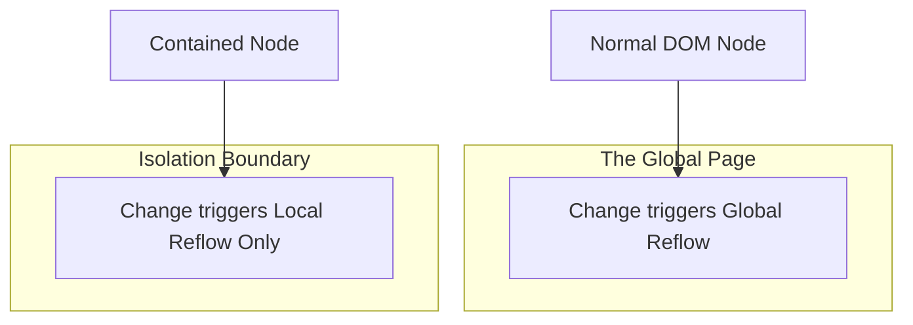

import Tabs from '@theme/Tabs';
import TabItem from '@theme/TabItem';

# CSS Containment

**CSS Containment** is a performance-focused feature that allows developers to tell the browser that a specific portion of the DOM is isolated from the rest of the page. This prevents changes inside that element from triggering expensive Layout or Paint calculations on the rest of the document.

:::info[Core Philosophy]
**Localize the Blast Radius**. By default, changing one element in CSS can affect the layout of every other element. Containment "seals" the element, ensuring that work done inside its box stays inside its box.
:::

---

## 1. Easy: The `contain` Property

The `contain` property accepts several values:
- `layout`: Changes inside don't affect the outside layout.
- `paint`: Children are clipped. If the box is off-screen, it isn't painted.
- `size`: The element's size is independent of its children (must specify height/width).
- `strict`: A combination of all the above.



---

## 2. Medium: Content Visibility

The `content-visibility` property is a high-level API that leverages containment. When set to `auto`, the browser automatically skips the rendering (layout and paint) of an element until it is close to the viewport.

**The "Jump" problem**: Since the browser doesn't know the height of unrendered content, the scrollbar might "jump" as the content comes into view. To fix this, we use `contain-intrinsic-size`.

---

## 3. Hard: Implementation and Profiling

<Tabs groupId="lang" queryString>
<TabItem value="js" label="JavaScript">

```javascript
// Dynamically toggling containment for a performance-heavy list
const setupListPerformance = (selector) => {
  const container = document.querySelector(selector);
  
  // Isolate the list from global layout/paint cycles
  container.style.contain = 'content'; // layout + paint
  
  // Automatically skip rendering for off-screen items
  container.style.contentVisibility = 'auto';
  
  // Provide a placeholder size to prevent scroll jumps
  container.style.containIntrinsicSize = '0 500px'; 
};
```

</TabItem>
<TabItem value="ts" label="TypeScript">

```typescript
// Applying containment to a complex widget
interface ContainmentSettings {
  mode: 'strict' | 'content' | 'layout' | 'none';
  estimatedHeight: string;
}

const optimizeWidget = (el: HTMLElement, settings: ContainmentSettings): void => {
  el.style.contain = settings.mode;
  
  if (settings.mode !== 'none') {
    el.style.contentVisibility = 'auto';
    el.style.containIntrinsicSize = `auto ${settings.estimatedHeight}`;
  }
};
```

</TabItem>
</Tabs>

---

## 4. Advanced: Containment and the Accessibility Tree

Containment doesn't just affect pixels; it affects the **Accessibility Tree**. 
1. **Size Containment**: If you use `contain: size`, the browser ignores the children's dimensions. If you forget to set a fixed height, the element collapses to 0px, even if it has thousands of children.
2. **Hidden Content**: When `content-visibility: auto` hides an element, it is also removed from the semantic/accessibility tree to save resources. This is generally good, but you must ensure that "Find in Page" (Ctrl+F) still works by ensuring the element allows `content-visibility: hidden` search index traversal (browser dependent).

---

## 5. Interview Prep: 4 Key Questions

### Q1: What happens if you apply `contain: size` to an element but don't set a width or height?
**A:** The element will collapse to **0x0 pixels**. Size containment tells the browser that the element's dimensions are independent of its content. Without an explicit width or height via CSS, the default intrinsic size is used, which for a size-contained element is treated as zero.

### Q2: How does `content-visibility: auto` differ from `display: none`?
**A:** `display: none` completely removes the element from the layout and accessibility tree, and loses its state (like scroll position). `content-visibility: auto` keeps the element in the DOM and preserves its state, but **skips the rendering work** (paint and layout) when it's off-screen, offering a massive performance boost for long pages.

### Q3: Explain the "Layout Isolation" benefit of `contain: layout`.
**A:** Normally, the browser calculates the entire layout of a page because a change in one element might affect the position of another. `contain: layout` guarantees the browser that nothing inside that element can affect the position/size of anything outside it. This allows the browser to re-layout only that specific subtree, reducing "Time to Interactive."

### Q4: Why is `contain-intrinsic-size` critical for UX?
**A:** Without it, an element being rendered by `content-visibility: auto` has 0 height when off-screen. As the user scrolls and the element is rendered, it suddenly expands to its full height, causing the scrollbar to "jump" and the user to lose their place. `contain-intrinsic-size` provides a "placeholder" height so the page structure remains stable.
