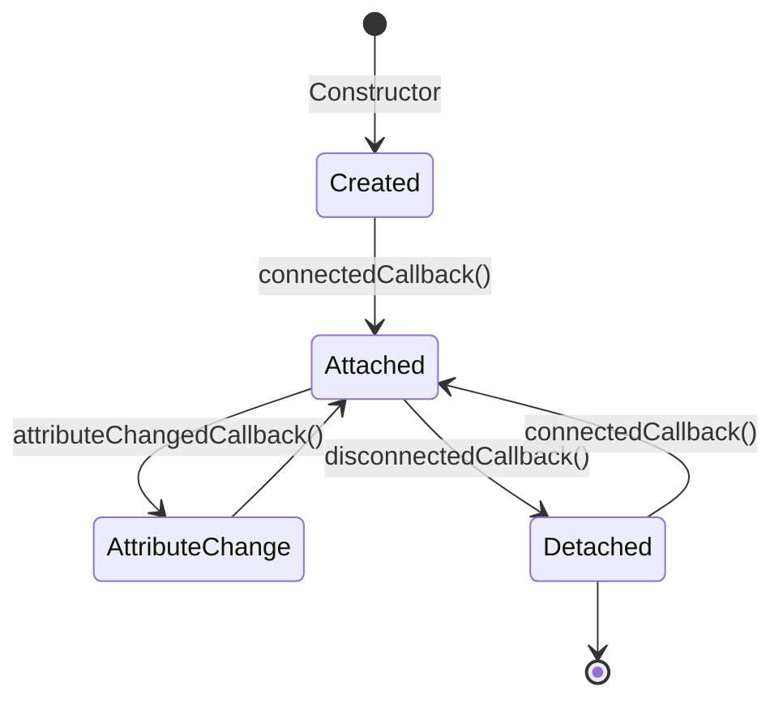

import Tabs from '@theme/Tabs';
import TabItem from '@theme/TabItem';

# Custom Elements Lifecycle

**Custom Elements** allow developers to define their own HTML tags. To manage these elements effectively, the browser provides **Lifecycle Callbacks** that trigger at specific points in an element's existence.

:::info[Core Philosophy]
**Native Hooks**. Just as React has `useEffect` or Vue has `onMounted`, Web Components have native browser hooks. These hooks ensure that resources are cleaned up and the UI stays in sync with its internal state.
:::

---

## 1. Easy: The Big 4 Hooks

When you extend the `HTMLElement` class, you gain access to four specific methods:

1.  **`constructor()`**: Called when the element is first created (or "upgraded"). Perfect for initializing state.
2.  **`connectedCallback()`**: Called when the element is inserted into the DOM. This is where you should fetch data or render the template.
3.  **`disconnectedCallback()`**: Called when the element is removed from the DOM. Perfect for cleaning up Event Listeners or Intervals.
4.  **`attributeChangedCallback()`**: Called when an attribute (like `src` or `color`) is changed or added.



---

## 2. Medium: Observing Attributes

The browser won't tell you about *every* attribute change by default (for performance). You must explicitly list which attributes you want to watch using a static getter called `observedAttributes`.

---

## 3. Hard: Syncing Attributes and Properties

One of the hardest parts of Web Components is keeping **HTML Attributes** (`<my-el color="red">`) in sync with **JS Properties** (`el.color = 'red'`).

<Tabs groupId="lang" queryString>
<TabItem value="js" label="JavaScript">

```javascript
class MySquare extends HTMLElement {
  static get observedAttributes() {
    return ['size'];
  }

  // Sync Property -> Attribute
  get size() {
    return this.getAttribute('size');
  }
  set size(val) {
    this.setAttribute('size', val);
  }

  attributeChangedCallback(name, oldVal, newVal) {
    if (name === 'size') {
      this.style.width = `${newVal}px`;
      this.style.height = `${newVal}px`;
    }
  }
}
customElements.define('my-square', MySquare);
```

</TabItem>
<TabItem value="ts" label="TypeScript">

```typescript
class StatusBadge extends HTMLElement {
  static get observedAttributes(): string[] {
    return ["status"];
  }

  // Getter/Setter for Type Safety
  get status(): string | null {
    return this.getAttribute("status");
  }

  set status(value: string) {
    this.setAttribute("status", value);
  }

  connectedCallback(): void {
    this.render();
  }

  attributeChangedCallback(name: string, old: string, newVal: string): void {
    if (name === "status" && old !== newVal) {
      this.render();
    }
  }

  private render(): void {
    this.innerHTML = `<span>Status: ${this.status}</span>`;
  }
}

customElements.define("status-badge", StatusBadge);
```

</TabItem>
</Tabs>

---

## 4. Advanced: The Adoption Hook

There is a rare, fifth hook called **`adoptedCallback()`**. 
This is triggered when an element is moved from one document to another (e.g., from the main page to an `<iframe>`). This is extremely useful for components that need to re-bind context or styles when their owner document changes.

**Timing Pitfall**: `connectedCallback` may be called multiple times if an element is moved around the DOM. Always check if you've already initialized your Shadow DOM/Template to avoid duplicate rendering.

---

## 5. Interview Prep: 4 Key Questions

### Q1: Why should you avoid doing DOM manipulation in the `constructor()`?
**A:** At the time the `constructor` runs, the element exists in memory but is not yet part of the DOM tree. It doesn't have a parent, siblings, or attributes yet. Attempting to set innerHTML or access attributes here can cause errors or unexpected behavior. Use `connectedCallback` for DOM-side initialization.

### Q2: What is the purpose of `observedAttributes`?
**A:** It is a performance optimization. The browser only triggers `attributeChangedCallback` for the attributes explicitly listed in this static array. Without this requirement, the browser would have to notify the class for every trivial change (like `id`, `class`, or `style`), wasting CPU cycles.

### Q3: How do you prevent memory leaks in Web Components?
**A:** You must leverage the `disconnectedCallback`. This is where you remove any global event listeners (like `window.addEventListener`), stop any `setInterval` or `setTimeout` calls, and disconnect any `MutationObservers` or `ResizeObservers`.

### Q4: Explain the difference between an Attribute and a Property.
**A:** An **Attribute** is defined in HTML (strings only, case-insensitive). A **Property** is defined in JavaScript (any data type, case-sensitive). For a high-quality Web Component, you should map properties to attributes so that updating one synchronizes the other.
