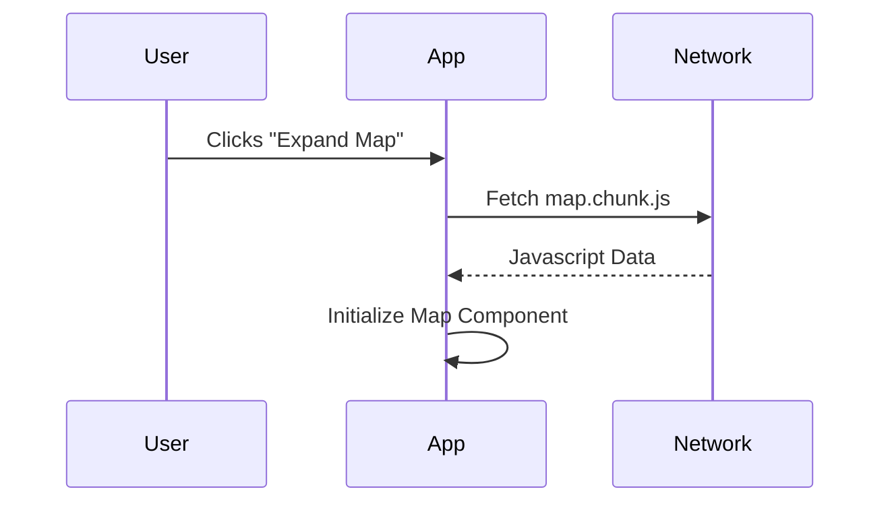

import Tabs from '@theme/Tabs';
import TabItem from '@theme/TabItem';

# Dynamic Import Chunking

The dynamic **`import()`** function is the standard syntax for triggering code splitting in JavaScript. Unlike the static `import` statement, it allows you to load modules asynchronously based on user interaction or logic.

:::info[Core Philosophy]
**Just-In-Time Loading**. Moving from "Static Imports" to "Dynamic Imports" shifts the architectural mental model from a single timeline to a multi-threaded, asynchronous loading forest.
:::

---

## 1. Easy: The `import()` Syntax

A dynamic import returns a **Promise**. This means you can use `.then()` or `await` to wait for the code to be downloaded before you use it.

```javascript
// Static (Loaded immediately)
// import { heavyChart } from './charts';

// Dynamic (Loaded ONLY when clicked)
button.onclick = () => {
  import('./charts').then(module => {
    module.heavyChart.draw();
  });
};
```

---

## 2. Medium: Module Entry Points

When a bundler (Webpack, Vite, Rollup) sees an `import('./file')` call, it does not just keep it as a function. It marks `./file` as a **Split Point**.

The bundler will:
1.  Isolate `./file` and all its private dependencies into a new `.js` file (a chunk).
2.  Generate a unique hash for that file name (e.g., `charts.4f2a.js`).
3.  Inject code at runtime to fetch the chunk via a script tag when the function is called.



---

## 3. Hard: Webpack Magic Comments

By default, bundlers give chunks generic names like `1.js`. To make debugging easier and control loading behavior, Webpack supports **Magic Comments**.

<Tabs groupId="lang" queryString>
<TabItem value="js" label="JavaScript">

```javascript
// 1. Give the chunk a custom name
import(/* webpackChunkName: "map-component" */ './Map');

// 2. Preload: High priority, load alongside the main bundle
import(/* webpackPreload: true */ './CriticalData');

// 3. Prefetch: Low priority, load when the browser is idle
import(/* webpackPrefetch: true */ './HeavySettingsMenu');
```

</TabItem>
<TabItem value="ts" label="TypeScript">

```typescript
async function loadModule(moduleName: string) {
  try {
    const { default: MyComp } = await import(
      /* webpackChunkName: "dynamic-[request]" */ 
      `./modules/${moduleName}`
    );
    return MyComp;
  } catch (err) {
    console.error("Chunk load failed!", err);
  }
}
```

</TabItem>
</Tabs>

---

## 4. Advanced: Preload vs. Prefetch

Understanding the priority gap is critical for senior engineering decisions:

- **`webpackPreload`**: Used for chunks that will be needed **immediately** after the page loads (e.g., a modal that is often open by default). It starts downloading in parallel with the main bundle.
- **`webpackPrefetch`**: Used for chunks that **might** be needed later (e.g., the next page in a wizard). It waits until the browser is completely idle (low CPU/Network usage) before starting the download.

---

## 5. Interview Prep: 4 Key Questions

### Q1: What does a dynamic `import()` return?
**A:** It returns a **Promise** that resolves to the module object. This object contains all the exports of the imported file (accessed via `module.exportName` or `module.default`).

### Q2: Difference between `webpackPreload` and `webpackPrefetch`?
**A:** `Preload` is for **high-priority** resources needed in the current navigation; it downloads in parallel with the parent chunk. `Prefetch` is for **low-priority** resources needed for future navigations; it waits for browser idle time to download and stores it in the browser cache.

### Q3: How do you handle a "Chunk Load Failure"?
**A:** Since `import()` returns a promise, you must use a `.catch()` block or `try/catch`. This is common when a user has a spotty connection or if you've deployed a new version of the site and the old chunk hash no longer exists on the server. In React, this is often handled using **Error Boundaries**.

### Q4: Why can't you use a variable for the entire path in a dynamic import?
**A:** For example, `import(myPath)` will fail in most bundlers. The bundler needs to know at **build time** which files to create chunks for. If the path is a complete mystery, it doesn't know what to bundle. To use variables, you must provide a static prefix (e.g., `import("./pages/" + name)`) so the bundler can at least find the directory and pre-bundle every file in it as a potential chunk.
