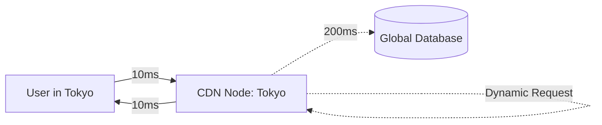

import Tabs from '@theme/Tabs';
import TabItem from '@theme/TabItem';

# Edge Rendering

**Edge Rendering** is the paradigm of running application logic and generating HTML at the "Edge" of the network—meaning on a CDN server geographically closest to the user, rather than on a centralized origin server.

:::info[Core Philosophy]
**Beat the Speed of Light**. Data cannot travel faster than light. If your user is in Tokyo and your origin server is in New York, every request has a baseline latency of ~200ms. By moving the rendering logic to a CDN node in Tokyo, you eliminate the physical distance bottleneck.
:::

---

## 1. Easy: Origin vs. Edge

Traditionally, a CDN (Content Delivery Network) only served static files (images, CSS, JS). Dynamic HTML was generated by a central Node.js server (the "Origin"). 

With Edge Rendering, the CDN itself runs serverless functions. When a user requests a dynamic page, the closest CDN node executes the JavaScript, generates the HTML, and sends it back instantly.



---

## 2. Medium: The V8 Isolate Architecture

How do CDNs run millions of user functions so quickly? They do not use traditional Node.js containers or Virtual Machines (which take hundreds of milliseconds to "cold start").

Instead, platforms like Cloudflare Workers and Vercel Edge use **V8 Isolates**. This is the exact same technology Google Chrome uses to securely run different tabs. An Isolate is a lightweight, isolated JavaScript context. It has zero "cold start" penalty (booting in under 5ms) and uses vastly less memory than a Node process.

---

## 3. Hard: Edge Limitations and APIs

Because Edge functions run in V8 Isolates and not Node.js, they do **not** have access to standard Node APIs (like `fs`, `path`, or `child_process`). They only have access to standard Web APIs (like `fetch`, `Request`, `Response`, `crypto`).

<Tabs groupId="lang" queryString>
<TabItem value="js" label="JavaScript">

```javascript
// Edge Middleware Pattern
// Modifying a request at the edge before it hits the origin
export default {
  async fetch(request, env) {
    const url = new URL(request.url);

    // 1. A/B Testing at the Edge (Zero latency penalty)
    if (url.pathname === '/home') {
      const variant = Math.random() < 0.5 ? 'a' : 'b';
      return fetch(`https://origin.com/home-${variant}`);
    }

    // 2. Security at the Edge
    const token = request.headers.get('Authorization');
    if (!isValidToken(token)) {
      return new Response('Unauthorized', { status: 401 });
    }

    return fetch(request);
  }
};
```

</TabItem>
<TabItem value="ts" label="TypeScript">

```typescript
// Edge Database Connections
// Traditional TCP databases (like Postgres) cannot handle thousands of 
// concurrent connections from thousands of globally distributed Edge nodes.
// You MUST use an HTTP-based connection pool or a REST API.

import { Pool } from '@neondatabase/serverless';

export async function edgeDbQuery(request: Request) {
  // Using a serverless-friendly connection pool over WebSockets/HTTP
  const pool = new Pool({ connectionString: process.env.DATABASE_URL });
  
  const result = await pool.query('SELECT * FROM users LIMIT 10');
  
  return new Response(JSON.stringify(result.rows), {
    headers: { 'Content-Type': 'application/json' }
  });
}
```

</TabItem>
</Tabs>

---

## 4. Advanced: Data Gravity

The biggest challenge with Edge Rendering is **Data Gravity**. 

If your Edge function in Tokyo needs to make 5 sequential database queries, and your database is still located in New York, the Tokyo Edge node must make 5 round-trips to New York. 

`5 queries * 200ms = 1000ms delay.`

In this scenario, Edge Rendering is actually **slower** than Origin Rendering. Edge Rendering only makes sense if:
1. The page requires no database data (e.g., personalization via cookies).
2. The database is globally replicated to the edge (e.g., Turso, CosmosDB).
3. The Edge node makes a single, batched HTTP request to an origin GraphQL/REST endpoint.

---

## 5. Interview Prep: 4 Key Questions

### Q1: What is the difference between Serverless Functions (AWS Lambda) and Edge Functions?
**A:** Serverless functions typically run in containers (like Docker) in a specific datacenter region (e.g., `us-east-1`). They suffer from "cold starts" and have access to the full Node.js runtime. Edge Functions run on globally distributed CDN nodes using V8 Isolates. They have near-zero cold starts but have a restricted runtime environment (no Node.js native modules).

### Q2: Why can't you use the standard `pg` (Postgres) NPM library in an Edge Function?
**A:** The `pg` library relies on Node.js core modules like `net` to establish persistent TCP socket connections. V8 Isolates at the Edge do not support raw TCP sockets; they only support HTTP and WebSockets. To query a database from the Edge, you must use a driver that communicates over HTTP or WebSockets (like `@neondatabase/serverless` or Prisma Data Proxy).

### Q3: What is "Middleware" in the context of Edge architecture?
**A:** Edge Middleware is a function that intercepts a user's request at the CDN level *before* it reaches the origin server. It is commonly used for authentication, bot protection, geolocation-based redirects, and A/B testing, because executing these rules at the edge is incredibly fast and shields the origin server from unnecessary load.

### Q4: How does caching work in an Edge Function?
**A:** Because Edge nodes are distributed, they do not share a single memory space. You cannot use a global JavaScript variable for caching. Instead, you must use distributed Key-Value stores provided by the Edge platform (like Cloudflare KV or Vercel Edge Config) which synchronize data globally across all nodes.
