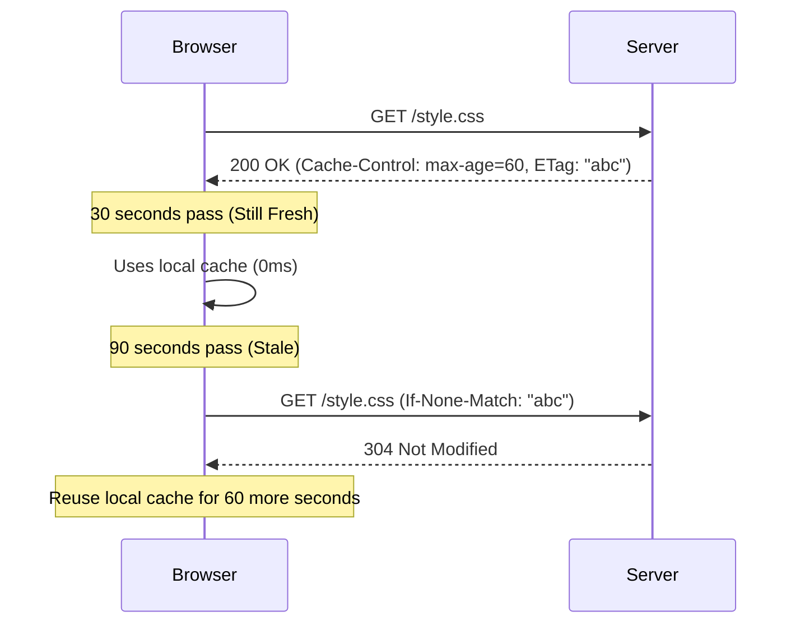

import Tabs from '@theme/Tabs';
import TabItem from '@theme/TabItem';

# ETag vs. Cache-Control

In the world of web performance, caching is divided into two distinct responsibilities: **Freshness** (knowing if a resource is still good) and **Validation** (confirming with the server if a resource has changed).

:::info[Core Philosophy]
**Verify or Trust**. `Cache-Control` tells the browser to trust the locally stored file for a fixed time. `ETag` is the fingerprint used to verify if that file is still the "source of truth."
:::

---

## 1. Easy: Freshness vs. Validation

-   **Cache-Control (Freshness)**: "Keep this image for 10 minutes. Don't ask me about it until then."
-   **ETag (Validation)**: "Here is a unique ID for this file. Next time you want it, send me the ID, and I'll tell you if it's still current."



---

## 2. Medium: Weak vs. Strong ETags

Not all changes require a full download.
-   **Strong ETag**: The file is byte-for-byte identical.
-   **Weak ETag** (prefixed with `W/`): The file is semantically the same but might have minor differences (like changed metadata or compressed differently).

---

## 3. Hard: Implementation and Performance

<Tabs groupId="lang" queryString>
<TabItem value="js" label="JavaScript">

```javascript
// Manually checking for ETag changes in an API
async function fetchWithETag(url) {
  const cachedEtag = localStorage.getItem(`etag-${url}`);
  
  const response = await fetch(url, {
    headers: cachedEtag ? { 'If-None-Match': cachedEtag } : {}
  });

  if (response.status === 304) {
    console.log("Database says: Use your local version.");
    return JSON.parse(localStorage.getItem(`data-${url}`));
  }

  const data = await response.json();
  const newEtag = response.headers.get('ETag');
  
  if (newEtag) {
    localStorage.setItem(`etag-${url}`, newEtag);
    localStorage.setItem(`data-${url}`, JSON.stringify(data));
  }
  
  return data;
}
```

</TabItem>
<TabItem value="ts" label="TypeScript">

```typescript
// Server-side ETag Generation logic (Conceptual)
import crypto from 'crypto';

const generateETag = (content: string): string => {
  // Use MD5 or SHA-1 to create a unique fingerprint of the content
  return crypto
    .createHash('md5')
    .update(content)
    .digest('hex');
};

// If generateETag(currentContent) === request.headers['if-none-match']
// Then return 304 Not Modified
```

</TabItem>
</Tabs>

---

## 4. Advanced: The Cost of ETags

While ETags save bandwidth (by returning 304s), they have a **Compute Cost**. 
1.  **Server CPU**: The server must read the file and generate a hash (or read it from a database) for every incoming request.
2.  **RTT (Round Trip Time)**: Unlike `Cache-Control: max-age`, which is instant (0ms), an ETag validation still requires a full network round-trip to the server.

---

## 5. Interview Prep: 4 Key Questions

### Q1: Why is `Cache-Control` generally better for performance than `ETag`?
**A:** `Cache-Control` (with a positive `max-age`) allows the browser to serve the resource from the local disk/memory without making a network request at all (0ms latency). `ETag` always requires a network trip to the server to perform the validation, which introduces latency dependent on the user's connection speed.

### Q2: What happens if both `Cache-Control: max-age` and `ETag` are present?
**A:** The browser will prioritize `Cache-Control`. As long as the `max-age` has not expired, the resource is considered "Fresh," and the browser will use it without checking the ETag. Once the timer expires, the resource becomes "Stale," and the browser will then use the ETag to perform a validation check via the `If-None-Match` header.

### Q3: What is the purpose of `304 Not Modified`?
**A:** It is a shorthand response from the server that contains headers but **no body**. It tells the browser that the version it already has is identical to the one on the server. This saves the bandwidth cost of re-downloading the entire file, which is especially critical for large assets like JavaScript bundles or high-res images.

### Q4: When should you use `no-cache`?
**A:** You use `no-cache` when you want the browser to store the file, but you **always** want it to validate with the server before using it. This is useful for configuration files or HTML files where you want the "fast path" of a 304 response if nothing has changed, but you cannot risk the user seeing an outdated version.
