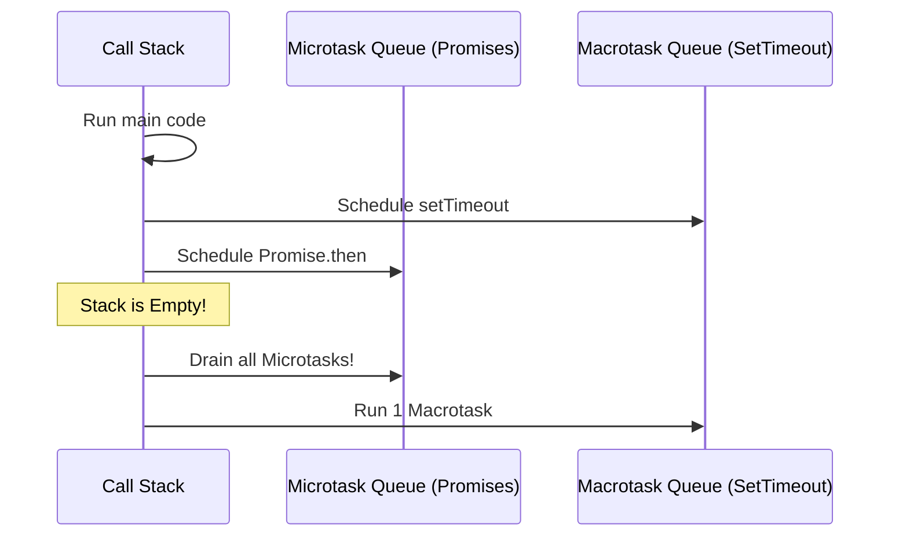

import Tabs from '@theme/Tabs';
import TabItem from '@theme/TabItem';

# The Event Loop

The **Event Loop** is the secret sauce that makes JavaScript feel parallel even though it is fundamentally **single-threaded**. It is the mechanism that coordinates the execution of code, the collection of events, and the processing of sub-tasks.

:::info[Core Philosophy]
**Non-Blocking I/O**. JavaScript never "waits" for a network request or a timer. Instead, it offloads that work to the browser/Node environment and continues executing other code, picking up the result only when it's ready.
:::

---

## 1. Easy: The Call Stack

Imagine a chef (the JS Engine) and a recipe (your code). The chef can only do one thing at a time. The **Call Stack** is where the chef keeps track of what step of the recipe they are currently on.

```javascript
function greet() {
  console.log("Hello!");
}

function start() {
  greet();
}

start();
```

1. `start()` is pushed onto the stack.
2. `greet()` is pushed on top of `start()`.
3. `console.log()` is pushed on top of `greet()`.
4. Work finishes, everything is popped off.

---

## 2. Medium: Macro vs. Microtasks

Not all tasks are created equal. When the Call Stack is empty, the Event Loop looks at two different queues:

1.  **Macrotask Queue**: SetTimeout, SetInterval, I/O, UI Rendering. These are "heavy" tasks.
2.  **Microtask Queue**: Promises (`.then`, `await`), `MutationObserver`. These are "light" tasks.

**The Golden Rule**: The Event Loop will drain the entire **Microtask** queue before moving on to the next **Macrotask**.



---

## 3. Hard: The Render Queue

Modern browsers have a third, critical stage: the **Render Queue**. 
The browser tries to update the screen at 60fps (every 16.6ms). It rarely renders *during* a task. Instead, it waits for the Call Stack to be empty and for the Microtasks to be finished.

If a task (or a loop of microtasks) takes 100ms, the browser **cannot render**. This is why long-running JS "freezes" the page.

<Tabs groupId="lang" queryString>
<TabItem value="js" label="JavaScript">

```javascript
console.log("1. Start");

setTimeout(() => {
  console.log("2. Macrotask (Timer)");
}, 0);

Promise.resolve().then(() => {
  console.log("3. Microtask (Promise)");
});

console.log("4. End");

// OUTPUT: 1, 4, 3, 2
```

</TabItem>
<TabItem value="ts" label="TypeScript">

```typescript
async function process() {
  console.log("A");
  await Promise.resolve(); // Sends the rest of the function to Microtask queue
  console.log("B"); 
}

process();
console.log("C");

// OUTPUT: A, C, B
```

</TabItem>
</Tabs>

---

## 4. Advanced: The Animation Frame (`requestAnimationFrame`)

Where does `requestAnimationFrame` (rAF) fit? It is a special task that runs **right before the paint**. 

Unlike `setTimeout(0)`, which is handled as a Macrotask and might happen *after* a frame has already passed, `rAF` is mathematically guaranteed to run in the next available paint cycle. 

Current browsers generally process the event loop in this order:
1.  Run the **Call Stack** until empty.
2.  Drain the **Microtask Queue** until empty.
3.  Check if a **Render** is needed.
4.  If yes: Run `requestAnimationFrame` -> Calculate Styles -> Layout -> Paint.
5.  Pick up the next **Macrotask**.

---

## 5. Interview Prep: 4 Key Questions

### Q1: What happens if a Microtask schedules another Microtask recursively?
**A:** You will cause **Task Starvation**. Because the Event Loop drains the Microtask queue completely before doing anything else (including rendering), an infinite loop of Promises will hang the browser tab, preventing any UI updates or user interactions forever.

### Q2: Why is `setTimeout(fn, 0)` not actually 0 milliseconds?
**A:** According to the HTML5 spec, browsers clamp nested `setInterval`/`setTimeout` calls to a minimum of **4ms** to prevent background tabs from draining the battery. Additionally, it is a Macrotask, so it must wait for all pending Microtasks to finish before it can execute.

### Q3: Contrast `process.nextTick` (Node.js) with `queueMicrotask` (Browser).
**A:** Both are used to schedule micro-tasks, but `process.nextTick` is even Higher Priority than a Promise. It runs immediately after the current operation finishes, whereas `queueMicrotask` puts the task at the end of the standard Microtask queue.

### Q4: How does `async/await` look on the Event Loop?
**A:** Everything before the first `await` runs synchronously on the main stack. Everything *after* the `await` is treated like a `.then()` callback and is sent to the Microtask queue to be executed after the current stack clears.
