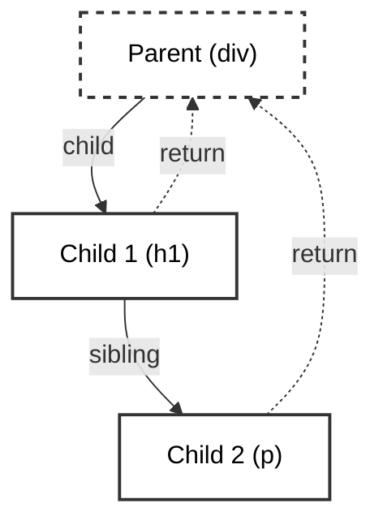

import Tabs from '@theme/Tabs';
import TabItem from '@theme/TabItem';

# Fiber Architecture

React Fiber is the complete internal rewrite of the React core algorithm that shipped in React 16. It is the engine that dictates how React manages the component tree, queues state updates, and executes the rendering process.

:::info[Core Philosophy]
**Virtual Stack Frames**. Prior to Fiber, React relied on the JavaScript call stack to recursively traverse the DOM. Fiber solves this by manually mimicking the call stack. This allows React to pause work, yield to the browser, abort work, or alter the priority of tasks.
:::

---

## 1. Easy: The Limitations of the Stack

Before Fiber, React used the **Stack Reconciler**. 
When React evaluated a component update, it would call its child component, which would call its child component, completely occupying the JavaScript engine's Call Stack.

If you had a 50-level deep component tree, React occupied exactly 50 stack frames. The browser could not intervene to process a user's click or a CSS animation until React finished traversing to the very bottom and returned all the way to the top. This made heavy apps feel totally unresponsive.

---

## 2. Medium: The Fiber Node Structure

To fix the un-interruptible stack, React created the **Fiber Node**. Every React element you declare maps to an internal Fiber Node object. Rather than a standard strict hierarchical tree, Fibers are linked together fundamentally as a **Singly Linked List**.

A Fiber strictly knows three things about its surroundings to navigate without a call stack:
1. `child`: Pointer to its first child.
2. `sibling`: Pointer to its next sibling.
3. `return` (Parent): Pointer back to the parent.



Because it's a linked list, React can calculate `Child 1`, save a pointer to `Child 2` as the "next unit of work," pause the entire execution, yield to the browser, and pick back up at `Child 2` a few milliseconds later.

---

## 3. Hard: The React Work Loop

The fundamental engine backing Fiber is the **Work Loop**. It continuously iterates through the Linked List nodes, constantly checking a deadline timer to see if it is out of time.

<Tabs groupId="lang" queryString>
<TabItem value="js" label="JavaScript">

```javascript
let nextUnitOfWork = null;

function workLoop(deadline) {
  let shouldYield = false;
  
  // Keep working through the linked list while we have time
  while (nextUnitOfWork && !shouldYield) {
    nextUnitOfWork = performUnitOfWork(nextUnitOfWork);
    
    // Check if the browser needs the main thread back (Time Slicing allowance)
    shouldYield = deadline.timeRemaining() < 1;
  }

  // Phase 1 (Render) is done. 
  if (!nextUnitOfWork && workInProgressRoot) {
    // Phase 2: Commit all changes to the DOM synchronously
    commitRoot();
  } else {
    // Phase 1 was paused. Schedule the next chunk to run later.
    requestIdleCallback(workLoop);
  }
}
```

</TabItem>
<TabItem value="ts" label="TypeScript">

```typescript
type Fiber = {
  type: string;
  props: object;
  child?: Fiber;
  sibling?: Fiber;
  return?: Fiber;
  dom: HTMLElement | null;
  alternate: Fiber | null;
};

let nextUnitOfWork: Fiber | null = null;

function workLoop(deadline: IdleDeadline) {
  let shouldYield = false;
  
  while (nextUnitOfWork && !shouldYield) {
    nextUnitOfWork = performUnitOfWork(nextUnitOfWork);
    shouldYield = deadline.timeRemaining() < 1;
  }

  if (!nextUnitOfWork && workInProgressRoot) {
    commitRoot();
  } else {
    requestIdleCallback(workLoop);
  }
}
```

</TabItem>
</Tabs>

---

## 4. Advanced: Double Buffering

Fiber operates using a technique heavily inspired by video game rendering engines called **Double Buffering**.

React actually maintains *two* complete Fiber trees at any given moment:
1. **Current Tree**: This perfectly represents what is currently painted on the DOM.
2. **Work-In-Progress (WIP) Tree**: This is the background draft that the Work Loop is calculating.

When the WIP tree traversal finishes, React instantly swaps the `current` root pointer to the WIP tree. This avoids a nightmare scenario where the browser paints a "half-finished" UI layout to the screen.

---

## 5. Interview Prep: 4 Key Questions

### Q1: What was the primary motivation for writing the Fiber Reconciler?
**A:** The original Stack Reconciler relied on JS Engine call stacks. It was strictly synchronous and uninterruptible. Fiber was built to manually mimic a call stack using objects in the heap (Linked Lists) so work could be paused, prioritized, and resumed, enabling Concurrency (`<Suspense>` and `useTransition`).

### Q2: Explain the two phases of a standard React render cycle.
**A:** 
1. **Render Phase**: (Interruptible). React traverses the Fiber tree, calculating diffs and tagging nodes marked for creation, update, or deletion (Effect Tags).
2. **Commit Phase**: (Synchronous, Uninterruptible). React traverses the calculated effect list and executes raw physical DOM mutations (`appendChild`, `removeChild`), followed by firing `useEffect` pipelines.

### Q3: Why does a Fiber point back to its `return` rather than calling it a `parent`?
**A:** Because Fiber is specifically mimicking a Javascript stack frame. When a unit of work completes for a child, it literally "returns" execution control back to its parent Fiber, which then looks for its next child or sibling to process.

### Q4: How does Fiber optimize list reconciliation?
**A:** Keys. When iterating over arrays, React Fiber relies heavily on the `key` prop attached to mapped elements. When constructing the WIP tree, React uses a Map to look up existing Fibers by key, conceptually moving the existing Fiber node (and underlying DOM element) rather than destroying it and creating a brand new one.
