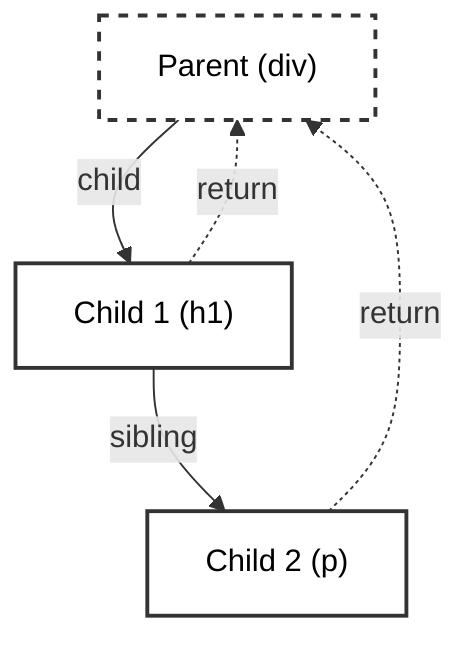

import Tabs from '@theme/Tabs';
import TabItem from '@theme/TabItem';

# Fiber Architecture

React Fiber is the complete internal rewrite of the React core algorithm, shipping in React 16. It handles how React manages the component tree, queues state updates, and executes the rendering process.

Before Fiber, React used the "Stack Reconciler," which was strictly recursive and synchronous. Fiber turns recursion into an interruptible loop using a Linked List structure.

:::info[Core Philosophy]
**Virtual Stack Frames**. Fiber allows React to pause work, yield to the browser, abort work, or alter the priority of tasks. Each element in the tree has a corresponding "Fiber Node" representing a unit of work.
:::

---

## 1. The Structure of a Fiber Node

Every React element you declare `<div />` maps to an internal Fiber Node object. Rather than a standard strict hierarchical tree, Fibers are linked together mathematically.

A Fiber strictly knows three things about its surroundings:
1. `child`: Pointer to its first child.
2. `sibling`: Pointer to its next sibling.
3. `return` (Parent): Pointer back to the parent.



---

## 2. The React Work Loop

The fundamental engine backing Fiber is the Work Loop. It iterates through the nodes continuously, constantly checking if it is out of time.

<Tabs groupId="lang" queryString>
<TabItem value="js" label="JavaScript">

```javascript
let nextUnitOfWork = null;

function workLoop(deadline) {
  let shouldYield = false;
  
  // Keep working through the linked list while we have time
  while (nextUnitOfWork && !shouldYield) {
    nextUnitOfWork = performUnitOfWork(nextUnitOfWork);
    
    // Check if the browser needs the main thread back (Time Slicing)
    shouldYield = deadline.timeRemaining() < 1;
  }

  if (!nextUnitOfWork && workInProgressRoot) {
    // Phase 2: Commit all changes to the DOM synchronously
    commitRoot();
  } else {
    // Schedule the next chunk
    requestIdleCallback(workLoop);
  }
}
```

</TabItem>
<TabItem value="ts" label="TypeScript">

```typescript
type Fiber = {
  type: string;
  props: object;
  child?: Fiber;
  sibling?: Fiber;
  return?: Fiber;
  dom: HTMLElement | null;
  alternate: Fiber | null;
};

let nextUnitOfWork: Fiber | null = null;

function workLoop(deadline: IdleDeadline) {
  let shouldYield = false;
  
  while (nextUnitOfWork && !shouldYield) {
    nextUnitOfWork = performUnitOfWork(nextUnitOfWork);
    shouldYield = deadline.timeRemaining() < 1;
  }

  if (!nextUnitOfWork && workInProgressRoot) {
    commitRoot();
  } else {
    requestIdleCallback(workLoop);
  }
}
```

</TabItem>
</Tabs>

---

## 3. Double Buffering

Fiber uses a technique heavily inspired by video game rendering engines called **Double Buffering**.

React maintains two complete Fiber trees at any given moment:
1. **Current Tree**: This is what is currently painted on the DOM.
2. **Work-In-Progress (WIP) Tree**: This is the background draft that React is calculating.

When the WIP tree calculation finishes, React instantly swaps the `current` pointer to the WIP tree, avoiding intermediate layout paints on the screen.

---

## 4. Interview Prep: 4 Key Questions

### Q1: What was the primary motivation for writing the Fiber Reconciler?
**A:** The original Stack Reconciler relied on JS Engine call stacks. If you had a 50-level deep component tree, React occupied exactly 50 stack frames, blocking the engine until it cleared. Fiber was built to manually mimic a call stack so it could be paused and resumed, enabling features like `<Suspense>` and `useTransition`.

### Q2: Explain the two phases of a standard React render cycle.
**A:** 
1. **Render Phase**: (Interruptible). React traverses the Fiber tree, calculating diffs and tagging nodes marked for creation, update, or deletion (Effect Tags).
2. **Commit Phase**: (Synchronous, Uninterruptible). React traverses the calculated list and executes raw DOM mutations (`appendChild`, `removeChild`), followed by firing `useEffect` pipelines.

### Q3: Why does a Fiber point back to its `return` rather than calling it a `parent`?
**A:** Because Fiber mimics a stack frame structure, when a unit of work completes for a child, it literally "returns" execution control back to its parent Fiber to process the next sibling.

### Q4: How does Fiber optimize list reconciliation?
**A:** Keys. When iterating over arrays, React Fiber relies heavily on the `key` prop attached to mapped elements. This instructs the reconciler algorithm to conceptually move the existing Fiber node (and DOM element) rather than destroying it and creating a brand new one.
