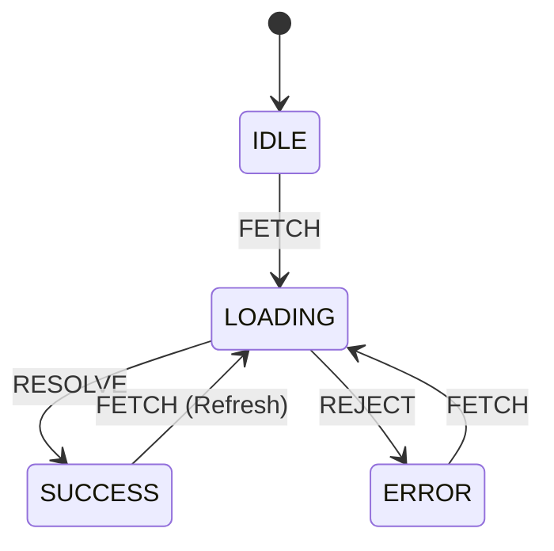

import Tabs from '@theme/Tabs';
import TabItem from '@theme/TabItem';

# Finite State Modeling

**Finite State Modeling** is the practice of designing application logic using deterministic state machines. A system can only be in exactly one defined "State" at any given time, and it can only transition to another State through explicit "Events".

:::info[Core Philosophy]
**Make Impossible States Impossible**. If you use separate boolean flags (`isLoading`, `isError`, `isSuccess`) to manage a network request, you technically have 8 possible states ($2^3$). Can a request be loading, successful, and an error simultaneously? No. State machines enforce this constraint mathematically.
:::

---

## 1. Easy: The Problem with Booleans

In a typical React component, developers usually model data fetching with multiple variables.

```javascript
const [isLoading, setIsLoading] = useState(false);
const [isError, setIsError] = useState(false);
const [data, setData] = useState(null);

// Inside a fetch block:
setIsLoading(true);
setIsError(false); // Did you remember to reset this?
// ... fetch data ...
```

If a developer forgets to reset `isError` when starting a new fetch, the UI will display a loading spinner *and* an error message at the same time. This is a bug caused by allowing an "impossible state."

---

## 2. Medium: Finite State Machines (FSM)

A Finite State Machine (FSM) defines a strict set of rules. For a network request, the machine looks like this:

-   **States**: `IDLE`, `LOADING`, `SUCCESS`, `ERROR`.
-   **Events**: `FETCH`, `RESOLVE`, `REJECT`.

If the machine is in the `LOADING` state, and the user clicks the "Fetch" button again (firing a `FETCH` event), the machine simply ignores it, because there is no defined transition from `LOADING` via a `FETCH` event. Double-submit bugs are eliminated by design.



---

## 3. Hard: Implementation with XState

While you can write a simple reducer to act as a state machine, complex applications use libraries like **XState** to manage hierarchical state, parallel states, and side effects.

<Tabs groupId="lang" queryString>
<TabItem value="js" label="JavaScript">

```javascript
// A simple reducer acting as an FSM
const fetchReducer = (state, event) => {
  switch (state.status) {
    case 'IDLE':
      if (event.type === 'FETCH') return { status: 'LOADING' };
      return state;
    case 'LOADING':
      if (event.type === 'RESOLVE') return { status: 'SUCCESS', data: event.data };
      if (event.type === 'REJECT') return { status: 'ERROR', error: event.error };
      return state; // Ignore FETCH events while already LOADING
    case 'ERROR':
    case 'SUCCESS':
      if (event.type === 'FETCH') return { status: 'LOADING' };
      return state;
    default:
      return state;
  }
};
```

</TabItem>
<TabItem value="ts" label="TypeScript">

```typescript
// XState implementation
import { createMachine } from 'xstate';

interface FetchContext {
  retries: number;
}

// State machines map out exactly what should happen
const fetchMachine = createMachine({
  id: 'fetch',
  initial: 'idle',
  context: { retries: 0 },
  states: {
    idle: {
      on: { FETCH: 'loading' }
    },
    loading: {
      on: {
        RESOLVE: 'success',
        REJECT: 'error'
      }
    },
    success: {
      type: 'final'
    },
    error: {
      on: {
        // You can define explicit retry logic
        RETRY: {
          target: 'loading',
          // Actions are side-effects executed during transitions
          actions: 'incrementRetryCount'
        }
      }
    }
  }
});
```

</TabItem>
</Tabs>

---

## 4. Advanced: State Charts and Hierarchy

A basic FSM is flat. If you have a complex UI (like a Multi-Step Checkout Form), flat FSMs suffer from "State Explosion" (too many states). 

David Harel introduced **Statecharts**, which XState implements. Statecharts allow states to contain other states. 

For example, a `LOGGED_IN` state might contain a nested machine for the User Dashboard. If a `LOGOUT` event fires, it immediately transitions the parent machine to `LOGGED_OUT`, instantly destroying the nested Dashboard machine. This guarantees complete, deterministic teardown of UI state.

---

## 5. Interview Prep: 4 Key Questions

### Q1: What does it mean to "Make impossible states impossible"?
**A:** It refers to designing a data structure or system where invalid combinations of data simply cannot be represented in code. Instead of using multiple boolean variables (which can mathematically overlap into conflicting states), you use a single enumerator or string union (e.g., `type Status = 'idle' | 'loading' | 'success'`) to enforce that only one valid state exists at a time.

### Q2: How does a State Machine prevent double-submission bugs on a form?
**A:** When the form is submitted, the machine transitions from `IDLE` to `SUBMITTING`. If the user clicks the submit button again, the system fires another `SUBMIT` event. However, the State Machine definition dictates that if the current state is `SUBMITTING`, the `SUBMIT` event is ignored. The logic is declarative, not imperative.

### Q3: Why is standard Redux considered state management, but not necessarily state modeling?
**A:** Standard Redux focuses on how to update and propagate a global data store (managing state). However, reducers often rely on massive `switch(action.type)` blocks that blindly update state regardless of the *current* state. State Modeling (via FSMs) requires checking *both* the `action.type` AND the `current.status` to determine if a transition is mathematically legal.

### Q4: What is the difference between an FSM and a Statechart?
**A:** A Finite State Machine is "flat"; a system is simply in one state. A Statechart extends FSMs by adding hierarchy (nested states), orthogonal regions (parallel states running simultaneously), and history (remembering the last state when re-entering a parent state). This prevents state explosion in complex applications.
