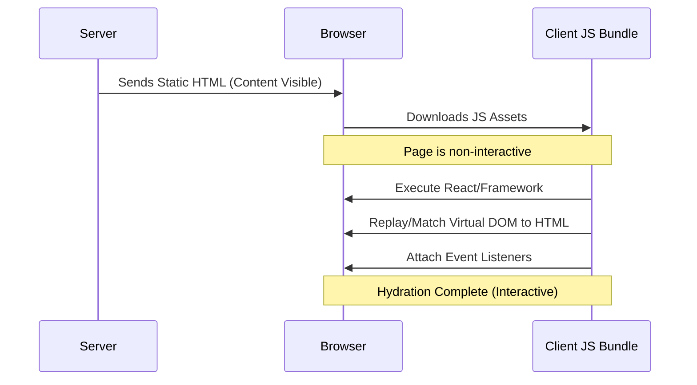

# Hydration

Hydration is the process of attaching event listeners and state to a static HTML page that was pre-rendered on the server, making it interactive on the client.

It acts as a bridge between the "dry" HTML sent by the server and the "wet" interactive application required by the browser.

## Internal Working
When a user requests a page, the server generates the full HTML and sends it to the browser. At this point, the page is visible but non-interactive (buttons don't work, state isn't tracked).

1. **Server Rendering**: The framework (e.g., React, Next.js) converts components into a string of HTML.
2. **Client Booting**: The browser downloads the JavaScript bundle.
3. **The Replay Phase**: The framework runs the application code on the client. It doesn't re-create the DOM from scratch (which would cause a flicker); instead, it walks the existing DOM tree and "hydrates" it by:
   - Matching existing DOM nodes with the Virtual DOM structure.
   - Attaching event handlers (onClick, onInput, etc.).
   - Initializing the internal state of components.

### Mermaid Diagram: The Hydration Flow


## Real-World Example: A Like Button
Imagine a blog post with a "Like" button rendered on the server.
- **Before Hydration**: You see the button, but clicking it does nothing because the `onClick` function hasn't been attached yet.
- **After Hydration**: The JavaScript has "claimed" the button, and now clicking it updates the count in state.

## Code Snippet: Manual Re-hydration Logic (Conceptual)
```javascript
// Server (pseudocode)
const html = renderToString(<App />);
res.send(`
  <div id="root">${html}</div>
  <script src="/bundle.js"></script>
`);

// Client (index.js)
import { hydrateRoot } from 'react-dom/client';
import App from './App';

const container = document.getElementById('root');
// hydrateRoot picks up where the server left off
hydrateRoot(container, <App />);
```

## Key Idea
Hydration is about **restoring state and behavior** to a pre-rendered UI without re-rendering the visual structure.

## Why it Matters
- **SEO**: Search engines see a fully populated HTML page.
- **Perceived Performance**: Users see content immediately (LCP) even if they have to wait a moment for interactivity (FID/TBT).

## Interview Insights
- **Q: How does Hydration differ from CSR (Client Side Rendering)?**
  - A: In CSR, the browser starts with an empty `div` and builds the DOM from scratch. In Hydration, the browser starts with a full DOM and only adds "intelligence."
- **Q: What is a "Hydration Mismatch" error?**
  - A: It occurs when the server-rendered HTML doesn't match the initial client-side render (e.g., using `new Date()` or `Math.random()` inside a component).

## Common Mistakes
- **Direct DOM Manipulation**: Changing the DOM before hydration starts can cause the framework to lose track of nodes.
- **Conditional Rendering based on Window**: Using `typeof window !== 'undefined'` to hide parts of a component on the server can cause mismatches if not handled carefully (e.g., using `useEffect` to trigger client-only features).

## Comparison: CSR vs. SSR + Hydration
| Feature | Client-Side Rendering (CSR) | SSR + Hydration |
| :--- | :--- | :--- |
| **Initial Experience** | White screen until JS loads | Content visible immediately |
| **SEO** | Harder for some crawlers | Excellent |
| **JS Bundle Size** | High impact on LCP | High impact on TBT/FID |
| **Server Load** | Low | High |
