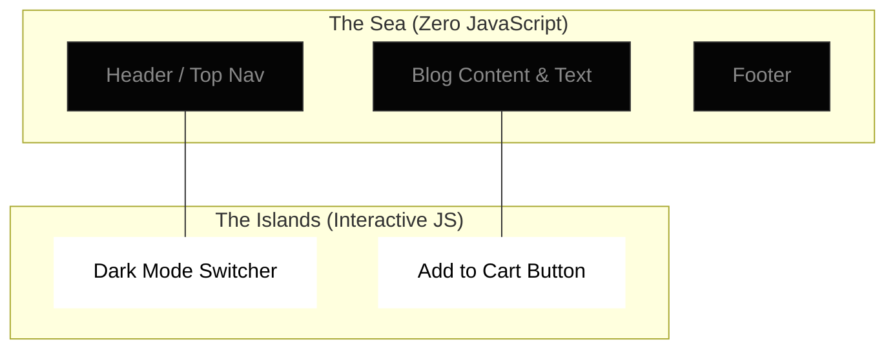

# Islands Architecture (Deep Dive)

Islands Architecture is a rendering paradigm that encourages the creation of small, entirely isolated interactive components—called "Islands"—within an otherwise completely static, zero-JavaScript HTML shell.

Pioneered largely by Jason Miller (Preact) and popularized heavily by the **Astro** framework, it aims to deliver the baseline performance of Static Site Generation while maintaining the rich interactivity of Single-Page Applications where necessary.

:::info[Core Philosophy]
**Assume Static by Default.** The framework compiler assumes every component you write is pure HTML and strips out its associated JavaScript completely. Developers must explicitly opt-in to interactivity on a per-component basis.
:::

---

## 1. How the Pipeline Works

In classic SSR paradigms (like Next.js Pages router), the server renders the HTML, and the client pulls down the generalized JS bundle that corresponds to the entire view. 

In an Islands Architecture framework (like Astro):
1. **Component Agnostic Parsing**: The server compiles components (React, Vue, Svelte) to pure HTML.
2. **Pruning**: Unused JS runtime logic is discarded.
3. **Island Directives**: If a component has an explicit "client" directive, its JS dependencies and framework runtime are packaged into a tiny, isolated bundle.
4. **Independent Hydration**: Island A does not depend on Island B to load. If Island A fails, Island B still functions perfectly.



---

## 2. Opt-in Interactivity (Astro syntax)

Unlike Next.js App Router (which uses `'use client'`), Astro uses HTML compilation directives directly on the instances of the components.

```javascript
// pages/index.astro
import Layout from '../layouts/Layout.astro';
import StaticHeader from '../components/StaticHeader.jsx';
import InteractiveCounter from '../components/Counter.jsx';
import HeavyChart from '../components/HeavyChart.svelte';

<Layout title="Dashboard">
  {/* This is rendered to HTML. Zero React runtime is sent to the client. */}
  <StaticHeader />

  {/* Hydrates immediately. React runtime is loaded. */}
  <InteractiveCounter client:load initialCount={0} />

  {/* Hydrates ONLY when the user scrolls the chart into the Viewport! Svelte runtime loaded. */}
  <HeavyChart client:visible dataUrl="/api/v1/stats" />
</Layout>
```

:::tip[Architectural Superpower: Framework Agnostic]
Because the Islands are completely isolated and root hydration is split, you can trivially mount a Vue island and a React island on the exact same page without conflict. The base HTML acts as the unifying shell.
:::

---

## 3. Communication Between Islands

The primary architectural hurdle of Islands is shared state. Since multiple reactive components are separated entirely in the DOM tree and might run different virtual runtimes, standard context (`React.createContext`) fails.

You must solve this via **Nano Stores** or native generic events:

```javascript
// store.js - Using Nano Stores (Framework agnostic state)
import { atom } from 'nanostores';

export const isCartOpen = atom(false);
```

```javascript
// CartIcon.jsx (Island A - React)
import { useStore } from '@nanostores/react';
import { isCartOpen } from '../store';

export function CartIcon() {
  const open = useStore(isCartOpen);
  return <div className={open ? 'active' : ''}>Cart</div>;
}
```

```typescript
// AddToCart.vue (Island B - Vue)
<script setup>
import { useStore } from '@nanostores/vue';
import { isCartOpen } from '../store';

const open = useStore(isCartOpen);
const toggle = () => isCartOpen.set(!open.value);
</script>

<template>
  <button @click="toggle">Toggle Cart</button>
</template>
```

---

## 4. Interview Prep: 5 Key Questions

### Q1: What is the defining difference between Islands Architecture and standard Micro-Frontends?
**A:** Micro-frontends generally split an application by business domains (e.g., Team A builds the Checkout page, Team B builds the Product page), heavily focusing on isolated deployments. Islands Architecture focuses on granular *rendering isolation* on a single page, specifically aimed at stripping execution overhead and minimizing JavaScript.

### Q2: How does the "client:visible" directive in Astro technically work under the hood?
**A:** The framework injects a tiny inline script into the HTML that spins up an `IntersectionObserver`. It watches the placeholder element. Only when the `IntersectionObserver` triggers (meaning the element enters the viewport) does the script dynamically `import()` the interactive JS bundle for that specific framework.

### Q3: What is the largest downside of an Islands Architecture?
**A:** Highly interconnected SPAs. If almost every element on a page relies heavily on complex, rapidly changing global state (like a real-time Figma clone or a heavy dashboard), isolating them into Islands creates massive overhead. Islands are best for content-heavy sites (blogs, eCommerce, documentation).

### Q4: Compare Islands vs React Server Components (RSC).
**A:** RSC allows backend-only rendering for server components, passing serialized data down to Client Components. However, RSC is highly coupled exclusively to React. Islands architecture creates a framework-agnostic shell, allowing you to throw away entire runtimes completely and compose the page out of raw HTML blocks.

### Q5: How do Islands affect styling architectures like CSS-in-JS (e.g., Styled Components)?
**A:** Because runtime JavaScript is stripped for static components, traditional runtime CSS-in-JS libraries can fail or suffer severe performance penalties in Islands architectures. You must use Zero-Runtime CSS-in-JS (Vanilla Extract) or generic CSS modules.
