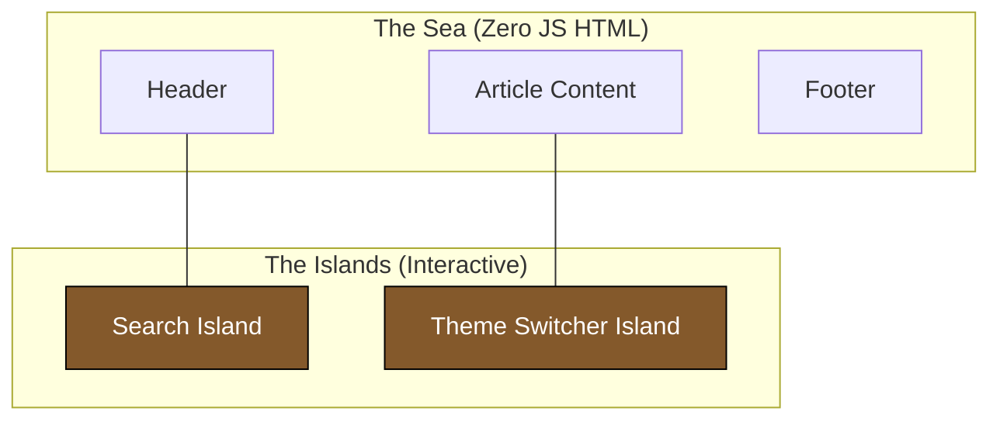

# Islands Architecture

Islands Architecture is a rendering paradigm that encourages the creation of small, completely independent interactive components—"islands"—within a largely static, server-rendered HTML page.

This is the core architecture powering frameworks like **Astro** and **Fresh**.

:::info[Key Idea]
You are shipping a "Sea of Static HTML" with isolated "Interactive Islands" floating in it. The islands boot up (hydrate) independently of each other.
:::

---

## 1. How it works

In standard SPAs (Single Page Applications), the entire page is the application. In Islands Architecture, the page acts as a frame.

1. **HTML First**: The server builds and sends a complete HTML document.
2. **Component Isolation**: Interactive elements (like a carousel or an Add-to-Cart button) are isolated.
3. **Just-in-Time Hydration**: You can declare *when* an island should load its JS. For example, to only load the JS when the user scrolls the island into the viewport.

### The Ecosystem



---

## 2. Astro Specifics (Client Directives)

Astro popularized the use of `client:` directives to control exactly when these islands wake up.

```html
<!-- Astro HTML -->
<body>
  <!-- Static: Zero JS sent to the browser -->
  <ArticleHeader />

  <!-- Hydrates immediately on page load -->
  <ShoppingCart client:load />

  <!-- Hydrates ONLY when the user scrolls to it -->
  <ImageCarousel client:visible />

  <!-- Hydrates ONLY if the user is on a desktop device (media query) -->
  <Sidebar client:media="(min-width: 1024px)" />
</body>
```

:::tip[Interview Insight]
**Q: Can you use React and Vue on the same page with Islands Architecture?**

Yes. Because the main page frame isn't tied to a specific framework's runtime, Island architectures (like Astro) allow multiple frameworks. An island is simply a node that mounts a specific framework script. You could have a React Navbar and a Vue Footer.
:::

---

## 3. Benefits & Drawbacks

### Benefits
- **Zero JS by Default**: Unbeatable baseline performance.
- **Micro-Frontend Flexibility**: Easy to migrate codebases iteratively.
- **Exceptional SEO**: All content is present in the initial HTML payload.

### Drawbacks
- **Inter-Island Communication**: It's harder for Island A to talk to Island B. You must rely on global states like Nano Stores or vanilla JavaScript custom events.
