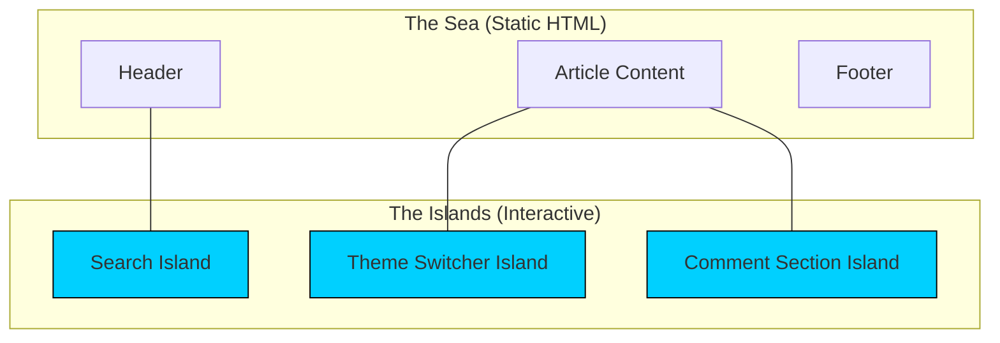

# Islands Architecture

Islands Architecture is a design pattern that encourages the creation of small, independent interactive components (islands) within a largely static, server-rendered HTML document.

It is the architectural implementation of partial hydration, popularized by frameworks like Astro, Fresh, and Marko.

## Internal Working
Instead of building a single SPA that takes over the whole page, Islands Architecture treats the page like a series of "slots."

1. **HTML First**: The server generates a full HTML page.
2. **Component Isolation**: Interactive components are compiled as independent units. They are literally "islands" in a sea of static HTML.
3. **Just-in-Time Hydration**: Islands are hydrated only when necessary (e.g., when visible in the viewport, or only on mobile).
4. **No Shared Runtime (Optional)**: In some implementations (like Astro), different islands can even use different frameworks (e.g., a React search bar and a Svelte toggle on the same page).

### Mermaid Diagram: An Island-Based Page


## Real-World Example: An E-commerce Product Page
- **Static**: Product description, reviews text, technical specs, related products list. These are pure HTML/CSS.
- **Island 1**: "Add to Cart" button (Needs state and click event).
- **Island 2**: Image Carousel (Needs JS for swiping).
- **Island 3**: User Auth Modal.

By isolating these, the user doesn't download the JS for the "Reviews" logic until they decide to interact with a review island.

## Code Snippet: Astro's Island Syntax
```astro
---
// ProductPage.astro
import StaticContent from './StaticContent.astro';
import AddToCartIsland from './AddToCartIsland.jsx';
import CarouselIsland from './CarouselIsland.svelte';
---

<html>
  <body>
    <StaticContent />
    
    <!-- This island hydrates only when the user scrolls to it -->
    <CarouselIsland client:visible />
    
    <!-- This island hydrates immediately -->
    <AddToCartIsland client:load />
    
    <footer>Classic static footer</footer>
  </body>
</html>
```

## Key Idea
Islands Architecture is about **reducing the floor** of your JavaScript bundle. You pay only for what you use, when you use it.

## Why it Matters
- **Superior LCP/FID**: Since the bulk of the page is static HTML, it ships and paints almost instantly.
- **Micro-Framework friendly**: Prevents framework lock-in.
- **Shipping Zero JS**: If a page has no islands, Astro or Fresh will ship exactly 0 bits of JavaScript.

## Interview Insights
- **Q: How does Islands Architecture differ from Micro-Frontends?**
  - A: Islands are fine-grained (at the component level) and usually live within the same repository/deployment. Micro-frontends are usually larger services deployed independently.
- **Q: What is the main drawback of Islands?**
  - A: Communication between islands. Since they aren't part of a single tree, you have to use external methods (Signals, Pub/Sub, or Web APIs) to talk between them.

## Common Mistakes
- **Hydrating Everything**: If you make every component an "island," you've effectively just built a fragmented SPA with more overhead.
- **SEO assumption**: While great for SEO, remember that if an island contains content that *only* renders on the client (not the server), that specific content won't be indexed.

## Comparison: SPA vs. Islands
| Feature | Single Page Application (SPA) | Islands Architecture |
| :--- | :--- | :--- |
| **Initial HTML** | Empty shell | Rich, complete HTML |
| **Interactivity** | Monolithic hydration | Granular hydration |
| **Performance** | Slow TTI (Time to Interactive) | Extremely fast TTI |
| **State Management**| Easy (Context/Redux) | Harder (Global store/Events) |
