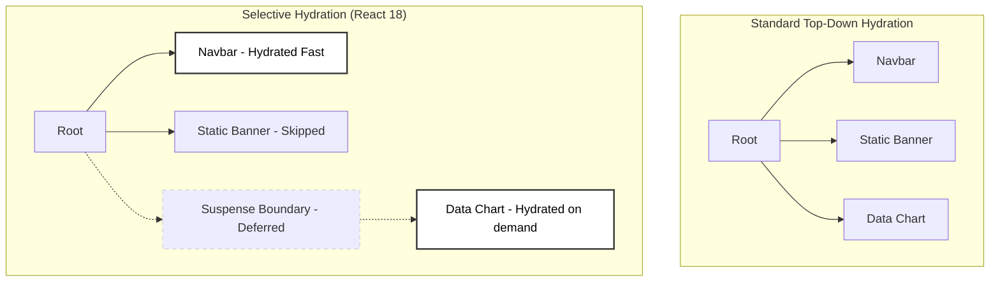

# Partial Hydration (Selective Hydration)

Partial Hydration (or Selective Hydration in React 18 terminology) is an advanced rendering optimization where only specific, interactive portions of a server-rendered page are hydrated, deferring or outright eliminating the evaluation of non-interactive JavaScript.

This directly attacks the primary weakness of traditional hydration: high Total Blocking Time (TBT).

:::info[Core Philosophy]
**Hydrate only what needs interaction**. If a footer component requires no JavaScript events or state bindings, don't execute its JS definition on the client. Just let it remain standard HTML.
:::

---

## 1. Internal Working

Traditional Single-Page Applications perform top-down monolithic hydration. They start at `<App />` and hydrate every node recursively.

Partial Hydration forces the framework compiler to categorize the DOM tree into:
1. **Static Nodes**: Components completely pure and stateless. JS code stripped.
2. **Dynamic Boundaries**: Specific nodes mapped out for deferral.

In React 18, this is heavily coupled with `Suspense`. When React hydrates a page, if it encounters a `<Suspense>` boundary containing an interactive component, it can pause hydration of that slice, prioritize hydrating something else the user is clicking on, and fetch the JS bundle for the suspended code in the background.



---

## 2. React 18 Implementation (TypeScript)

If you load a page heavily dependent on data, you can wrap expensive components in `<Suspense>`. React will render the fallback HTML on the server. On the client, it will hydrate the lightweight components first.

```javascript
import { Suspense, lazy } from 'react';

// Main bundle does not include HeavyChart
const HeavyChart = lazy(() => import('./components/HeavyChart'));

export default function Dashboard() {
  return (
    <div className="layout">
      {/* Navbar hydrates immediately, user can click links */}
      <Navigation />
      
      <main>
        <h1>Performance Stats</h1>
        
        {/* React defers hydration of this tree */}
        <Suspense fallback={<div className="skeleton">Loading visuals...</div>}>
          <HeavyChart dataset="q1" />
        </Suspense>
      </main>
    </div>
  );
}
```

:::warning[The React 18 "Prioritization" Feature]
If `HeavyChart` is loading in the background, but the user rapidly clicks on `Navigation`, React 18's event system detects this and *elevates* the hydration priority of the Navigation component specifically, pausing everything else.
:::

---

## 3. Interview Prep: 5 Key Questions

### Q1: What is the relationship between Code Splitting and Partial Hydration?
**A:** Code Splitting separates the JS bundle into chunks so the browser downloads less upfront. Partial Hydration dictates *when* and *if* those split chunks are actually evaluated by the framework to attach interactivity. You need Code Splitting to efficiently utilize Partial Hydration.

### Q2: How does React 18's Selective Hydration handle user events that occur before a component hydrates?
**A:** React 18 attaches a generic global event listener (event delegation) at the root level very early. If a user clicks an unhydrated component wrapped in Suspense, React catches the event, records it, accelerates the hydration of exactly that component, and then "replays" the event instantly.

### Q3: What is "Resumability" and how does it differ from Partial Hydration?
**A:** Frameworks like Qwik use Resumability. Instead of downloading JS to rebuild the VDOM and attach listeners (Hydration), Resumable frameworks serialize the exact execution state into the HTML itself. When an event fires, the framework simply "resumes" exactly where the server left off, achieving O(1) boot time. Hydration is still O(N) relative to the component tree size.

### Q4: Which architectures strictly enforce complete partial hydration by default?
**A:** Astro and Fresh. In Astro, every single component is treated as static HTML by default unless explicitly marked with a client directive (e.g., `client:load`, `client:idle`).

### Q5: Does Partial Hydration fix layout shifts (CLS)?
**A:** Not inherently. If the server-rendered fallback of a suspended component does not share the exact same dimensions as the hydrated component, a layout shift will still occur when the JS bundle evaluates.
