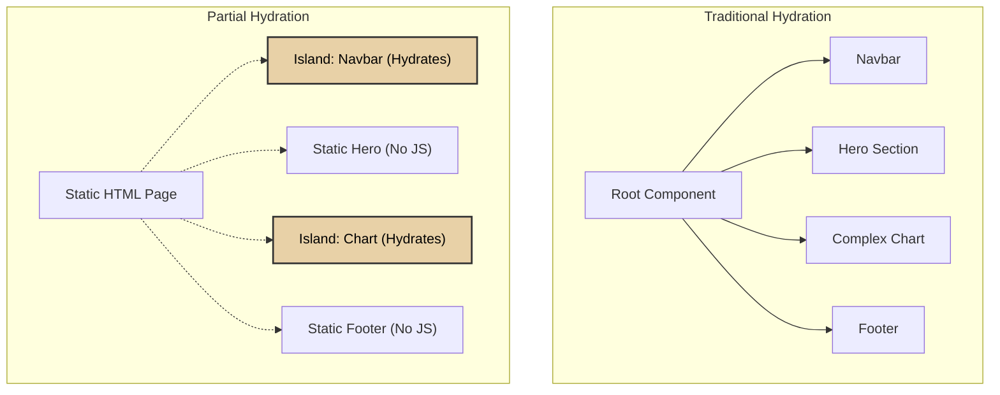

# Partial Hydration

Partial Hydration (also known as Selective Hydration) is an advanced rendering optimization where only specific, interactive portions of a server-rendered page are hydrated, rather than booting up the entire application at once.

This pattern breaks the traditional "all-or-nothing" hydration model.

:::info[Key Idea]
Partial Hydration prioritizes intelligence. You don't pay the JavaScript execution cost for nodes (like pure text or static footers) that don't need interactivity.
:::

---

## 1. Internal Working

In standard hydration, a web page is treated as one monolithic component tree. Even if only a single button is interactive, the entire page's React/Vue component tree must be processed by the browser.

By using partial hydration:
1. **Static Analysis**: The framework determines which components contain state or effects.
2. **Laziness & Splitting**: JS bundles are split. The browser only downloads JS for the interactive bits.
3. **Selective Booting**: Interactive components (often called Islands) hydrate independently. A complex Data Chart can hydrate later, while a simple Theme Toggle hydrates instantly.

### Traditional vs Partial Hydration



---

## 2. Why it Matters

- **Total Blocking Time (TBT)**: Massively reduces execution time on the main thread.
- **Payload Size**: Zero unnecessary JS is shipped over the wire.
- **Uncanny Valley**: Narrows the gap between when a user sees the page and when they can actually interact with it.

:::tip[Interview Insight]
**Q: What is the main drawback of splitting a page into multiple partially hydrated zones?**

State sharing becomes harder. Since standard React Context sits above the tree, multiple disconnected "islands" cannot easily share state. They must rely on global state managers (like Nano Stores) or native DOM Events to communicate.
:::

---

## 3. Real-World Look (React 18 Suspense)

```javascript
import { Suspense, lazy } from 'react';

const HeavyDashboard = lazy(() => import('./HeavyDashboard'));

function App() {
  return (
    <div>
      {/* Static parts */}
      <Header /> 
      
      {/* Suspended boundary hydrates independently */}
      <Suspense fallback={<p>Loading interactive chart...</p>}>
        <HeavyDashboard />
      </Suspense>
    </div>
  );
}
```
