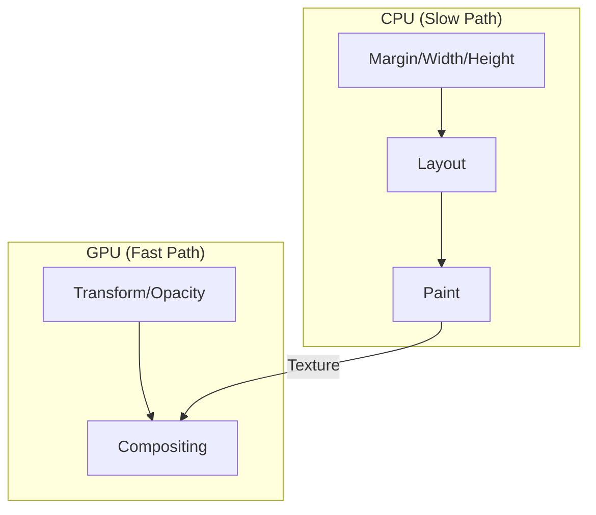

import Tabs from '@theme/Tabs';
import TabItem from '@theme/TabItem';

# GPU Acceleration in CSS

**GPU Acceleration** (or Hardware Acceleration) is the practice of offloading complex rendering tasks from the CPU (Main Thread) to the GPU. In CSS, this is achieved by "promoting" certain elements to their own layers so they can be managed by the browser's Compositor Thread.

:::info[Core Philosophy]
**Smoothness over CPU Cycles**. By moving an animation to the GPU, you ensure that even if the CPU is locked by heavy JavaScript, the animation remains fluid and jank-free at 60fps.
:::

---

## 1. Easy: CPU vs. GPU

- **CPU (Main Thread)**: Handles Layout, Paint, and all your JavaScript. It's like a genius mathematician who can only do one task at a time.
- **GPU (Compositor)**: Handles textures and moving layers. It's like a massive army of students who can instantly slide glass sheets (layers) around without re-calculating everything.



---

## 2. Medium: Triggering the GPU

Historically, developers used "Null Transform" hacks to force an element into its own GPU layer. Today, we have standard hints.
- **Older Hack**: `transform: translateZ(0);` or `transform: translate3d(0,0,0);`
- **Modern Hint**: `will-change: transform;`

**Warning**: Every GPU layer uses physical VRAM. Promoting too many elements to the GPU can crash your browser or cause significant lag due to memory overhead.

---

## 3. Hard: Implementation and Profiling

<Tabs groupId="lang" queryString>
<TabItem value="js" label="JavaScript">

```javascript
// High-performance animation using CSS Variables and GPU
const box = document.querySelector('.gpu-box');

// Set the hint early
box.style.willChange = 'transform';

// Move the logic to the Compositor thread
function moveBox(x, y) {
  // Using transform instead of top/left avoids Layout/Paint
  box.style.transform = `translate3d(${x}px, ${y}px, 0)`;
}
```

</TabItem>
<TabItem value="ts" label="TypeScript">

```typescript
// Managing GPU layers for a complex UI
const enableGPU = (element: HTMLElement): void => {
  // Promoting the element to its own layer
  element.style.setProperty('will-change', 'transform, opacity');
  
  // Backface-visibility: hidden is a common cross-browser 
  // trigger for hardware acceleration
  element.style.setProperty('backface-visibility', 'hidden');
};

const disableGPU = (element: HTMLElement): void => {
  element.style.removeProperty('will-change');
  element.style.removeProperty('backface-visibility');
};
```

</TabItem>
</Tabs>

---

## 4. Advanced: Sub-pixel Rendering and Blur

When an element is promoted to the GPU, it is essentially converted into a **Bitmap (Texture)**. 
1. **Blurring**: If you transform an element to an odd coordinate (e.g., `translate(10.5px)`), the texture might not align with the physical pixels, causing text to look blurry.
2. **Text Anti-aliasing**: macOS and Windows handle sub-pixel anti-aliasing on the CPU. When a layer moves to the GPU, the browser often falls back to grayscale anti-aliasing, which can make text suddenly "thinner" or "thicker" the moment an animation starts.

**Performance Check**: Use the Chrome DevTools "Rendering" tab and check "Layer borders." Green boxes indicate GPU layers.

---

## 5. Interview Prep: 4 Key Questions

### Q1: Why is `translate3d(0,0,0)` used even when the Z-axis is zero?
**A:** This is a "Hardware Acceleration Hint." Older browsers didn't have the `will-change` property. By specifying a 3D transform, developers forced the browser to treat the element as a separate 3D layer, moving it from the CPU (Main Thread) to the GPU (Compositor Thread) for smoother rendering.

### Q2: Is GPU acceleration always better for performance?
**A:** No. Every GPU layer consumes memory (VRAM). On mobile devices with limited memory, creating too many layers ("Layer Explosion") can lead to crashes or slow background tab performance. It also carries an initial overhead of "painting" the element into a texture before it can be handed to the GPU.

### Q3: How do you identify "Jank" in an animation?
**A:** Jank occurs when the browser cannot finish its rendering work within the 16.6ms window (for 60fps). You can identify this using the Performance Tab in DevTools: look for long "Task" bars in the Main thread or dropped frames in the "Frames" row. GPU-accelerated animations using `transform` often bypass these Main thread tasks entirely.

### Q4: Explain the "Composite-Only" property principle.
**A:** To achieve optimal performance, you should only animate properties that the browser can handle in the final **Compositing** stage, skipping Layout and Paint. These are primarily `transform` and `opacity`. Every other property (like `width`, `height`, or `background-color`) requires a re-paint or re-layout on the CPU.
