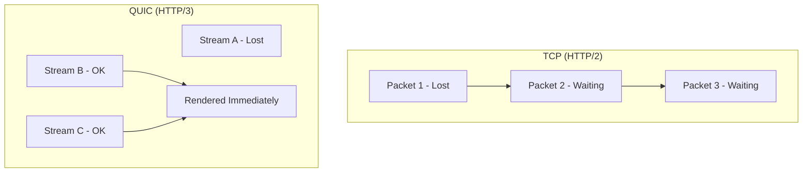

import Tabs from '@theme/Tabs';
import TabItem from '@theme/TabItem';

# HTTP/3 and QUIC

**HTTP/3** is the latest version of the Hypertext Transfer Protocol. Unlike its predecessors, which relied on TCP, HTTP/3 is built on **QUIC** (Quick UDP Internet Connections), a protocol designed by Google to solve the inherent latency and reliability issues of the aging TCP stack.

:::info[Core Philosophy]
**Zero-Wait Connection**. HTTP/3 eliminates the "Head-of-Line Blocking" problem that plagued both HTTP/1.1 and HTTP/2 by treating every stream as an independent entity on top of UDP.
:::

---

## 1. Easy: The Move to UDP

-   **HTTP/1 & 2**: Use **TCP**. TCP ensures everything arrives in order. If Packet 1 is lost, Packet 2 and 3 must wait, even if they arrived perfectly. This is **Head-of-Line (HOL) Blocking**.
-   **HTTP/3**: Uses **UDP**. UDP doesn't care about order at the network layer. QUIC handles the ordering inside the protocol itself, so if one stream loses a packet, other streams keep moving.



---

## 2. Medium: 0-RTT and Connection Migration

-   **0-RTT Handshake**: In TCP+TLS, a connection requires multiple round-trips before data can be sent. QUIC combines the transport and security handshakes, allowing data to be sent on the very first packet if the client has connected before.
-   **Connection Migration**: If you switch from Wi-Fi to 5G, a TCP connection breaks (because your IP changed). QUIC uses **Connection IDs**, allowing the transfer to continue seamlessly even if your IP or network changes.

---

## 3. Hard: Implementation and QPACK

<Tabs groupId="lang" queryString>
<TabItem value="js" label="JavaScript">

```javascript
// Browsers handle HTTP/3 negotiation automatically via Alt-Svc
// You can check if a site is using H3 in the DevTools Network Tab
async function checkH3Support(url) {
  const response = await fetch(url);
  // Modern browsers expose the protocol used
  console.log(`Connected via: ${response.type}`); 
  // Look for 'h3' in the 'Protocol' column of Network tab
}
```

</TabItem>
<TabItem value="ts" label="TypeScript">

```typescript
// Conceptual: Server-side H3 headers
interface H3Config {
  altSvc: string; // e.g. 'h3=":443"; ma=86400'
}

const enableH3 = (res: any, config: H3Config) => {
  // Telling the browser that an H3 endpoint is available
  res.setHeader('Alt-Svc', config.altSvc);
};
```

</TabItem>
</Tabs>

---

## 4. Advanced: Why not just update TCP?

Updating TCP is nearly impossible because of **"Ossification."** Every router and firewall between you and the server understands TCP. If you change a single bit in the TCP header, these middle-boxes might drop the packet thinking it's a virus. By building QUIC on top of **UDP payloads**, the entire protocol is encrypted, making it invisible to middle-boxes and allowing the protocol to evolve without breaking the internet.

---

## 5. Interview Prep: 4 Key Questions

### Q1: What is "Head-of-Line Blocking" in HTTP/2?
**A:** In HTTP/2, all streams are multiplexed over a single TCP connection. Because TCP requires packets to be delivered in strict order, if a single packet is lost at the network layer, the entire TCP connection stops. Even if packets for other streams have arrived, they cannot be processed until the lost packet is re-transmitted. HTTP/3 solves this by using independent streams over UDP.

### Q2: Explain "0-RTT" and its impact on performance.
**A:** 0-RTT (Zero Round-Trip Time) allows a client to send encrypted data to a server in the very first packet of a connection, provided they have communicated previously. In traditional TLS 1.2 over TCP, this could take 3-4 round-trips before the first byte of data was sent. 0-RTT significantly reduces "Time to First Byte" (TTFB), especially on high-latency mobile networks.

### Q3: How does HTTP/3 handle network switching (e.g., Wi-Fi to LTE)?
**A:** HTTP/3 uses **Connection IDs** instead of the "IP+Port" tuple used by TCP. When a user switches networks, their IP address changes. In TCP, this resets the connection. In HTTP/3, the client sends the same Connection ID from the new IP, and the server continues the stream as if nothing happened. This is called **Connection Migration**.

### Q4: What is QPACK and why was HPACK replaced?
**A:** HPACK (HTTP/2's header compression) relied on a strict ordering of headers. Since HTTP/3 allows streams to arrive out of order, HPACK would have re-introduced Head-of-Line blocking. **QPACK** was designed to allow for parallel, out-of-order header decompression, ensuring that the benefits of UDP are not lost at the application layer.
