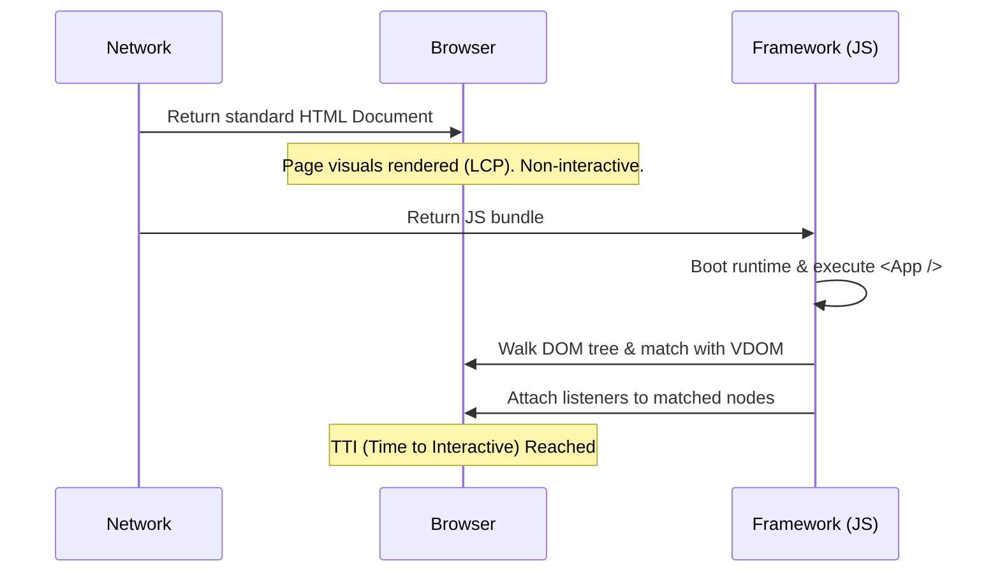

import Tabs from '@theme/Tabs';
import TabItem from '@theme/TabItem';

# Hydration (Deep Dive)

Hydration is the mechanism by which a modern JavaScript framework (like React, Vue, or Solid) attaches event listeners and instantiates state on a static, server-rendered DOM tree without recreating the DOM nodes from scratch.

This is the foundational pillar of **SSR (Server-Side Rendering)** and **SSG (Static Site Generation)** architectures.

:::info[Core Philosophy]
**Re-use over Re-creation**. Hydration assumes the DOM structure shipped by the server is structurally identical to the initial render tree produced by the Virtual DOM algorithm on the client. It walks the existing DOM, "claims" the nodes, and makes them interactive.
:::

---

## 1. Architectural Flow (The Replay Phase)

When the browser receives the HTML from the server, it is "dry" (static). The browser must boot up the client-side JavaScript engine to "water" (hydrate) it.

1. **Parse HTML**: Browser renders the visual shell immediately (Fast LCP).
2. **Download & Execute JS**: Framework libraries load.
3. **Re-render locally**: The framework renders the root component *in memory* to create a Virtual DOM.
4. **Hydrate / Match**: The framework walks the real DOM and the Virtual DOM simultaneously, ensuring they perfectly match.
5. **Attach Listeners**: `onClick`, `onScroll`, etc., are bound to the real DOM nodes.



---

## 2. Server vs Client Code Execution

<Tabs groupId="lang" queryString>
<TabItem value="js" label="JavaScript">

```javascript
// Server-Side: Generating the initial "Dry" HTML string
import { renderToString } from 'react-dom/server';
import { App } from './App';

export function handleRequest(req, res) {
  const htmlString = renderToString(<App />);
  res.send(`
    <html>
      <body>
        <div id="root">${htmlString}</div>
        <script src="/client-bundle.js"></script>
      </body>
    </html>
  `);
}

// ==============

// Client-Side: Bootstrapping and Hydrating
import { hydrateRoot } from 'react-dom/client';
import { App } from './App';

const rootNode = document.getElementById('root');

if (rootNode) {
  hydrateRoot(rootNode, <App />);
}
```

</TabItem>
<TabItem value="ts" label="TypeScript">

```typescript
// Server-Side: Generating the initial "Dry" HTML string
import { renderToString } from 'react-dom/server';
import { App } from './App';

export function handleRequest(req: Request, res: Response) {
  const htmlString = renderToString(<App />);
  res.send(`
    <html>
      <body>
        <div id="root">${htmlString}</div>
        <script src="/client-bundle.js"></script>
      </body>
    </html>
  `);
}

// ==============

// Client-Side: Bootstrapping and Hydrating
import { hydrateRoot } from 'react-dom/client';
import { App } from './App';

const rootNode = document.getElementById('root');

if (rootNode) {
  hydrateRoot(rootNode, <App />);
}
```

</TabItem>
</Tabs>

---

## 3. Hydration Mismatches (The Danger Zone)

A Mismatch occurs when the Server HTML output and the initial Client Virtual DOM output differ. React cannot efficiently reconcile this and falls back to completely wiping the tree and recreating it (Client-Side Rendering), destroying the performance gains of SSR.

### Common Mismatch Causes:
1. **Invalid HTML Nesting**: Writing `<p><div></div></p>`. The browser's native parser will automatically fix this to `<p></p><div></div><p></p>` before JS runs, breaking the match.
2. **Browser-only APIs**: Using `typeof window !== 'undefined'` to conditionally render content.
3. **Non-deterministic data**: Using `Math.random()` or `new Date()` directly in render.

:::tip[How to fix random data mismatches]
Wait until hydration completes (via `useEffect`) to update the DOM with dynamic data.

<Tabs groupId="lang" queryString>
<TabItem value="js" label="JavaScript">

```javascript
import { useState, useEffect } from 'react';

function ClientDate() {
  const [date, setDate] = useState(null);

  useEffect(() => {
    // This only runs ON THE CLIENT after hydration
    setDate(new Date().toLocaleTimeString());
  }, []);

  return <div>{date ?? 'Loading time...'}</div>;
}
```

</TabItem>
<TabItem value="ts" label="TypeScript">

```typescript
import { useState, useEffect } from 'react';

function ClientDate() {
  const [date, setDate] = useState<string | null>(null);

  useEffect(() => {
    // This only runs ON THE CLIENT after hydration
    setDate(new Date().toLocaleTimeString());
  }, []);

  return <div>{date ?? 'Loading time...'}</div>;
}
```

</TabItem>
</Tabs>
:::

---

## 4. Interview Prep: 5 Key Questions

### Q1: What is the defining difference between Client-Side Rendering (CSR) and Hydration?
**A:** In CSR, the standard entry point (`createRoot` in React) wipes the node empty and replaces it with a fully new DOM. In Hydration (`hydrateRoot`), the framework expects the DOM to already be perfectly populated and only traverses it to attach memory references and event listeners.

### Q2: Why does standard Hydration negatively impact TTI/FID?
**A:** "The Uncanny Valley". Because standard hydration works top-down, the engine must execute the *entire* application component tree before the page becomes fully interactive. If the JS bundle is massive, the main thread locks up.

### Q3: How do you suppress unavoidable Hydration Warnings in React?
**A:** You can use the `suppressHydrationWarning=true` prop on elements where standard mismatches are acceptable (e.g., timestamps). However, this only suppresses text-content level warnings, not structural DOM layout mismatches.

### Q4: Does Hydration block the main thread?
**A:** Yes, historically it has been synchronous and blocked the main thread. React 18 introduced concurrent features that allow Hydration to be interrupted and prioritized if the user interacts with specific elements.

### Q5: What is "Double Rendering"?
**A:** When a severe structural mismatch occurs during hydration, React 16/17 would discard the server HTML, re-render the components from scratch, and replace the DOM (Double Render). This causes extreme layout shifts (CLS) and performance degradation.
