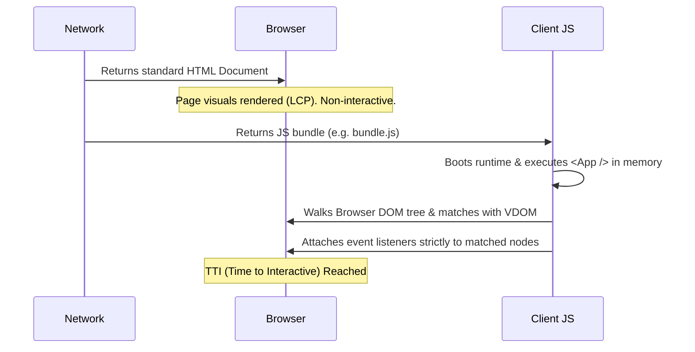

import Tabs from '@theme/Tabs';
import TabItem from '@theme/TabItem';

# Hydration (Deep Dive)

Hydration is the mechanism by which a modern JavaScript framework (like React, Vue, or Solid) attaches event listeners and instantiates state on a static, server-rendered DOM tree without recreating the DOM nodes from scratch.

This is the foundational pillar of **SSR (Server-Side Rendering)** and **SSG (Static Site Generation)** architectures.

:::info[Core Philosophy]
**Re-use over Re-creation**. Hydration assumes the DOM HTML shipped by the server is structurally identical to the initial render tree produced by the Virtual DOM algorithm on the client. It walks the existing physical DOM, "claims" the nodes in memory, and makes them interactive.
:::

---

## 1. Easy: The Problem with Pure HTML

When you visit a Server-Side Rendered (SSR) React app, the server returns an HTML string. The browser parses it instantly and displays the UI. This is why SSR sites paint to the screen so fast.

However, buttons don't work, and inputs are locked. Why? Because pure HTML doesn't contain your JavaScript `onClick()` handlers or `useState` logic. The page is completely **Dry** (static). 

The browser must download your React JS bundle, execute it, and **Water** (Hydrate) the UI to bring it to life.

---

## 2. Medium: Architectural Flow (The Replay Phase)

To hydrate properly, the client JS essentially has to "replay" the exact same render that the server just did to guarantee they match, then stitch the logic onto the UI.

1. **Parse HTML**: Browser renders the visual shell immediately (Fast LCP).
2. **Download JS**: Framework libraries load.
3. **Re-render locally**: The framework runs your components *in memory* to create a fresh Virtual DOM.
4. **Hydrate / Match**: The framework walks the real DOM and the Virtual DOM simultaneously.
5. **Attach Listeners**: Interactive events are bound to the exact right physical nodes.



---

## 3. Hard: Server vs Client Execution Code

Hydration requires unique entry points in your code depending on which environment is running.

<Tabs groupId="lang" queryString>
<TabItem value="js" label="JavaScript">

```javascript
// SERVER-SIDE: Generating the initial "Dry" HTML string
import { renderToString } from 'react-dom/server';
import { App } from './App';

export function handleRequest(req, res) {
  const htmlString = renderToString(<App />);
  res.send(`
    <html>
      <body>
        <div id="root">${htmlString}</div>
        <script src="/client-bundle.js"></script>
      </body>
    </html>
  `);
}

// ==============

// CLIENT-SIDE: Bootstrapping and Hydrating the App
import { hydrateRoot } from 'react-dom/client';
import { App } from './App';

const rootNode = document.getElementById('root');

if (rootNode) {
  // We use hydrateRoot instead of createRoot!
  hydrateRoot(rootNode, <App />);
}
```

</TabItem>
<TabItem value="ts" label="TypeScript">

```typescript
// SERVER-SIDE: Generating the initial "Dry" HTML string
import { renderToString } from 'react-dom/server';
import { App } from './App';
import type { Request, Response } from 'express';

export function handleRequest(req: Request, res: Response) {
  const htmlString = renderToString(<App />);
  res.send(`
    <html>
      <body>
        <div id="root">${htmlString}</div>
        <script src="/client-bundle.js"></script>
      </body>
    </html>
  `);
}

// ==============

// CLIENT-SIDE: Bootstrapping and Hydrating the App
import { hydrateRoot } from 'react-dom/client';
import { App } from './App';

const rootNode = document.getElementById('root');

if (rootNode) {
  // We use hydrateRoot instead of createRoot!
  hydrateRoot(rootNode, <App />);
}
```

</TabItem>
</Tabs>

---

## 4. Advanced: Hydration Mismatches (The Danger Zone)

A **Mismatch** occurs when the Server HTML output and the initial Client Virtual DOM output differ. React cannot safely stitch the logic together, so it falls back to completely wiping the tree and recreating it (Client-Side Rendering), violently destroying the performance gains of SSR.

### Common Mismatch Causes:
1. **Browser-only APIs**: Using `typeof window !== 'undefined'` to conditionally render content. The server renders branch A, but the client instantly evaluates `window` and renders branch B.
2. **Non-deterministic data**: Using `Math.random()` or `new Date()` directly in the render phase.

:::tip[How to safe-guard dynamic data]
Wait until hydration explicitly completes (via `useEffect`) to update the DOM with dynamic data.

<Tabs groupId="lang" queryString>
<TabItem value="js" label="JavaScript">

```javascript
import { useState, useEffect } from 'react';

function ClientDate() {
  const [date, setDate] = useState(null); // Keep states matching initially!

  useEffect(() => {
    // This only runs ON THE CLIENT natively AFTER hydration finishes safely
    setDate(new Date().toLocaleTimeString());
  }, []);

  return <div>{date ?? 'Loading time from client...'}</div>;
}
```

</TabItem>
<TabItem value="ts" label="TypeScript">

```typescript
import { useState, useEffect } from 'react';

function ClientDate() {
  const [date, setDate] = useState<string | null>(null);

  useEffect(() => {
    setDate(new Date().toLocaleTimeString());
  }, []);

  return <div>{date ?? 'Loading time from client...'}</div>;
}
```

</TabItem>
</Tabs>
:::

---

## 5. Interview Prep: 4 Key Questions

### Q1: What is the defining difference between Client-Side Rendering (CSR) and Hydration?
**A:** In CSR, the standard entry point (`createRoot` in React) wipes the HTML root node completely empty and replaces it with a fully new DOM payload generated by JS. In Hydration (`hydrateRoot`), the framework mathematically expects the DOM to *already* be perfectly populated by the server and only traverses it to attach memory references and event listeners.

### Q2: Why does standard Monolithic Hydration negatively impact TTI/FID?
**A:** The "Uncanny Valley" problem. Because standard hydration works top-down, the engine must execute the *entire* application component tree before the page becomes fully interactive. If the JS bundle is massive, the main thread locks up, causing the user to click unresponsive buttons for multiple seconds.

### Q3: How do you deliberately suppress unavoidable Hydration Warnings in React?
**A:** You can use the `suppressHydrationWarning={true}` prop on specific physical DOM elements where standard mismatches are acceptable (e.g., timestamps from an external server). However, this only suppresses text-content level warnings, not severe structural DOM layout mismatches.

### Q4: What is "Double Rendering" in severe mismatch cases?
**A:** When a severe structural mismatch occurs during hydration (e.g. nesting a `<div>` inside a `<p>`), React discards the highly optimized server HTML, forcefully re-renders the components entirely from scratch, and replaces the DOM physically. This causes extreme layout shifts (CLS) and heavily punishes mobile device performance.
