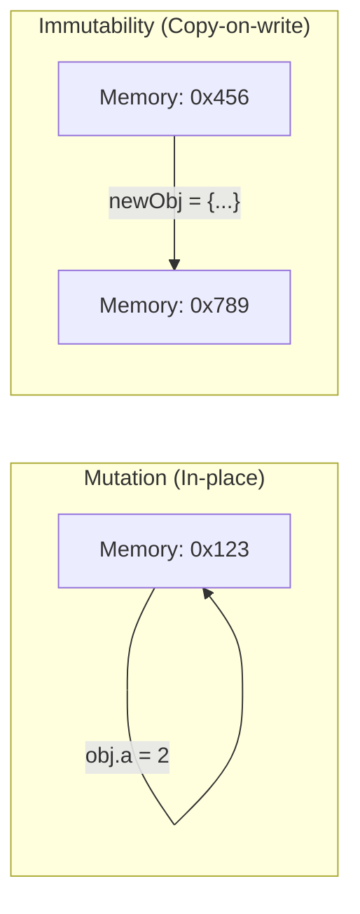

import Tabs from '@theme/Tabs';
import TabItem from '@theme/TabItem';

# Immutable Data Patterns

In modern frontend architecture, **Immutability** is a requirement for predictable state change detection and performance. It is the concept that data, once created, cannot be changed.

:::info[Core Philosophy]
**Data as a Snapshot**. Instead of modifying an existing object in memory (Mutation), we treat state as a read-only series of snapshots. To "change" something, we generate a brand new snapshot.
:::

---

## 1. Easy: Mutation vs. Immutability

When you **mutate** an object (`obj.a = 2`), the memory address (pointer) stays the same. The computer knows the *content* changed, but it has to traverse the entire object to find out *what* changed. This is slow for large apps.

With **Immutability**, we never change the original. We create a copy with the change.



---

## 2. Medium: Common Patterns for State

Efficiently updating state requires moving away from methods that mutate (`push`, `pop`, `splice`) toward those that return new instances (`map`, `filter`, `slice`, `spread`).

<Tabs groupId="lang" queryString>
<TabItem value="js" label="JavaScript">

```javascript
// 1. Updating Nested Objects
const state = { id: 1, info: { name: "React" } };
const nextState = { ...state, info: { ...state.info, name: "Next.js" } };

// 2. Inserting into Arrays
const items = [1, 3];
const inserted = [...items.slice(0, 1), 2, ...items.slice(1)]; // [1, 2, 3]

// 3. Conditional Update (Arrays)
const users = [{id: 1, role: 'user'}, {id: 2, role: 'user'}];
const updated = users.map(u => u.id === 2 ? { ...u, role: 'admin' } : u);
```

</TabItem>
<TabItem value="ts" label="TypeScript">

```typescript
interface User { id: number; role: string; }

const promoteUser = (users: User[], targetId: number): User[] => {
  return users.map(user => 
    user.id === targetId 
      ? { ...user, role: 'admin' } 
      : user
  );
};

// Returns a brand new array reference without touching the original
```

</TabItem>
</Tabs>

---

## 3. Hard: Deep Immutability and Proxies

Manual spreading becomes a "syntactic nightmare" when data is 4-5 levels deep. This is where **Immer** wins. It uses the standard **JavaScript Proxy API** to track "mutations" on a draft and converts them into immutable operations automatically.

```javascript
import { produce } from "immer";

const state = {
  users: {
    1: { name: "John", stats: { loginCount: 5 } }
  }
};

const nextState = produce(state, draft => {
  // We code like it's 1999 (Mutating!)
  draft.users[1].stats.loginCount++;
});
```

---

## 4. Advanced: Persistent Data Structures

Under the hood, real-world immutable libraries don't just "spread objects." They use **Vector Tries**. When you update index `5000` of a 10,000 item list, a Vector Trie only recreates 3-4 internal "nodes" in a tree rather than copying all 10,000 items. This allows immutable updates to stay at **O(log N)** performance, which is effectively constant time for web apps.

---

## 5. Interview Prep: 4 Key Questions

### Q1: Why is `Object.freeze()` not recommended for React state?
**A:** `Object.freeze()` is a runtime restriction—it prevents mutation but it doesn't help you *derive* a new state. It's also shallow (doesn't freeze nested objects) and has a performance penalty when used extensively in large component trees.

### Q2: Is the spread operator `{...obj}` a "Deep Copy" or "Shallow Copy"?
**A:** It is a **Shallow Copy**. It only copies the top-level references. If you have nested objects, those objects are shared by reference between the old and new state (Structural Sharing). This is good for performance but means you must continue spreading for any nested updates.

### Q3: How does immutability enable "Time Travel Debugging"?
**A:** Because previous states are never destroyed or modified, a state manager (like Redux) can simply keep an array of all previous state snapshots in memory. To "go back in time," you just swap the current state pointer to a previous snapshot in the array.

### Q4: Which Array methods must be strictly avoided in React state setters?
**A:** Avoid any method that changes the array "in-place": `push()`, `pop()`, `shift()`, `unshift()`, `splice()`, `reverse()`, and `sort()`. These change the data but *preserve* the memory reference, meaning React's `oldState === newState` check will return **true**, and your UI will not update.
