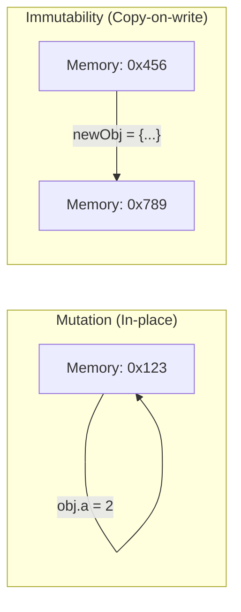

import Tabs from '@theme/Tabs';
import TabItem from '@theme/TabItem';

# Immutable Data Patterns

In modern frontend architecture, **Immutability** is not just a preference—it's a requirement for predictable state change detection and performance.

:::info[Core Philosophy]
**Data as a Snapshot**. Instead of modifying an existing object in memory (Mutation), we treat state as a read-only series of snapshots. To "change" something, we generate a brand new snapshot.
:::

---

## 1. Mutation vs. Immutability

When you mutate an object, the reference (pointer) remains the same. The computer knows the *content* changed, but it has to traverse the entire object to find out *what* changed.



---

## 2. Patterns for Common Operations

Efficiently updating state requires moving away from methods that mutate (`push`, `pop`, `splice`) toward those that return new instances (`map`, `filter`, `slice`, `spread`).

<Tabs groupId="lang" queryString>
<TabItem value="js" label="JavaScript">

```javascript
// 1. Updating Nested Objects
const state = { id: 1, info: { name: "React" } };
const nextState = { ...state, info: { ...state.info, name: "Next.js" } };

// 2. Inserting in Arrays
const items = [1, 3];
const inserted = [...items.slice(0, 1), 2, ...items.slice(1)]; // [1, 2, 3]

// 3. Updating Array of Objects
const users = [{id: 1, role: 'admin'}, {id: 2, role: 'user'}];
const updatedUsers = users.map(u => u.id === 2 ? { ...u, role: 'admin' } : u);
```

</TabItem>
<TabItem value="ts" label="TypeScript">

```typescript
interface User { id: number; role: string; }

const promoteUser = (users: User[], targetId: number): User[] => {
  return users.map(user => 
    user.id === targetId 
      ? { ...user, role: 'admin' } 
      : user
  );
};

// Returns a brand new array reference
```

</TabItem>
</Tabs>

---

## 3. Proxy-based Immutability (Immer)

The community favorited **Immer** because it allows you to write "mutating" code inside a safe proxy wrapper.

```javascript
import produce from "immer";

const baseState = [{ todo: "Learn React", done: true }];

const nextState = produce(baseState, draftState => {
    draftState.push({ todo: "Tweet about it" });
    draftState[0].done = false;
});
```

Under the hood, Immer uses the standard **JavaScript Proxy API** to track every move you make on `draftState` and then applies the equivalent immutable spread operations to produce a final `nextState`.

---

## 4. Interview Prep: 4 Key Questions

### Q1: Why is `Object.freeze()` not enough for true immutability in React?
**A:** `Object.freeze()` is a runtime "lock". It prevents mutation but it doesn't help you *create* the next state. Furthermore, it's shallow—it doesn't freeze nested objects. It also has a performance overhead during development.

### Q2: Explain the difference between `Shallow Copy` and `Deep Copy` in the context of state updates.
**A:** A **Shallow Copy** (spread operator) only copies the top-level references. Nested objects still point to the original memory addresses (see Structural Sharing). A **Deep Copy** duplicates the entire tree. For 99% of React apps, **Shallow Copy** is preferred because Deep Copy destroys performance and Breaks `React.memo` by changing every reference in the tree.

### Q3: How does immutability enable "Time Travel Debugging"?
**A:** Because previous states are never mutated or destroyed, Redux/State managers can simply keep an array of state snapshots. Moving "back in time" is as simple as swapping the current state pointer to a previous object in the history array.

### Q4: Which Array methods should be avoided when using React state?
**A:** Avoid `push()`, `pop()`, `shift()`, `unshift()`, `splice()`, `reverse()`, and `sort()`. These methods mutate the array in-place. If you use them, React won't see a new reference, will evaluate `oldState === newState` as **true**, and will fail to trigger a re-render.
