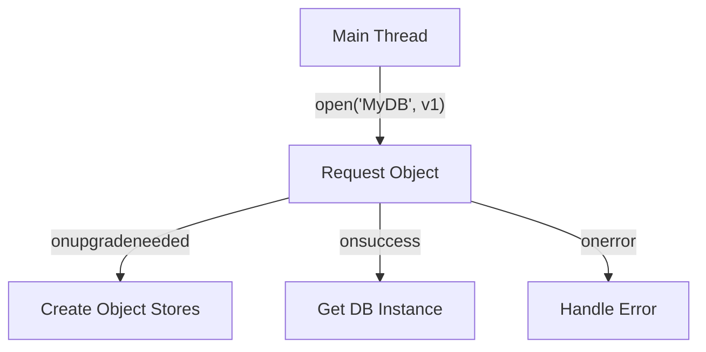

import Tabs from '@theme/Tabs';
import TabItem from '@theme/TabItem';

# IndexedDB

**IndexedDB** is a low-level API for client-side storage of significant amounts of structured data, including files/blobs. It is a transactional, object-oriented database system designed to be highly scalable and fast.

:::info[Core Philosophy]
**Transactional & Asynchronous**. IndexedDB is not a simple Key-Value store like `localStorage`. It is a full NoSQL database that requires transactions to read/write, ensuring data integrity even if the browser crashes.
:::

---

## 1. Easy: Opening a Database

Unlike synchronized storage, IndexedDB works with **Requests**. You open a database, and the browser notifies you when it is ready.



---

## 2. Medium: Transactions and CRUD

Every operation in IndexedDB must happen within a **Transaction**. This ensures that multiple operations succeed or fail as a single unit.

---

## 3. Hard: Implementation and Cursors

For large datasets, you cannot just fetch everything into memory. You must use a **Cursor** to iterate through the data.

<Tabs groupId="lang" queryString>
<TabItem value="js" label="JavaScript">

```javascript
// Opening and Reading with a Cursor
const request = indexedDB.open("NotesDB", 1);

request.onupgradeneeded = (e) => {
  const db = e.target.result;
  db.createObjectStore("notes", { keyPath: "id", autoIncrement: true });
};

request.onsuccess = (e) => {
  const db = e.target.result;
  const tx = db.transaction("notes", "readonly");
  const store = tx.objectStore("notes");
  const cursorRequest = store.openCursor();

  cursorRequest.onsuccess = (e) => {
    const cursor = e.target.result;
    if (cursor) {
      console.log("Note:", cursor.value);
      cursor.continue(); // Move to the next record
    }
  };
};
```

</TabItem>
<TabItem value="ts" label="TypeScript">

```typescript
// Transactional Write with Type Safety
interface Note {
  title: string;
  content: string;
}

const saveNote = async (db: IDBDatabase, note: Note): Promise<void> => {
  return new Promise((resolve, reject) => {
    const transaction = db.transaction("notes", "readwrite");
    const store = transaction.objectStore("notes");
    const request = store.add(note);

    request.onsuccess = () => resolve();
    request.onerror = () => reject(request.error);
  });
};
```

</TabItem>
</Tabs>

---

## 4. Advanced: Versioning and Migrations

The `onupgradeneeded` event is the only place where you can change the database structure (create/delete object stores or indexes). 
- **Versioning**: When you change the version number in `open()`, the browser triggers the upgrade event.
- **Indexes**: You can create indexes to search for non-primary key data (e.g., searching notes by "category").

---

## 5. Interview Prep: 4 Key Questions

### Q1: Why use IndexedDB over localStorage?
**A:** `localStorage` is synchronous, limited to ~5MB, and only stores strings. **IndexedDB** is asynchronous (non-blocking), can store gigabytes of data, supports complex data types (Blobs, Files, Objects), and uses transactions for data integrity.

### Q2: What is the purpose of the `onupgradeneeded` event?
**A:** This is a special lifecycle event triggered when a database is opened with a higher version number than the one currently stored. It is the **only** time you are allowed to create or modify "Object Stores" (tables) or "Indexes."

### Q3: Explain the benefit of "Read-Only" transactions.
**A:** Transactions can be `readonly` or `readwrite`. By explicitly using `readonly`, multiple transactions can occur in parallel to the same object store. If a transaction is `readwrite`, it locks the object store, preventing other transactions from starting until it finishes.

### Q4: How do you handle "Key Collision" in IndexedDB?
**A:** If you try to `add()` an object with an ID that already exists, the request will fail with a `ConstraintError`. To avoid this, either use `keyPath: "id", autoIncrement: true` to let the DB generate unique keys, or use the `put()` method, which performs an "upsert" (replaces the existing object if the key matches).
