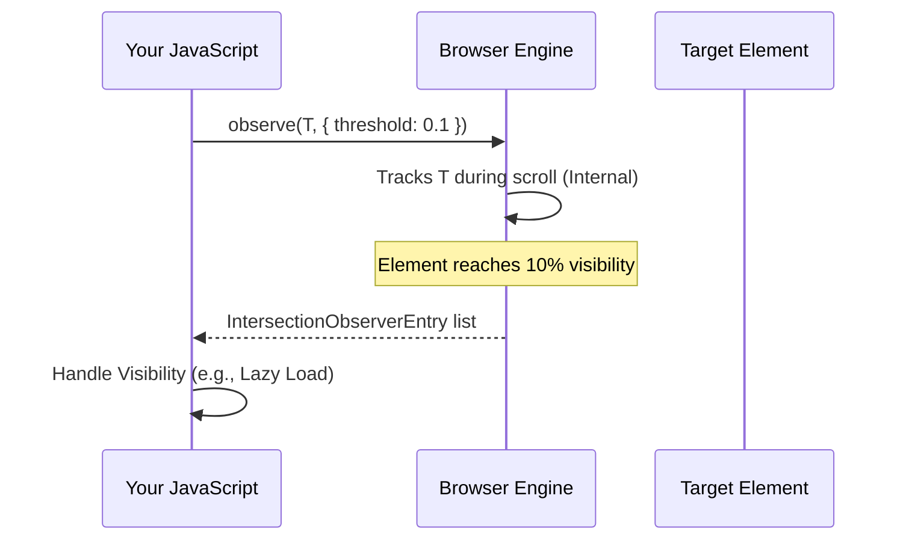

import Tabs from '@theme/Tabs';
import TabItem from '@theme/TabItem';

# Intersection Observer Internals

The **Intersection Observer API** provides a way to asynchronously observe changes in the intersection of a target element with an ancestor element or with a top-level document's viewport.

:::info[Core Philosophy]
**Efficient Tracking**. Traditionally, tracking an element's visibility required listening for `scroll` events on the main thread, which triggered heavy calculations 60 times a second. Intersection Observer offloads this "measurement" work to the browser's internal engine, only notifying your JS when a threshold is met.
:::

---

## 1. Easy: The Basic Watcher

Instead of checking "Where is the element?" every few milliseconds, you tell the browser: "Tell me when 10% of this element is visible."



---

## 2. Medium: Config (Root, Margin, Threshold)

- **Root**: The "frame" we are checking against (default is the viewport).
- **RootMargin**: A "buffer" around the root (e.g., `100px` to start loading an image before it actually enters the screen).
- **Threshold**: An array (e.g., `[0, 0.5, 1]`) indicating at which percentages of visibility the callback should run.

---

## 3. Hard: Implementation and Edge Cases

<Tabs groupId="lang" queryString>
<TabItem value="js" label="JavaScript">

```javascript
// A robust infinite scroll implementation
const observer = new IntersectionObserver((entries) => {
  entries.forEach(entry => {
    // entry.isIntersecting is more reliable than checking ratios
    if (entry.isIntersecting) {
      loadMoreData();
      // Unobserve if you only need the event once (e.g. Lazy Loading)
      // observer.unobserve(entry.target);
    }
  });
}, {
  rootMargin: '200px', // Pre-fetch content
  threshold: 1.0       // Fire only when 100% visible
});

const sentinel = document.querySelector('#footer-sentinel');
observer.observe(sentinel);
```

</TabItem>
<TabItem value="ts" label="TypeScript">

```typescript
// Managing many observations efficiently
interface ObserverOptions {
  threshold: number | number[];
  rootMargin?: string;
}

class SentinelManager {
  private observer: IntersectionObserver;

  constructor(options: ObserverOptions) {
    this.observer = new IntersectionObserver(this.handleIntersect, options);
  }

  private handleIntersect: IntersectionObserverCallback = (entries) => {
    for (const entry of entries) {
      if (entry.isIntersecting) {
        console.log("Element visible:", (entry.target as HTMLElement).dataset.id);
      }
    }
  };

  public watch(el: HTMLElement) {
    this.observer.observe(el);
  }
}
```

</TabItem>
</Tabs>

---

## 4. Advanced: Asynchronicity and Precision

1.  **Event Timing**: Callbacks are **not** synchronous with the scroll. The browser delivers them when it has "free time" (usually at the end of a frame). This means `isIntersecting` can sometimes feel slightly delayed, which is a deliberate performance trade-off.
2.  **Thread Safety**: The measurement logic runs in the browser's background rendering thread, not your JS thread. This prevents "Layout Thrashing" because your JS isn't calling `getBoundingClientRect()` repeatedly.

---

## 5. Interview Prep: 4 Key Questions

### Q1: Why is Intersection Observer better than `window.addEventListener('scroll', ...)`?
**A:** Standard scroll listeners run on the main thread and often require calling `getBoundingClientRect()`, which forces a **synchronous reflow (layout)**. If done frequently, this causes significant "Jank." Intersection Observer is handled by the browser's rendering engine asynchronously, decoupled from the main thread, leading to much smoother 60fps performance.

### Q2: How do you handle an element that is already visible when `observe()` is called?
**A:** The Intersection Observer is designed to fire the callback **immediately** after `observe()` is called, providing an initial status of the element's visibility. You don't need a separate "check on mount" logic; the first entry in the callback will tell you the current state.

### Q3: What is the purpose of `rootMargin`?
**A:** `rootMargin` acts like a CSS margin for the "intersection box." It allows you to grow or shrink the area used for intersection testing. For example, a `rootMargin: '200px'` will trigger the intersection callback when the element is still 200px away from the viewport, which is perfect for lazy-loading images or pre-fetching data before the user reaches it.

### Q4: Can Intersection Observe track elements in an `<iframe>`?
**A:** Yes, but with restrictions. If the iframe is from the same origin, you can set the `root` to an element in the parent document. If it is cross-origin, the observer will only track the intersection with the top-level viewport, and you won't be able to customize the `root`.
