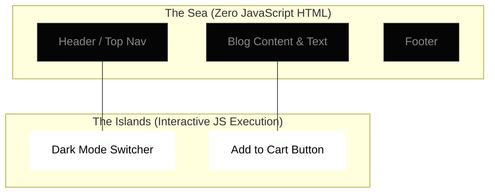

import Tabs from '@theme/Tabs';
import TabItem from '@theme/TabItem';

# Islands Architecture

Islands Architecture is a rendering paradigm that encourages the creation of small, entirely isolated interactive components—called "Islands"—within an otherwise completely static, zero-JavaScript HTML shell.

Pioneered largely by Jason Miller (Preact) and popularized heavily by the **Astro** framework, it aims to deliver the baseline performance of Static Site Generation while optionally maintaining the rich interactivity of Single-Page Applications natively.

:::info[Core Philosophy]
**Assume Static by Default.** The framework compiler mathematically assumes every component you write is pure HTML and strips out its associated JavaScript completely from the client bundle. Developers must explicitly opt-in to interactivity on a granular per-component basis.
:::

---

## 1. Easy: The Sea and The Islands

Think of your webpage as an Ocean of static HTML (The Sea). It is incredibly fast, but nothing moves. Everything from your `Header`, `Blog Text`, and `Footer` lives in the sea.

If you need a button that opens a `Modal`, or a `DarkModeSwitcher`, you declare those specific components as **Islands**. Only those isolated islands download and execute JavaScript.

---

## 2. Medium: How the Pipeline Works

In classic SSR paradigms (like Next.js Pages router), the server renders the HTML, and the client pulls down the generalized JS bundle that corresponds to the entire view perfectly. 

In an Islands Architecture framework (like Astro):
1. **Component Agnostic Parsing**: The server compiles components (React, Vue, Svelte) to pure HTML.
2. **Aggressive Pruning**: Unused JS runtime logic is violently discarded.
3. **Island Directives**: If a component has an explicit `client` opt-in directive, its JS dependencies and framework runtime are packaged into a tiny, isolated bundle.
4. **Independent Hydration**: Island A does not mathematically depend on Island B to load. If Island A crashes entirely, Island B still functions perfectly.



---

## 3. Hard: Opt-in Interactivity (Astro Syntax)

Unlike Next.js App Router (which functionally uses `'use client'`), Astro aggressively uses HTML compilation directives directly on the instances of the mounted components.

<Tabs groupId="lang" queryString>
<TabItem value="js" label="JavaScript">

```javascript
// pages/index.astro
import Layout from '../layouts/Layout.astro';
import StaticHeader from '../components/StaticHeader.jsx';
import InteractiveCounter from '../components/Counter.jsx';
import HeavyChart from '../components/HeavyChart.svelte';

<Layout title="Dashboard">
  {/* This is rendered purely to HTML. Zero React runtime is sent to the client. */}
  <StaticHeader />

  {/* Hydrates immediately. React runtime is isolated and loaded securely. */}
  <InteractiveCounter client:load initialCount={0} />

  {/* Hydrates ONLY when the user physically scrolls the chart into the Viewport! Svelte runtime loaded. */}
  <HeavyChart client:visible dataUrl="/api/v1/stats" />
</Layout>
```

</TabItem>
<TabItem value="ts" label="TypeScript">

```typescript
// pages/index.astro
import Layout from '../layouts/Layout.astro';
import StaticHeader from '../components/StaticHeader.tsx';
import InteractiveCounter from '../components/Counter.tsx';
import HeavyChart from '../components/HeavyChart.svelte';

<Layout title="Dashboard">
  {/* This is rendered purely to HTML. Zero React runtime is sent to the client. */}
  <StaticHeader />

  {/* Hydrates immediately. React runtime is isolated and loaded securely. */}
  <InteractiveCounter client:load initialCount={0} />

  {/* Hydrates ONLY when the user physically scrolls the chart into the Viewport! Svelte runtime loaded. */}
  <HeavyChart client:visible dataUrl="/api/v1/stats" />
</Layout>
```

</TabItem>
</Tabs>

:::tip[Architectural Superpower: Framework Agnostic]
Because the Islands are completely isolated and root hydration is physically severed, you can trivially mount a Vue island and a React island on the exact same page without conflict or error. The base HTML natively acts as the unifying shell.
:::

---

## 4. Advanced: Communication Between Islands

The primary architectural hurdle of Islands is shared state across different execution times. Since multiple interactive components are separated entirely in the DOM tree, and might even run entirely different virtual runtimes, standard context tools (like `React.createContext`) fail aggressively.

You must logically solve this via Nano-Stores or native browser events.

<Tabs groupId="lang" queryString>
<TabItem value="js" label="JavaScript">

```javascript
// store.js - Using Nano Stores (Framework agnostic state sharing)
import { atom } from 'nanostores';

export const isCartOpen = atom(false);
```

```javascript
// CartIcon.jsx (Island A - React)
import { useStore } from '@nanostores/react';
import { isCartOpen } from '../store';

export function CartIcon() {
  const open = useStore(isCartOpen);
  return <div className={open ? 'active' : ''}>Cart</div>;
}
```

</TabItem>
<TabItem value="ts" label="TypeScript">

```typescript
// store.ts - Using Nano Stores (Framework agnostic state sharing)
import { atom } from 'nanostores';

export const isCartOpen = atom<boolean>(false);
```

```typescript
// CartIcon.tsx (Island A - React)
import { useStore } from '@nanostores/react';
import { isCartOpen } from '../store';

export function CartIcon() {
  const open = useStore(isCartOpen);
  return <div className={open ? 'active' : ''}>Cart</div>;
}
```

</TabItem>
</Tabs>

---

## 5. Interview Prep: 4 Key Questions

### Q1: What is the defining performance difference between Islands Architecture and standard Micro-Frontends?
**A:** Micro-frontends generally split an application by massive business domains (e.g., Team A dynamically builds the Checkout container, Team B builds the Product window container), heavily focusing on isolated corporate deployments. Islands Architecture focuses on ultra-granular *rendering isolation* on a single page shell, specifically aimed at violently stripping execution overhead and minimizing network JavaScript.

### Q2: How does the `client:visible` directive in Astro technically work under the native hood?
**A:** The compiler physically injects a tiny 1KB inline script into the HTML that spins up a native `IntersectionObserver` attached to the window. It passively watches the static placeholder element. Only when the `IntersectionObserver` triggers (meaning the element enters the user's viewport) does the script dynamically call `import()` to fetch the interactive JS bundle for that specific framework.

### Q3: What is the largest definitive downside of an Islands Architecture?
**A:** Highly interconnected SPAs. If almost every element on a page relies heavily on complex, rapidly changing global state (like a real-time Figma clone, a heavy analytics dashboard, or an Email client), isolating them into Islands creates massive IPC overhead. Islands are mathematically best suited strictly for content-heavy sites (blogs, eCommerce products, documentation).

### Q4: Compare Islands Architecture vs React Server Components (RSC).
**A:** RSC securely allows backend-only rendering for server components, passing serialized JSON data down to strict Client Components. However, RSC is fundamentally highly coupled exclusively to React. Islands architecture creates a natively framework-agnostic shell, allowing you to completely throw away entire runtimes at will and powerfully compose the page out of raw HTML blocks.
