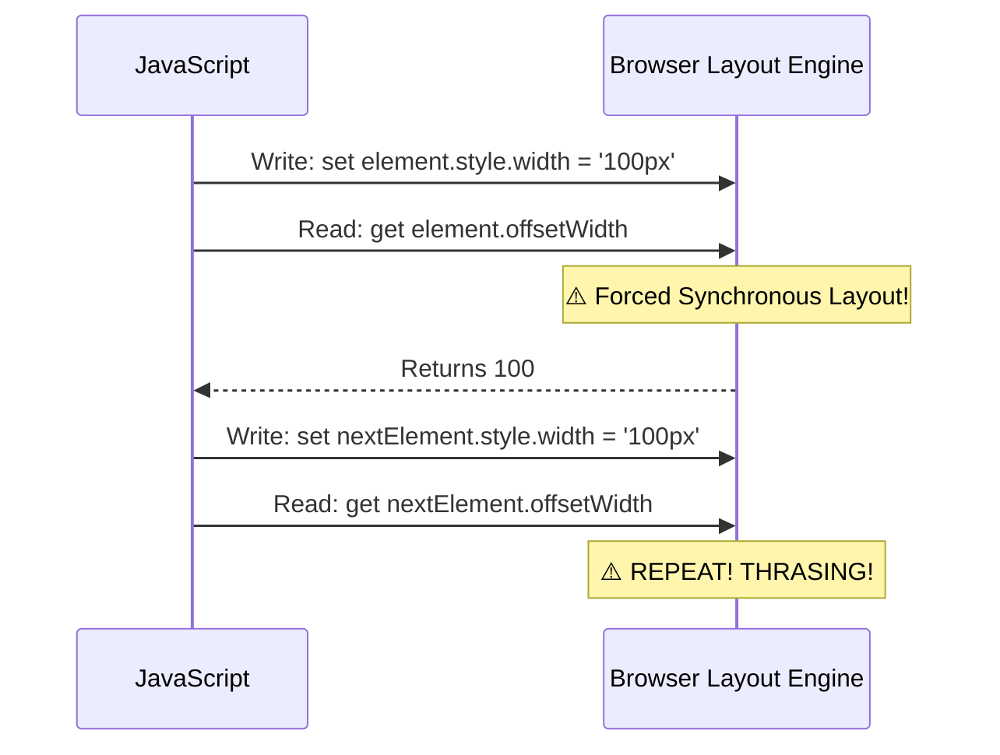

import Tabs from '@theme/Tabs';
import TabItem from '@theme/TabItem';

# Layout Thrashing

**Layout Thrashing** (also known as **Forced Synchronous Layout**) occurs when you repeatedly read and write to the DOM in a way that forces the browser to recalculate the page layout multiple times in a single frame.

:::info[Core Philosophy]
**Read-Write Separation**. Browsers are lazy on purpose. They want to batch all "Writes" (style changes) and calculate the "Layout" (geometry) only once at the end of the frame. Thrashing forces the browser to be "active" multiple times a frame.
:::

---

## 1. Easy: The Reflow and Repaint

Every change you make to the DOM has a cost:
1.  **Repaint**: Changing a color or visibility. The browser just re-draws the pixels. (Fast)
2.  **Reflow (Layout)**: Changing width, height, or position. The browser must recalculate where *everything* on the page is. (Slow)

Layout Thrashing is when you make the browser do a Reflow many times in a row, usually inside a loop.

---

## 2. Medium: Forced Synchronous Layout

Normally, if you change an element's width, the browser just "notes" it and waits. 

But if you change the width and then **immediately read** the width (via `offsetWidth`), the browser cannot wait. It must calculate the layout *right now* to give you the correct pixel value.



---

## 3. Hard: The Performance Destroyer

Thrashing is most dangerous in loops. For example, adjusting the width of 100 boxes based on their parent's width.

<Tabs groupId="lang" queryString>
<TabItem value="js" label="JavaScript">

```javascript
// ❌ BAD: Layout Thrashing
const items = document.querySelectorAll('.box');

for (let i = 0; i < items.length; i++) {
  // 1. READ (forces layout if a write happened before)
  const width = container.offsetWidth; 
  
  // 2. WRITE
  items[i].style.width = `${width / 2}px`; 
}

// ✅ GOOD: Batched Operations
const width = container.offsetWidth; // ONE READ

for (let i = 0; i < items.length; i++) {
  items[i].style.width = `${width / 2}px`; // MANY WRITES (Batched by browser)
}
```

</TabItem>
<TabItem value="ts" label="TypeScript">

```typescript
function resizeItems(selector: string, container: HTMLElement): void {
  const items = document.querySelectorAll<HTMLElement>(selector);
  
  // Batch all reads FIRST
  const containerWidth = container.offsetWidth;
  const itemCounts = items.length;

  // Then perform all writes
  items.forEach(item => {
    item.style.transform = `translateX(${containerWidth / itemCounts}px)`;
  });
}
```

</TabItem>
</Tabs>

---

## 4. Advanced: FastDOM and `requestAnimationFrame`

In complex applications, it's hard to keep track of every read and write. Tools like **FastDOM** or the **`requestAnimationFrame` (rAF)** pattern allow you to schedule your DOM work.

The goal is to move all **Reads** to the start of the frame and all **Writes** to a `rAF` callback, which the browser executes at the perfect time.

```javascript
// Optimized Read/Write Cycle
function updateUI() {
  // Phase 1: Read safely
  const height = element.clientHeight;

  // Phase 2: Schedule write for the next paint
  requestAnimationFrame(() => {
    element.style.height = `${height + 10}px`;
  });
}
```

---

## 5. Interview Prep: 4 Key Questions

### Q1: What is the technical trigger for Layout Thrashing?
**A:** It is triggered when code inter-leaves **DOM Writes** (mutations that invalidate layout) with **DOM Reads** (accessing properties like `scrollTop`, `offsetHeight`, or `getComputedStyle`) that require a clean layout to return a correct value. This forces the browser to stop JS execution and perform a synchronous reflow.

### Q2: List 3 DOM properties that will force a synchronous layout if accessed after a mutation.
**A:** `offsetWidth`/`offsetHeight`, `scrollTop`/`scrollLeft`, and `getBoundingClientRect()`. Most geometric properties and those related to scroll position or computed styles will trigger this.

### Q3: How does React's Virtual DOM inherently help prevent layout thrashing?
**A:** React's **Render Phase** only calculates what *should* change in a pure JS environment (zero DOM reads/writes). During the **Commit Phase**, React applies all changes to the physical DOM in a single, batched sequence. Because React does all its writing at once at the end of the tick, it minimizes the internal read-write inter-leaving that causes thrashing.

### Q4: Why is `transform: translate()` preferred over `top/left` for animations?
**A:** Because `transform` changes do not trigger a **Reflow**. They are handled during the **Compositing** stage, often on the GPU. Changing `top` or `left` affects the document geometry and forces a Reflow, making it a potential candidate for layout thrashing if those reads are accessed elsewhere in the frame.
