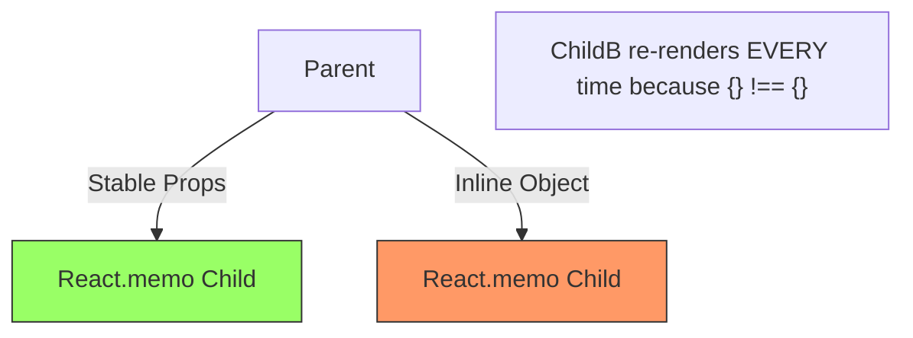

import Tabs from '@theme/Tabs';
import TabItem from '@theme/TabItem';

# Memoization Pitfalls

Memoization is the process of caching the result of a calculation to reuse it in the future. In React, it's often treated as a "magic performance button," but when misused, it can actually **slow down your app** and introduce **buggy state**.

:::info[Core Philosophy]
**Trade-offs: Memory vs. CPU**. Every time you use `useMemo`, you are trading RAM (to store the value and dependency array) for CPU cycles (to avoid recalculation). If the calculation is cheap, you are losing on both ends.
:::

---

## 1. Easy: The Overhead of "Pure" Memoization

Every memoization hook in React incurs an initialization cost. React has to:
1. Allocate memory for the dependency array.
2. Perform a shallow comparison on every single render to see if dependencies changed.

**When it's a Pitfall:**
Using `useMemo` for a simple string concatenation or a basic filter on a 5-item list. The time React spends comparing the dependency array is often longer than the time it would take to just re-run the code.

```javascript
// ❌ PITFALL: Overhead exceeds benefit
const fullName = useMemo(() => `${firstName} ${lastName}`, [firstName, lastName]);

// ✅ OPTIMAL: Just do the math
const fullName = `${firstName} ${lastName}`;
```

---

## 2. Intermediate: The "Broken Chain" Problem

`React.memo` only works if **all** props passed to the component have stable references. A single "inline" object in the parent breaks memoization for the entire subtree.



---

## 3. Hard: Stale Closures in useCallback

One of the most dangerous pitfalls is an incorrect dependency array in `useCallback`.

<Tabs groupId="lang" queryString>
<TabItem value="js" label="JavaScript">

```javascript
const [count, setCount] = useState(0);

// ❌ BUG: Stale Closure
// Because [ ] is empty, this function is only created ONCE.
// It 'captures' count at 0 and will always set it to 1.
const increment = useCallback(() => {
  setCount(count + 1); 
}, []); 

// ✅ FIX: Correct Dependencies
const increment = useCallback(() => {
  setCount(c => c + 1); // Or add [count] to deps
}, []); 
```

</TabItem>
<TabItem value="ts" label="TypeScript">

```typescript
const [data, setData] = useState<string[]>([]);

const addItem = useCallback((item: string) => {
  // Always uses the updater pattern to avoid stale closures
  setData(prev => [...prev, item]);
}, []); // Stable reference across renders
```

</TabItem>
</Tabs>

---

## 4. Advanced: useMemo for Referential Stability

Sometimes, the "Easy to Hard" journey leads to a realization: we don't use `useMemo` for math, we use it to **stabilize references** for `useEffect` or `Child.memo`.

```javascript
// This object is used as a dependency in a child's useEffect
const options = useMemo(() => ({
  color: theme === 'dark' ? 'white' : 'black',
  padding: 10
}), [theme]);

return <ExpensiveComponent options={options} />;
```
Here, even if `options` is a cheap object, we **must** memoize it so `ExpensiveComponent` (wrapped in `React.memo`) doesn't re-render unnecessarily.

---

## 5. Interview Prep: 4 Key Questions

### Q1: Does `useMemo` guarantee that the value won't be recalculated?
**A:** **No.** React's documentation explicitly states that React may choose to "forget" the memoized value and recalculate it to free up memory. You should never use `useMemo` if your code *breaks* when the function is re-run (i.e., it should stay pure).

### Q2: Why is `useCallback(fn, [])` safer than `useCallback(fn, [dep])`?
**A:** It's not "safer" in terms of bugs (it's actually the source of stale closures), but it's "safer" for **referential stability**. If you use `[dep]`, the function reference changes whenever `dep` changes, potentially triggering a cascade of re-renders in optimized child components. Using the **functional updater pattern** (`setCount(c => c + 1)`) allows you to keep an empty dependency array while staying bug-free.

### Q3: When should you explicitly AVOID using `React.memo`?
**A:** Avoid it for components that are very cheap to render or components that **always** receive different props (like those receiving `props.children` as raw JSX). In these cases, the "props comparison" check is 100% wasted work because the component would have re-rendered anyway.

### Q4: Explain the "Composition" alternative to Memoization.
**A:** Instead of using `useMemo` to prevent a part of the UI from re-rendering, you can move the "state-heavy" logic into its own component or use the **"Children as Props"** pattern. If a component receives its content as `children`, and the parent re-renders, React is optimized to skip re-rendering `children` if their "slot" hasn't changed, achieving memoization without the hooks.
