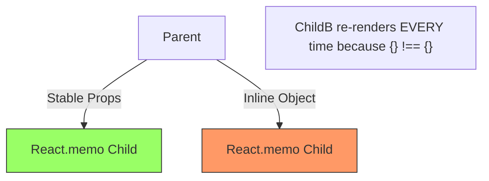

import Tabs from '@theme/Tabs';
import TabItem from '@theme/TabItem';

# Memoization Pitfalls

Memoization is the process of caching the result of a calculation to reuse it in the future. In React, it's often treated as a "magic performance button," but when misused, it can actually **slow down your app** and introduce **buggy state**.

:::info[Core Philosophy]
**Trade-offs: Memory vs. CPU**. Every time you use `useMemo`, you are trading RAM (to store the value and dependency array) for CPU cycles (to avoid recalculation). If the calculation is cheap, you are losing on both ends.
:::

---

## 1. Easy: The Initialization Overhead

Every memoization hook in React incurs a technical cost. React has to:
1. Allocate memory for the **dependency array**.
2. Perform a **Shallow Comparison** on every single render to see if dependencies changed.

**The Pitfall:**
Using `useMemo` for a simple string concatenation or a basic filter on a small list (e.g., 5 items). The time React spends comparing the dependency array is often **longer** than the time it would take to just re-run the code.

```javascript
// ❌ PITFALL: Overhead exceeds benefit
const fullName = useMemo(() => `${firstName} ${lastName}`, [firstName, lastName]);

// ✅ OPTIMAL: Just do the math
const fullName = `${firstName} ${lastName}`;
```

---

## 2. Medium: The "Broken Chain" Problem

`React.memo` only works if **all** props passed to the component have stable references. A single "inline" object or arrow function in the parent breaks memoization for the entire subtree.



If you memoize a child but forget to memoize the parent's `onClick` handler via `useCallback`, the child's `React.memo` check will always return `false`, meaning you've paid the "comparison cost" for zero benefit.

---

## 3. Hard: Stale Closures in `useCallback`

The most dangerous pitfall is an incorrect dependency array in `useCallback`. Because functions are objects, they "capture" the variables around them when created (Closures).

<Tabs groupId="lang" queryString>
<TabItem value="js" label="JavaScript">

```javascript
const [count, setCount] = useState(0);

// ❌ BUG: Stale Closure
// Because [ ] is empty, this function is only created ONCE.
// It 'captures' count at 0 and will always set it to 1, no matter how many clicks.
const increment = useCallback(() => {
  setCount(count + 1); 
}, []); 

// ✅ FIX: Functional Updater
const increment = useCallback(() => {
  setCount(c => c + 1); 
}, []); 
```

</TabItem>
<TabItem value="ts" label="TypeScript">

```typescript
const [data, setData] = useState<string[]>([]);

const addItem = useCallback((item: string) => {
  // Always use the updater pattern to avoid stale closures
  // while keeping the dependency array stable/empty.
  setData(prev => [...prev, item]);
}, []); 
```

</TabItem>
</Tabs>

---

## 4. Advanced: useMemo for Referential Stability

Advanced React patterns reveal that we don't usually use `useMemo` for heavy math—we use it to **stabilize references** for `useEffect` or `React.memo` comparisons downstream.

```javascript
// This object is used as a dependency in a child's useEffect
const options = useMemo(() => ({
  color: theme === 'dark' ? 'white' : 'black',
  padding: 10
}), [theme]);

return <ExpensiveComponent options={options} />;
```
Even if `options` is a "cheap" object, we **must** memoize it because `ExpensiveComponent` is wrapped in `React.memo`. If we don't, `ExpensiveComponent` will wastefully re-render on every parent update, even if `theme` hasn't changed.

---

## 5. Interview Prep: 4 Key Questions

### Q1: Does `useMemo` guarantee that the value won't be recalculated?
**A:** **No.** React documentation states that React may choose to "forget" the memoized value and recalculate it at any time to reclaim memory. You should only use `useMemo` for performance optimization, assuming that re-running the function remains safe and idempotent.

### Q2: Why is `useCallback(fn, [])` often considered a "code smell"?
**A:** Because it frequently leads to **Stale Closures**. If the function `fn` references any stale props or state, it will be trapped with the values from the first render. While developers use it to keep references stable, it is usually better to include actual dependencies or use functional state updaters.

### Q3: When should you explicitly AVOID using `React.memo`?
**A:** Avoid it for components that are "cheap" to render (e.g., small text labels) or components that **always** receive different props (like those using `props.children` containing unique JSX). In these cases, the "props comparison" check is 100% wasted work because the component would have re-rendered anyway.

### Q4: Explain the "Composition" alternative to Memoization.
**A:** Instead of using `useMemo` to prevent re-renders, you can use the **"Children as Props"** pattern. If a component receives its content as `children`, and the parent re-renders due to its own state, React is optimized to skip re-rendering `children` if their "slot" hasn't changed. This is "Memoization by Architecture" and is often more performant than hook-based memoization.
