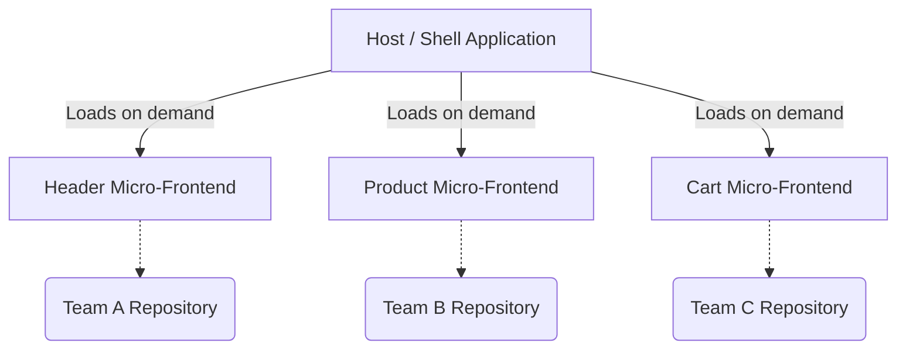

import Tabs from '@theme/Tabs';
import TabItem from '@theme/TabItem';

# Micro-Frontend Orchestration

**Micro-Frontend Orchestration** is an architectural pattern that extends the concepts of micro-services to the frontend. It allows multiple independent teams to build, test, and deploy separate pieces of a user interface, which are then stitched together into a single, cohesive web application.

:::info[Core Philosophy]
**Independent Deployability**. If a single massive monolithic React app takes 45 minutes to build and deploy, developer velocity grinds to a halt. Micro-frontends allow the "Checkout Team" to deploy an update to the checkout cart in seconds, without affecting or coordinating with the "Product Page Team".
:::

---

## 1. Easy: The Concept

Imagine an e-commerce site. 
-   **Team A** builds the Header and Navigation.
-   **Team B** builds the Product Details.
-   **Team C** builds the Shopping Cart.

Instead of one giant codebase, these are three separate repositories. A "Host" (or "Shell") application is responsible for orchestrating these remote apps, downloading their JavaScript bundles on the fly, and rendering them on the screen as if they were a single app.



---

## 2. Medium: Integration Strategies

How do you actually combine these separate apps?

1.  **Build-Time Integration (NPM Packages)**: Each team publishes their UI as an NPM package. The Host app runs `npm install` and builds the monolith. **Drawback**: Every time Team A updates the header, the Host app must be re-compiled and re-deployed. This defeats the purpose of independent deployability.
2.  **Run-Time Integration (iFrames)**: The oldest method. The Host renders `<iframe>` tags pointing to the remote apps. **Drawback**: Massive performance overhead, terrible SEO, and nearly impossible to share state or URL routing between the iframe and the host.
3.  **Run-Time Integration (Module Federation)**: The modern standard. The Host downloads raw JavaScript chunks from remote servers at run-time and injects them directly into its own React tree.

---

## 3. Hard: Webpack Module Federation

Webpack 5 introduced **Module Federation**, which fundamentally solved the micro-frontend orchestration problem. 

It allows a JavaScript application to dynamically load code from another application at runtime, while intelligently sharing dependencies (so React isn't downloaded twice).

<Tabs groupId="lang" queryString>
<TabItem value="js" label="JavaScript">

```javascript
// Webpack Config for the REMOTE app (The Shopping Cart)
const ModuleFederationPlugin = require('webpack/lib/container/ModuleFederationPlugin');

module.exports = {
  plugins: [
    new ModuleFederationPlugin({
      name: 'cartApp', // The name of this micro-frontend
      filename: 'remoteEntry.js', // The manifest file the host will download
      exposes: {
        './CartWidget': './src/components/CartWidget', // What we are sharing
      },
      shared: ['react', 'react-dom'], // Don't download these if the host already has them
    }),
  ],
};
```

</TabItem>
<TabItem value="ts" label="TypeScript">

```typescript
// React code inside the HOST app
import React, { lazy, Suspense } from 'react';

// The Host app dynamically imports the CartWidget from the Remote app at runtime.
// 'cartApp' resolves to a URL defined in the Host's webpack config.
const RemoteCartWidget = lazy(() => import('cartApp/CartWidget'));

function App() {
  return (
    <div>
      <h1>My E-Commerce Site</h1>
      {/* We use Suspense because the network request to the remote app takes time */}
      <Suspense fallback={<p>Loading Cart...</p>}>
        <RemoteCartWidget />
      </Suspense>
    </div>
  );
}
```

</TabItem>
</Tabs>

---

## 4. Advanced: State Sharing and Routing

The hardest parts of micro-frontend orchestration are State and Routing.

-   **State**: Micro-frontends should be as isolated as possible. If the Cart needs to know when the Product page adds an item, they should communicate via Custom DOM Events (`window.dispatchEvent`) or a lightweight shared Pub/Sub bus, NOT a massive shared Redux store.
-   **Routing**: The Host application should own the Browser History. Remote apps should use "Memory Routing" (so they don't fight the Host over the URL bar) and communicate intent to navigate back up to the Host.

---

## 5. Interview Prep: 4 Key Questions

### Q1: What is the primary business reason for adopting Micro-Frontends?
**A:** Organizational scaling. When a frontend engineering organization grows beyond a few dozen developers, a monolithic codebase leads to massive merge conflicts, slow CI/CD pipelines, and bottlenecked release trains. Micro-frontends allow autonomous squads to build, test, and release their features completely independently.

### Q2: How does Webpack Module Federation handle shared dependencies?
**A:** If both the Host and the Remote specify `react` as a shared dependency, the Host checks if it has already loaded React. If it has, it provides its copy of React to the Remote application, preventing the browser from downloading the 100kb React library twice. If the Host doesn't have it (or has an incompatible version), the Remote will download its own fallback copy.

### Q3: Why are iframes generally discouraged for modern Micro-Frontends?
**A:** Iframes create a hard boundary in the browser. You cannot easily share CSS stylesheets, meaning UI inconsistencies. You cannot share JavaScript contexts, meaning a heavy framework like Angular or React must be downloaded, parsed, and booted inside *every single iframe*, destroying performance and memory.

### Q4: What is the risk of Run-Time Integration?
**A:** Because the Host downloads the Remote code at the exact moment the user views the page, if Team B deploys a breaking change to the Product micro-frontend, the Host app will instantly break in production. Run-time integration requires incredibly strict CI/CD contracts, robust E2E testing, and strong API versioning to ensure Remotes do not break their Hosts.
