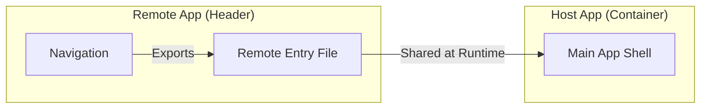

import Tabs from '@theme/Tabs';
import TabItem from '@theme/TabItem';

# Module Federation

**Module Federation** is a Webpack 5 feature that allows multiple independently built and deployed applications to share code at **runtime**. It is the primary architectural pattern for modern **Micro-Frontends**.

:::info[Core Philosophy]
**Distributed Bundling**. Instead of a single "Monolith" bundle, Module Federation creates a network of applications that can consume each other's modules as if they were local dependencies, without needing extra `npm install` steps or build-time linking.
:::

---

## 1. Easy: The Micro-Frontend Problem

In a large company, different teams might build different parts of a site (e.g., the Header team, the Search team, the Checkout team). 

- **The Old Way**: Every team publishes an NPM package. The main app installs these packages and rebuilds the entire site. If the Header team fixes a bug, the main app must **re-build and re-deploy**.
- **The Federico Way**: The Header team deploys their code independently. The main app "plugs in" to the Header team's live URL at runtime. A bug fix in the Header is live **instantly** without the main app doing anything.



---

## 2. Medium: Host vs. Remote

Module Federation defines two roles (an app can be both):

-   **Host (Container)**: The application that initializes the federation and "consumes" modules from others.
-   **Remote**: The application that "exposes" modules (components, functions, or utilities) for others to use.
-   **Remote Entry**: A tiny manifest file (usually `remoteEntry.js`) generated by the Remote app that tells the Host where to find the chunks of code.

---

## 3. Hard: Library Sharing and Singletons

A major risk in micro-frontends is downloading the same library (like React) multiple times. Module Federation solves this with the `shared` configuration.

<Tabs groupId="lang" queryString>
<TabItem value="js" label="JavaScript">

```javascript
// webpack.config.js (Host)
new ModuleFederationPlugin({
  name: 'app_shell',
  remotes: {
    header: 'header_app@http://localhost:3001/remoteEntry.js',
  },
  shared: { 
    react: { singleton: true, eager: true }, 
    'react-dom': { singleton: true, eager: true } 
  },
});

// Using the remote component in React
const Header = React.lazy(() => import('header/HeaderComponent'));
```

</TabItem>
<TabItem value="ts" label="TypeScript">

```typescript
// remote-decl.d.ts (Declaring types for remotes)
declare module 'header/HeaderComponent' {
  const HeaderComponent: React.ComponentType;
  export default HeaderComponent;
}

// Consuming in a TS Component
import React from 'react';
const RemoteHeader = React.lazy(() => import('header/HeaderComponent'));

export const App = () => (
  <React.Suspense fallback="Loading Header...">
    <RemoteHeader />
  </React.Suspense>
);
```

</TabItem>
</Tabs>

---

## 4. Advanced: Versioning and "Deadly Singletons"

When multiple apps share a library, Webpack uses a **Versioning Negotiator**. 
1. If Host has React 18.2 and Remote needs React 18.1, Webpack picks 18.2 (the highest compatible version).
2. If `singleton: true` is set, Webpack **strictly** forces only one instance of the library. This is vital for React, as having two `react-dom` instances on one page will crash the application state.

**Performance Pitfall**: If your `shared` libraries are poorly configured, a Host might end up downloading "fallback" versions of libraries, leading to massive bundle bloat.

---

## 5. Interview Prep: 4 Key Questions

### Q1: What is the purpose of the `remoteEntry.js` file?
**A:** It is a metadata manifest generated by the Remote application. It contains a mapping of all exposed modules and their corresponding chunks. When a Host app loads a remote, it first fetches this tiny file to understand what code is available and where to download the actual logic from.

### Q2: Why is the `singleton: true` flag essential for libraries like React?
**A:** Libraries like React maintain internal global state (like the fiber tree and hook pointers). If a Host and a Remote load two separate instances of React, they won't share this state, leading to "Invalid Hook Call" errors and rendering crashes. `singleton: true` ensures that even if multiple apps request React, only one instance is loaded into memory.

### Q3: Explain the "Shared Dependency" negotiation in Webpack 5.
**A:** When multiple federated apps share a dependency (e.g., `lodash`), Webpack checks the versions requested by each app. By default, it uses the highest satisfying version according to semver. If an app requires a version that is incompatible with the rest, Webpack will download an additional copy of that library specifically for that app (unless marked as a singleton).

### Q4: How does Module Federation differ from a standard Mono-repo?
**A:** A mono-repo is a **build-time** construct (shared code is compiled into the final bundle at build time). Module Federation is a **runtime** construct (sharing happens in the browser after the apps are deployed). Module Federation allows independent deployment pipelines, whereas a standard mono-repo usually requires a full re-build of the consumer when a shared library changes.
