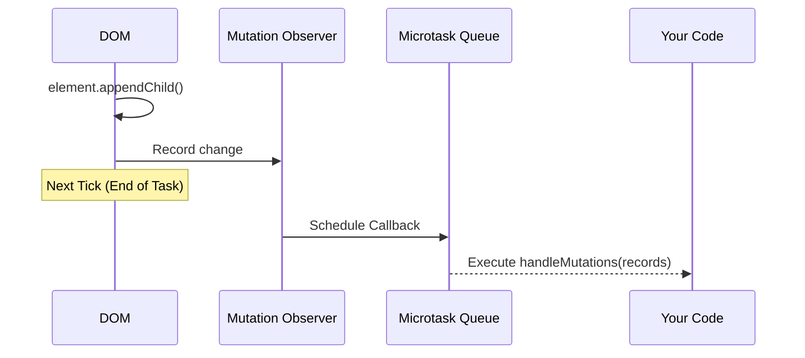

import Tabs from '@theme/Tabs';
import TabItem from '@theme/TabItem';

# Mutation Observer Cost

**Mutation Observer** is a built-in browser API that allows you to react to changes in the DOM. Unlike old-fashioned "Mutation Events" (which were synchronous and slowed down the browser), Mutation Observers are asynchronous and batch changes for performance.

:::info[Core Philosophy]
**Asynchronous Batching**. Mutation Observers do not fire for every tiny change. Instead, they collect all DOM changes and deliver them as a single list during the "Microtask" phase, ensuring the UI thread stays smooth.
:::

---

## 1. Easy: Basic Child Observation

The most common use case is watching for new elements added to a specific container.



---

## 2. Medium: The Config Options

When you start observing, you must specify what to watch. The more you watch, the higher the performance cost.
- `childList`: Add/remove children.
- `attributes`: Changes to `class`, `id`, `style`, etc.
- `subtree`: Watches the entire tree under the target element (**Dangerous for performance**).

---

## 3. Hard: Implementation and Performance Cost

<Tabs groupId="lang" queryString>
<TabItem value="js" label="JavaScript">

```javascript
// High-performance mutation tracking
const observer = new MutationObserver((mutations) => {
  for (const mutation of mutations) {
    if (mutation.type === 'childList') {
      console.log('Nodes added/removed:', mutation.addedNodes.length);
    }
  }
});

// Avoid 'subtree: true' on large containers like <body>
const config = { 
  childList: true, 
  attributes: true,
  attributeFilter: ['class'] // Only track class changes (Optimization)
};

observer.observe(document.getElementById('app'), config);
```

</TabItem>
<TabItem value="ts" label="TypeScript">

```typescript
// Typing mutation records
const handleMutations = (records: MutationRecord[]): void => {
  records.forEach((record) => {
    if (record.attributeName === "data-active") {
      const target = record.target as HTMLElement;
      console.log("State changed:", target.dataset.active);
    }
  });
};

const observer = new MutationObserver(handleMutations);
```

</TabItem>
</Tabs>

---

## 4. Advanced: The Microtask Queue and Memory

- **Microtask Timing**: Mutation callbacks happen after the current script finishes, but **before** the browser paints. If you make another DOM change inside the callback, you might trigger another observer cycle, potentially leading to infinite loops.
- **Memory Leaks**: Always call `observer.disconnect()` when you are done. While the browser tries to clean up, observers attached to high-traffic elements can prevent garbage collection of deleted nodes.

---

## 5. Interview Prep: 4 Key Questions

### Q1: Why are Mutation Observers better than the old Mutation Events?
**A:** Mutation Events (like `DOMNodeInserted`) were synchronous. If you added 100 nodes, the browser fired 100 events, forcing 100 separate script executions, which crushed performance. **Mutation Observers** are asynchronous; they batch all 100 changes and deliver them as one array in the next microtask, allowing the browser to optimize rendering.

### Q2: What is the purpose of `attributeFilter`?
**A:** It is a major performance optimization. Instead of triggering the observer for every single attribute change (like ARIA tags, styles, or IDs), you provide an array of specific attribute names (e.g., `['class', 'data-id']`). The observer will then only fire if one of those specific attributes changes.

### Q3: Explain the risk of setting `subtree: true` on the `document.body`.
**A:** Setting `subtree: true` on a high-level node means the browser must track **every single change** in your entire application. In a complex app with dynamic data, this creates massive overhead as the engine records every small attribute toggle or layout shift, leading to "Jank." Always narrow the observation to the smallest possible container.

### Q4: When does the Mutation Observer callback execute?
**A:** It executes as a **Microtask**. This means it runs at the very end of the current execution stack, but strictly before the browser performs its next "Paint" and before the next item in the "Macrotask" queue (like `setTimeout`) starts.
