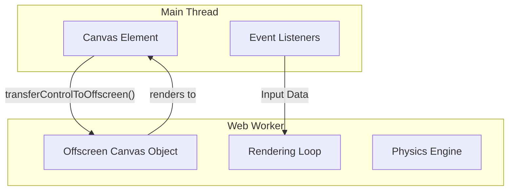

import Tabs from '@theme/Tabs';
import TabItem from '@theme/TabItem';

# Offscreen Canvas

**Offscreen Canvas** is a browser API that allows canvas rendering (2D or WebGL) to happen in a **Web Worker**. This decouples the rendering logic from the main thread, ensuring that complex animations don't block user interactions.

:::info[Core Philosophy]
**Asynchronous Rendering**. By moving the "drawing" work to a background thread, you ensure that even if the GPU or rendering logic is under heavy load, the main thread remains responsive to clicks, scrolls, and typing.
:::

---

## 1. Easy: The Main Thread Bottleneck

In standard Canvas applications, the `canvas.getContext()` call happens on the main thread. If you are drawing 10,000 particles at 60fps, the main thread is constanty busy calculating positions and drawing pixels. This leads to **Jank**.

**Offscreen Canvas** allows you to "hand over" the control of a canvas element to a background worker.



---

## 2. Medium: Transferring Control

To use Offscreen Canvas, you don't send the canvas element itself (DOM elements cannot live in workers). Instead, you call `transferControlToOffscreen()`, which returns an `OffscreenCanvas` object that can be transferred via `postMessage`.

---

## 3. Hard: Implementation in a Worker

<Tabs groupId="lang" queryString>
<TabItem value="js" label="JavaScript">

```javascript
// main.js
const canvas = document.querySelector('canvas');
const offscreen = canvas.transferControlToOffscreen();
const worker = new Worker('renderer.js');

worker.postMessage({ canvas: offscreen }, [offscreen]);

// renderer.js (Worker)
self.onmessage = (evt) => {
  const canvas = evt.data.canvas;
  const ctx = canvas.getContext('2d');

  function render(time) {
    ctx.clearRect(0, 0, canvas.width, canvas.height);
    ctx.fillStyle = 'red';
    ctx.fillRect(Math.sin(time / 1000) * 100, 50, 50, 50);
    requestAnimationFrame(render);
  }
  requestAnimationFrame(render);
};
```

</TabItem>
<TabItem value="ts" label="TypeScript">

```typescript
// main.ts
const canvas = document.getElementById("canvas") as HTMLCanvasElement;
const offscreen = canvas.transferControlToOffscreen();
const worker = new Worker(new URL("./worker.ts", import.meta.url));

worker.postMessage({ canvas: offscreen }, [offscreen]);

// worker.ts
self.onmessage = (event: MessageEvent<{ canvas: OffscreenCanvas }>) => {
  const { canvas } = event.data;
  const ctx = canvas.getContext("2d");
  
  if (!ctx) return;

  const animate = (time: number) => {
    // Heavy rendering logic here
    ctx.clearRect(0, 0, canvas.width, canvas.height);
    requestAnimationFrame(animate);
  };
  
  requestAnimationFrame(animate);
};
```

</TabItem>
</Tabs>

---

## 4. Advanced: WebGL and Transferable Logic

Offscreen Canvas is most powerful when paired with **WebGL** or **WebGPU**. 
1. **Parallelism**: You can run a physics simulation (WASM) and a WebGL renderer in two separate workers.
2. **Transferables**: You can calculate vertex data in a Physics Worker, transfer the `ArrayBuffer` to the Render Worker (zero-copy), and draw it to the Offscreen Canvas.

**The "Commit" step**: In some environments (like older versions of Chrome), you might need to call `ctx.commit()` to manually push the worker's buffer to the main thread's canvas element, though this is now largely automated.

---

## 5. Interview Prep: 4 Key Questions

### Q1: Why can't you just pass the `<canvas>` element directly to a Web Worker?
**A:** Web Workers are isolated from the DOM. They do not have access to the `document`, `window`, or any HTML elements. To solve this, the `OffscreenCanvas` API was created as a "headless" representation of a canvas that can be serialized and transferred between threads.

### Q2: What is the benefit of `requestAnimationFrame` inside a Worker?
**A:** Traditionally, `rAF` was strictly a main-thread API tied to the display refresh rate. In modern browsers, Workers also support `rAF`, allowing the background thread to sync its rendering loop with the monitor's vertical sync (V-Sync), preventing screen tearing and saving battery.

### Q3: How do you handle Window Resize events with Offscreen Canvas?
**A:** Since the Worker doesn't know about the window size, the main thread must listen for `resize` events and `postMessage` the new dimensions to the Worker. The Worker then updates the `offscreenCanvas.width` and `height` properties, which automatically resizes the drawing buffer.

### Q4: When would you NOT use Offscreen Canvas?
**A:** If your rendering is very simple (e.g., drawing a static logo or a few shapes), the overhead of creating a Worker and managing cross-thread communication might outweigh the performance benefits. It is also not supported in very old browsers (though polyfills or fallbacks to the main-thread canvas are common).
