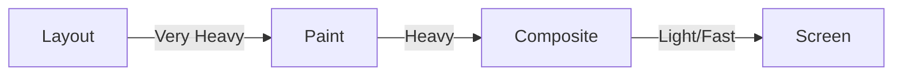

import Tabs from '@theme/Tabs';
import TabItem from '@theme/TabItem';

# Paint vs. Composite vs. Layout

To build high-performance web applications, you must understand the **Rendering Pipeline**. Every time you change a CSS property, the browser has to perform a certain amount of work to update the screen. Depending on the property, it might skip some steps or be forced to redo everything.

:::info[Core Philosophy]
**Aim for the Fast Path**. The ultimate goal of frontend performance is to only trigger **Compositing** changes, avoiding the heavy computational cost of **Layout** (Reflow) and **Paint** (Repaint).
:::

---

## 1. Easy: The Three Stages

1.  **Layout (Reflow)**: Calculating the geometry of the page—how big elements are and where they sit. If you change a `width`, every element after it might move.
2.  **Paint (Repaint)**: Filling in the pixels—colors, shadows, and text. If you change a `background-image`, the browser has to re-draw that area.
3.  **Composite**: Stacking layers together. This is mostly handled by the GPU.



---

## 2. Medium: Property Triggers

Not all CSS properties are equal. Different changes trigger different parts of the pipeline:

| Property | Stage Triggered | Performance |
| :--- | :--- | :--- |
| `width`, `height`, `margin`, `top` | **Layout** (then Paint & Composite) | 🔴 Slowest |
| `color`, `background-color`, `box-shadow` | **Paint** (then Composite) | 🟡 Medium |
| `transform`, `opacity` | **Composite** Only | 🟢 Fastest |

---

## 3. Hard: Implementation and Profiling

<Tabs groupId="lang" queryString>
<TabItem value="js" label="JavaScript">

```javascript
// AVOID: Triggers Layout/Reflow in a loop
function badAnimation() {
  const el = document.getElementById('box');
  let pos = 0;
  setInterval(() => {
    pos += 1;
    el.style.left = pos + 'px'; // Triggers Layout!
  }, 16);
}

// PREFER: Triggers Composite only
function goodAnimation() {
  const el = document.getElementById('box');
  let pos = 0;
  function update() {
    pos += 1;
    el.style.transform = `translateX(${pos}px)`; // GPU only
    requestAnimationFrame(update);
  }
  requestAnimationFrame(update);
}
```

</TabItem>
<TabItem value="ts" label="TypeScript">

```typescript
// Benchmarking layout vs composite
const measurePerformance = (callback: () => void, label: string): void => {
  performance.mark(`${label}-start`);
  callback();
  performance.mark(`${label}-end`);
  performance.measure(label, `${label}-start`, `${label}-end`);
  
  const measure = performance.getEntriesByName(label)[0];
  console.log(`${label} took ${measure.duration.toFixed(4)}ms`);
};
```

</TabItem>
</Tabs>

---

## 4. Advanced: Forced Synchronous Layout

A common performance pitfall is **Forced Synchronous Layout (FSL)**. This happens when you write to the DOM (changing a style) and then immediately read from it (like `offsetWidth`) in the same frame. 

The browser is forced to stop everything and calculate the layout *now* to give you the correct value, rather than waiting for the next planned layout cycle.

**The Fix**: Always **Read** first, then **Write**. Or use a library like `fastdom` to batch your reads and writes.

---

## 5. Interview Prep: 4 Key Questions

### Q1: What is "Reflow" and what is "Repaint"?
**A:** "Reflow" is the browser's name for **Layout**. It involves recalculating the geometry and positions of elements. "Repaint" is the process of drawing the pixels within those calculated boxes. Reflow is almost always more expensive because it can cascade through the entire DOM tree, whereas Repaint is localized to specific areas.

### Q2: Why is `transform` one of the only properties that triggers "Composite" only?
**A:** Because `transform` (and `opacity`) are properties that the browser can handle on the **GPU** (Compositor Thread). The browser takes the element, paints it onto its own layer (texture), and then simply asks the GPU to move or fade that texture. This doesn't change the layout of other elements, so the Layout and Paint stages are skipped.

### Q3: How do you debug which stage is being triggered in Chrome?
**A:** Open DevTools -> meatball menu (three dots) -> More Tools -> **Rendering**. Enable "Paint Flashing" to see Green highlights when Repaints occur, and "Layout Shift Regions" to see Blue highlights when Layout changes occur. For a deep dive, use the **Performance** tab and look for the "Layout" and "Paint" tasks in the flame chart.

### Q4: Explain "Forced Synchronous Layout" (FSL).
**A:** FSL occurs when JavaScript asks for a layout value (like `element.offsetHeight`) immediately after a style modification. To return an accurate value, the browser must synchronously perform a Layout calculation. Doing this inside a loop (like a scroll listener) is one of the most common causes of significant UI jank (dropping below 60fps).
