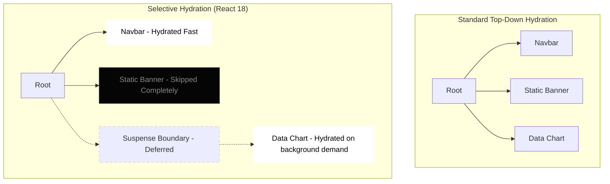

import Tabs from '@theme/Tabs';
import TabItem from '@theme/TabItem';

# Partial Hydration

Partial Hydration (or **Selective Hydration** in React 18 terminology) is an advanced rendering optimization where only specific, interactive portions of a server-rendered page are hydrated, deferring or outright eliminating the evaluation of non-interactive JavaScript.

:::info[Core Philosophy]
**Hydrate only what needs interaction**. If a massive footer component requires no complex JavaScript events or state bindings, don't execute its heavy JS definition on the client. Just let it functionally remain standard static HTML.
:::

---

## 1. Easy: The Problem with Monolithic Hydration

Traditional Single-Page Applications perform top-down **Monolithic Hydration**. They start at the very top `<App />` and hydrate practically every node recursively downward.

This fundamentally attacks the primary weakness of traditional React: incredibly high **Total Blocking Time (TBT)**. The browser freezes until the entire component tree executes on the client.

## 2. Medium: Separating the Tree

Partial Hydration forces the framework compiler to logically categorize the DOM tree into:
1. **Static Nodes**: Components completely pure and stateless. JS code stripped out.
2. **Dynamic Boundaries**: Specific nodes designated for deferred or isolated hydration.

In React 18, this mechanism is heavily coupled with `Suspense`. When React hydrates a page, if it encounters a `<Suspense>` boundary containing an interactive component, it can pause hydration of that slice, prioritize hydrating something else the user is clicking on, and fetch the JS bundle for the suspended code slowly in the background.



---

## 3. Hard: React 18 Implementation & Prioritization

To build a modern dashboard relying heavily on datasets, you can wrap incredibly expensive components securely in `<Suspense>`. React will render the fallback HTML on the server. On the client, it mathematically guarantees hydrating the lightweight navigational components *first*.

<Tabs groupId="lang" queryString>
<TabItem value="js" label="JavaScript">

```javascript
import { Suspense, lazy } from 'react';

// The Main bundle does mathematically NOT include HeavyChart.
// It is split and downloaded later.
const HeavyChart = lazy(() => import('./components/HeavyChart.jsx'));

export default function Dashboard() {
  return (
    <div className="layout">
      {/* Navbar hydrates immediately, user can click route links instantly! */}
      <Navigation />
      
      <main>
        <h1>Performance Stats</h1>
        
        {/* React defers hydration of this tree to free the main thread */}
        <Suspense fallback={<div className="skeleton">Loading visuals HTML...</div>}>
          <HeavyChart dataset="q1" />
        </Suspense>
      </main>
    </div>
  );
}
```

</TabItem>
<TabItem value="ts" label="TypeScript">

```typescript
import { Suspense, lazy, ReactElement } from 'react';

// Main bundle does mathematically NOT include HeavyChart
const HeavyChart = lazy(() => import('./components/HeavyChart.tsx'));

export default function Dashboard(): ReactElement {
  return (
    <div className="layout">
      {/* Navbar hydrates immediately, user can click route links instantly! */}
      <Navigation />
      
      <main>
        <h1>Performance Stats</h1>
        
        {/* React defers hydration of this tree to free the main thread */}
        <Suspense fallback={<div className="skeleton">Loading visuals HTML...</div>}>
          <HeavyChart dataset="q1" />
        </Suspense>
      </main>
    </div>
  );
}
```

</TabItem>
</Tabs>

---

## 4. Advanced: The Prioritization Engine

What happens if `HeavyChart` is loading slowly in the background, but the user rapidly clicks on `Navigation`? 

Because of React 18's **Concurrent Mode**, the event system detects the click on `Navigation` and *elevates* the hydration priority of the Navigation component specifically. It actively pauses everything else, hydrates the Navigation component instantly, and then smoothly handles the click routing event without dropping it. This fundamentally eliminates "Dead Clicks" common in standard SSR frameworks.

---

## 5. Interview Prep: 4 Key Questions

### Q1: What is the direct relationship between Code Splitting and Partial Hydration?
**A:** Code Splitting separates the Javascript bundle into distinct chunks so the browser physically downloads less upfront. Partial Hydration dictates *when* and *if* those split chunks are actually evaluated by the framework to attach interactivity to the DOM. You definitively need Code Splitting to efficiently utilize Partial Hydration boundaries.

### Q2: How does React 18's Selective Hydration handle user clicks that happen before a component hydrates?
**A:** React 18 aggressively attaches a generic global event listener (Event Delegation) at the Document root level instantly. If a user clicks an unhydrated component wrapped in Suspense, React catches the event, records it, massively accelerates the hydration queue of exactly that component to top priority, and then strictly "replays" the user click event instantly once hydration completes.

### Q3: What is "Resumability"? How does it inherently differ from Partial Hydration?
**A:** Next-gen frameworks like **Qwik** use Resumability. Instead of downloading heavy JS to rebuild the VDOM and attach listeners (Hydration), Resumable frameworks serialize the exact execution states directly into the HTML itself. When a click fires, the framework simply "resumes" logic exactly where the server left off, achieving $O(1)$ boot time regardless of page size. standard Hydration is still strictly $O(N)$ relative to the size of the interactive component tree.

### Q4: Does Partial Architecture fix Core Web Vitals like layout shifts (CLS)?
**A:** Not inherently, and it can actually worsen it if implemented poorly! If the server-rendered `fallback` visual wrapper of a suspended component does not match the exact pixel dimensions of the fully hydrated component, a massive physical layout shift will still violently occur when the JS bundle evaluates.
