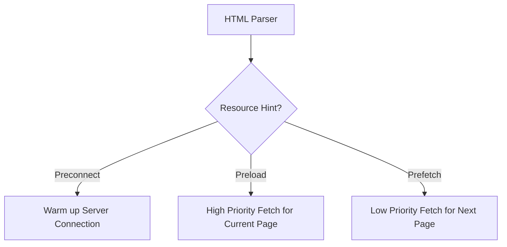

import Tabs from '@theme/Tabs';
import TabItem from '@theme/TabItem';

# Preload vs. Prefetch vs. Preconnect

Resource hints allow developers to assist the browser's scan-ahead parser by providing information about resources that will be needed soon. This can significantly reduce the **Critical Rendering Path** duration.

:::info[Core Philosophy]
**Intent over Automation**. The browser tries to guess what you need, but you know your application better. Hints allow you to override the browser's default priority queue.
:::

---

## 1. Easy: The Big Three

-   **Preconnect**: "I'm about to talk to this server. Start the DNS lookup and handshakes now."
-   **Preload**: "I need this file **right now** for the current page. Download it with high priority."
-   **Prefetch**: "The user will likely need this file **later** (on the next page). Download it when the browser is idle."



---

## 2. Medium: DNS-Prefetch vs. Preconnect

-   `dns-prefetch` only performs the DNS lookup (converting domain names to IPs). 
-   `preconnect` goes further by performing the TLS handshake and TCP connection.
-   **Rule of Thumb**: Use `preconnect` for your most critical 1-2 external origins (like your API or CDN). Use `dns-prefetch` as a fallback for dozens of less critical ones (like analytics or ad-trackers).

---

## 3. Hard: Implementation and Type Safety

<Tabs groupId="lang" queryString>
<TabItem value="js" label="JavaScript">

```javascript
// Dynamically preloading a critical JS module
function preloadModule(url) {
  const link = document.createElement('link');
  link.rel = 'preload';
  link.as = 'script';
  link.href = url;
  // Preloads are mandatory; if unused, the browser will 
  // throw a console warning after a few seconds.
  document.head.appendChild(link);
}
```

</TabItem>
<TabItem value="ts" label="TypeScript">

```typescript
// Managing pre-connections for an API-heavy app
const warmUpOrigins = (urls: string[]): void => {
  urls.forEach(url => {
    const link = document.createElement('link');
    link.rel = 'preconnect';
    link.href = new URL(url).origin;
    link.crossOrigin = "anonymous"; // Important for CORS-heavy APIs
    document.head.appendChild(link);
  });
};
```

</TabItem>
</Tabs>

---

## 4. Advanced: The "Preload" Warning and Priority

If you `preload` a resource but don't actually use it within 3-5 seconds of page load, the browser will issue a warning: *"The resource was preloaded but not used within a few seconds."*

This happens because `preload` is a **mandatory** fetch. By forcing a high-priority download that isn't needed, you are wasting bandwidth that the browser could have used for other critical resources (like your hero image or main CSS).

---

## 5. Interview Prep: 4 Key Questions

### Q1: What happens if you `preload` a script but leave out the `as="script"` attribute?
**A:** The browser will likely download the resource **twice**. Without the `as` attribute, the browser cannot verify if the preloaded resource matches the subsequent request. It also uses the `as` attribute to determine the correct Content Security Policy (CSP) and to set the appropriate request headers (like `Accept`).

### Q2: How does `prefetch` handle low-power modes or slow data?
**A:** Browsers are conservative with `prefetch`. If a user is on a metered connection (Save Data mode) or has a very high RTT, the browser might ignore your `prefetch` hints entirely to save the user's data and battery.

### Q3: Why is `preconnect` limited to only 2-3 origins?
**A:** Each `preconnect` consumes CPU and memory to maintain an open socket. Because browsers limit the number of concurrent connections to a single origin (usually 6), opening too many pre-connections can actually block other more critical network tasks, leading to a performance regression.

### Q4: Explain the difference between `preload` and `prefetch` in the context of SPAs.
**A:** In a Single Page Application (SPA), you use `preload` for the initial JS bundle and the hero image of the homepage. You use `prefetch` for the JS chunks belonging to other routes (like `/settings` or `/profile`). This ensures the first page loads instantly, and subsequent navigations feel instantaneous because the code is already in the browser's HTTP cache.
