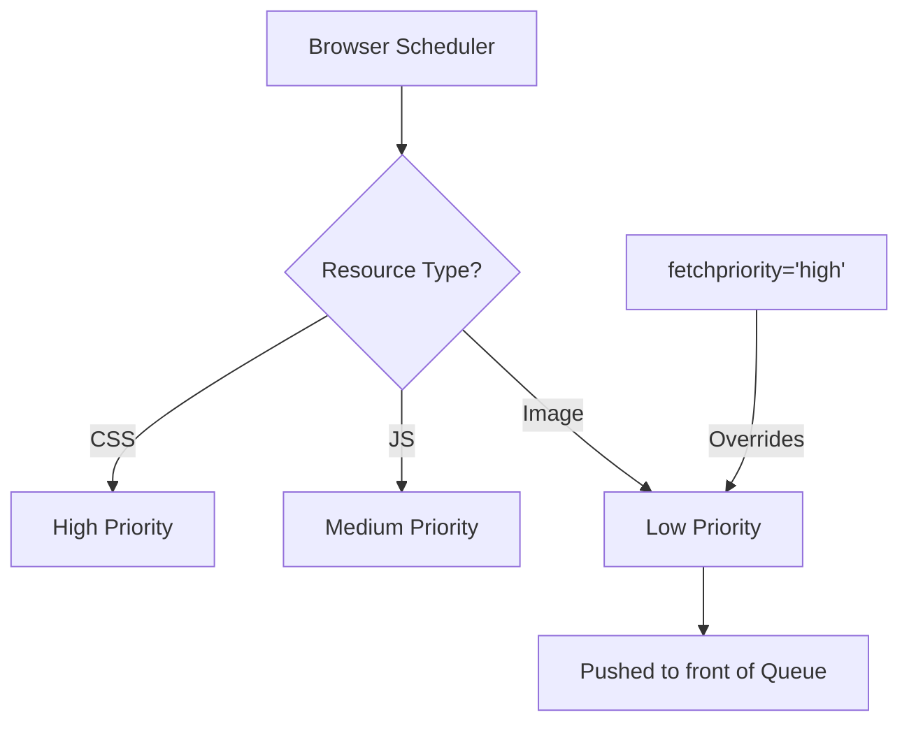

import Tabs from '@theme/Tabs';
import TabItem from '@theme/TabItem';

# Priority Hints

The **Priority Hints** API (via the `fetchpriority` attribute) allows developers to manually adjust the importance of a resource relative to others of the same type. This gives you direct control over the browser’s internal resource scheduler.

:::info[Core Philosophy]
**Granular Scheduling**. Browsers have built-in heuristics (e.g., "Render-blocking CSS is high priority"). Priority Hints allow you to tell the browser when its heuristics are wrong, such as when a specific image is actually the "Largest Contentful Paint" element.
:::

---

## 1. Easy: The `fetchpriority` Attribute

The attribute can be applied to ``, `<link>`, `<script>`, and `<iframe>` elements.
-   `high`: Tell the browser to prioritize this resource.
-   `low`: Tell the browser this isn't urgent (e.g., an off-screen image).
-   `auto`: The default; the browser decides.



---

## 2. Medium: Optimizing LCP

The most powerful use case for Priority Hints is for your **hero image**. 
Normally, images have "Low" priority until the browser finishes basic layout. By setting `fetchpriority="high"`, you tell the browser to start downloading the hero image immediately, significantly improving your **Largest Contentful Paint (LCP)** score.

---

## 3. Hard: Implementation and Fetch API

<Tabs groupId="lang" queryString>
<TabItem value="js" label="JavaScript">

```javascript
// Using priority hints with the Fetch API
async function loadNonCriticalData() {
  // Lowering the priority of a background data sync
  // to ensure user interactions stay smooth.
  const response = await fetch('/api/analytics', {
    priority: 'low' 
  });
  return response.json();
}
```

</TabItem>
<TabItem value="ts" label="TypeScript">

```typescript
// Dynamically boosting a script's priority
const loadUrgentScript = (src: string): void => {
  const script = document.createElement('script');
  script.src = src;
  // Telling the browser this script is critical
  // for the user's initial interaction.
  script.fetchPriority = 'high';
  document.head.appendChild(script);
};
```

</TabItem>
</Tabs>

---

## 4. Advanced: The Scheduler and Resource Pooling

Browsers like Chrome limit the number of **High Priority** requests they process at once (usually around 6). 
1.  **Starvation**: If you mark *every* image on your page as `fetchpriority="high"`, you are effectively marking none of them as high. They will battle for the limited "slots" in the scheduler, potentially delaying your main CSS or JS bundles.
2.  **Interaction with Preload**: `preload` tells the browser to fetch a file. `fetchpriority` tells the browser *where in the line* that fetch should stand. Using them together is the "Gold Standard" for performance optimization.

---

## 5. Interview Prep: 4 Key Questions

### Q1: What is the difference between `loading="lazy"` and `fetchpriority="low"`?
**A:** `loading="lazy"` is about **deferring** the request until the element is near the viewport. `fetchpriority="low"` is about the **importance** of the request once it is triggered. For an image that is already on-screen but not critical (like a secondary icon), you would use `fetchpriority="low"`. For an image far down the page, you would use `loading="lazy"`.

### Q2: How do Priority Hints help with Render-Blocking JS?
**A:** If you have an async script that provides critical functionality (like an analytics-driven paywall or a theme-switcher), the browser might give it "Low" priority because it's marked `async`. By adding `fetchpriority="high"`, you ensure the browser fetches it as early as possible while still not blocking the HTML parser.

### Q3: Why is `fetchpriority` specifically useful for images inside `<iframe>`?
**A:** Browsers often deprioritize all resources inside an iframe to focus on the main document. If your app relies on a heavy component hosted in an iframe, `fetchpriority="high"` on the `<iframe>` tag itself helps signal to the browser that the content inside is valuable to the user.

### Q4: Can Priority Hints guarantee a specific download order?
**A:** No. Priority hints are **hints**, not commands. The browser's scheduler considers many factors: the server’s support for HTTP/2 prioritization, the available bandwidth, and the current state of the main thread. While hints are very influential, the browser preserves the right to ignore them to prevent the page from crashing or freezing.
