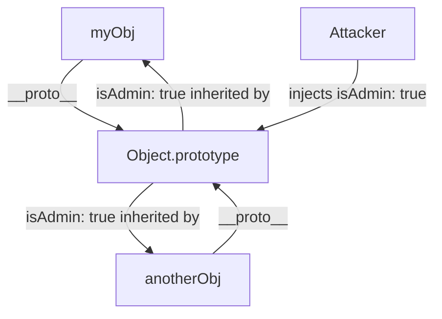

import Tabs from '@theme/Tabs';
import TabItem from '@theme/TabItem';

# Prototype Pollution

**Prototype Pollution** is a severe JavaScript vulnerability where an attacker manipulates the fundamental properties of base objects (like `Object.prototype`). By injecting malicious properties into the prototype, the attacker alters the behavior of *every single object* in the application.

:::info[Core Philosophy]
**The Danger of Inheritance**. JavaScript is a prototype-based language. When you ask an object for a property it doesn't have, it looks up the prototype chain to find it. If an attacker poisons the top of that chain, every object inherits the poison.
:::

---

## 1. Easy: The Prototype Chain

Every JavaScript object has a hidden link to another object called its prototype. Most plain objects ultimately inherit from `Object.prototype`.

The magic property `__proto__` is an accessor that exposes an object's prototype.

```javascript
const myObj = {};
console.log(myObj.isAdmin); // undefined

// Polluting the global prototype
myObj.__proto__.isAdmin = true;

const anotherObj = {};
console.log(anotherObj.isAdmin); // true! (Inherited from the polluted prototype)
```



---

## 2. Medium: How Pollution Occurs

Attackers don't usually write `myObj.__proto__.isAdmin = true` directly. They exploit vulnerable functions in your code that blindly assign properties from user input to objects.

The most common culprits are **Deep Merge**, **Object Clone**, and **Query String Parsing** functions.

If an attacker sends a JSON payload like this:
```json
{
  "__proto__": {
    "isAdmin": true
  }
}
```
A poorly written deep merge function will recursively traverse the `__proto__` key and apply `isAdmin: true` directly to `Object.prototype`.

---

## 3. Hard: Implementation and Mitigation

<Tabs groupId="lang" queryString>
<TabItem value="js" label="JavaScript">

```javascript
// Vulnerable Deep Merge Function
function merge(target, source) {
  for (let key in source) {
    if (typeof source[key] === 'object' && typeof target[key] === 'object') {
      merge(target[key], source[key]); // Recurses into __proto__
    } else {
      target[key] = source[key]; // Pollutes the prototype!
    }
  }
  return target;
}
```

</TabItem>
<TabItem value="ts" label="TypeScript">

```typescript
// Mitigation: Blocking dangerous keys
function secureMerge(target: any, source: any) {
  for (let key in source) {
    // Block traversal into prototype modifiers
    if (key === '__proto__' || key === 'constructor' || key === 'prototype') {
      continue; 
    }
    
    if (typeof source[key] === 'object' && typeof target[key] === 'object') {
      secureMerge(target[key], source[key]);
    } else {
      target[key] = source[key];
    }
  }
  return target;
}
```

</TabItem>
</Tabs>

---

## 4. Advanced: The Impact (XSS and RCE)

Why is setting `isAdmin = true` on `Object` so dangerous? Because it affects **everything**.

1.  **Frontend XSS**: If a React component expects a `dangerouslySetInnerHTML` prop but it's undefined, it will look up the prototype chain. If the prototype is polluted with ``, the component renders the XSS payload.
2.  **Backend RCE**: In Node.js, `child_process.exec()` accepts an `env` options object. If `env` is undefined, it looks at the prototype. An attacker can pollute the prototype to inject malicious environment variables (like `NODE_OPTIONS`), tricking the server into executing arbitrary code.

---

## 5. Interview Prep: 4 Key Questions

### Q1: What is the difference between `Object.create(null)` and `{}`?
**A:** `{}` creates a standard object that inherits from `Object.prototype`. `Object.create(null)` creates a "dictionary" object that has **no prototype** (`__proto__` is undefined). Using `Object.create(null)` is a secure way to store maps or caches, as they are completely immune to prototype pollution.

### Q2: How do you completely prevent Prototype Pollution across a Node.js application?
**A:** You can use `Object.freeze(Object.prototype)`. This locks down the global prototype so no new properties can be added to it. While effective, this can break older third-party libraries that rely on monkey-patching the global prototype. 

### Q3: Why are JSON parsers (`JSON.parse`) generally immune to prototype pollution?
**A:** `JSON.parse` treats `__proto__` as a standard string key during parsing, not as the magic prototype accessor. The vulnerability only occurs *after* parsing, when you take that parsed object and pass it into a vulnerable JavaScript function (like a deep merge) that iterates over the keys and applies them to a target object.

### Q4: Besides `__proto__`, what other keys must be blocked to prevent pollution?
**A:** `constructor` and `prototype`. An attacker can bypass a `__proto__` filter by using `target.constructor.prototype.isAdmin = true`. Any secure object manipulation library must block all three of these magic keys.
