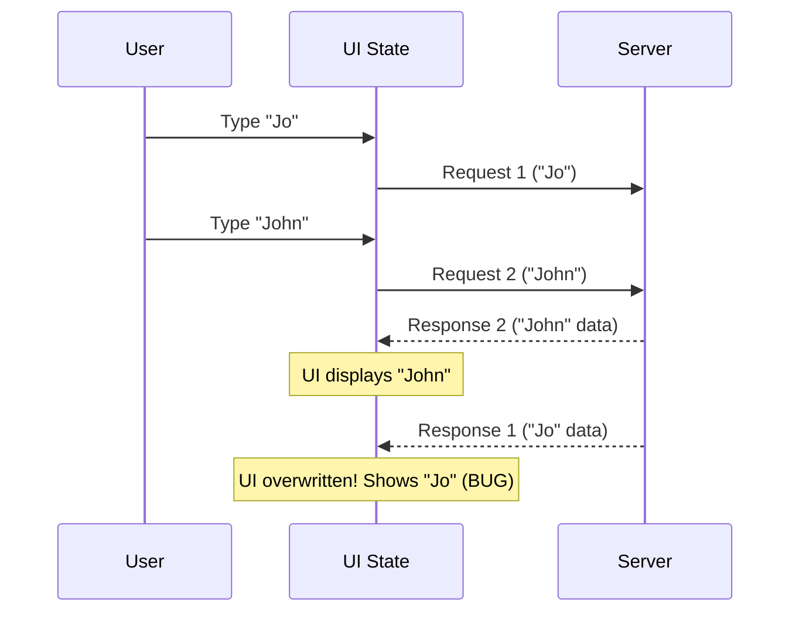

import Tabs from '@theme/Tabs';
import TabItem from '@theme/TabItem';

# Race Conditions in UI State

A **Race Condition** in a UI occurs when the final state of the application depends on the unpredictable timing of asynchronous events (like network requests or timers). When these events resolve out of order, the UI falls out of sync with the user's intent.

:::info[Core Philosophy]
**The Network is Unpredictable**. You cannot guarantee that Request B will finish after Request A, even if Request B was started later. Your UI logic must be defensive against out-of-order execution.
:::

---

## 1. Easy: The Classic Problem

Imagine a search bar that fetches user profiles as you type.

1.  User types "Jo". The app fetches `/users?q=Jo` (Request 1).
2.  User types "John". The app fetches `/users?q=John` (Request 2).
3.  **The Race**: Request 2 is fast and resolves in 50ms. The UI shows "John".
4.  Request 1 was slow and resolves in 500ms. The UI overwrites "John" with the older "Jo" data.
5.  **The Result**: The user searched for "John", but the screen shows results for "Jo".



---

## 2. Medium: Mitigation via Boolean Flags

The simplest way to fix this in frameworks like React is using a boolean flag inside the `useEffect` cleanup function. When the component re-renders (because the search query changed), the cleanup function marks the *previous* request as "stale".

When the stale request finally resolves, it checks the flag and simply does nothing.

---

## 3. Hard: Implementation and AbortController

While boolean flags prevent UI bugs, they still waste user bandwidth because the browser continues downloading the obsolete data. The modern, robust solution is the **AbortController**.

<Tabs groupId="lang" queryString>
<TabItem value="js" label="JavaScript">

```javascript
// React useEffect with AbortController
useEffect(() => {
  const controller = new AbortController();

  async function fetchUser() {
    try {
      const response = await fetch(`/api/users?q=${query}`, {
        signal: controller.signal // Link the fetch to the controller
      });
      const data = await response.json();
      setResults(data);
    } catch (err) {
      if (err.name === 'AbortError') {
        console.log('Obsolete request aborted.');
      }
    }
  }

  fetchUser();

  // Cleanup: Abort the previous fetch if the query changes
  return () => controller.abort();
}, [query]);
```

</TabItem>
<TabItem value="ts" label="TypeScript">

```typescript
// Throttling vs Debouncing
// Another mitigation for search race conditions is limiting request volume.
const debounce = (func: Function, delay: number) => {
  let timeoutId: ReturnType<typeof setTimeout>;
  
  return (...args: any[]) => {
    clearTimeout(timeoutId);
    timeoutId = setTimeout(() => {
      func.apply(null, args);
    }, delay);
  };
};

// Use this to wrap the fetch trigger, so "Jo" is never fetched
// if the user quickly types "John".
```

</TabItem>
</Tabs>

---

## 4. Advanced: Suspense and Data Fetching Libraries

Managing race conditions manually using `AbortController` or cleanup flags across an entire enterprise application is error-prone. Modern architectures solve this at the library level:

1.  **React Query / SWR**: These libraries automatically deduplicate requests, handle race conditions internally, and throw away stale data based on cache keys.
2.  **React Suspense**: By moving data fetching outside of the component's render lifecycle (e.g., "Render-as-you-fetch" pattern), the framework itself coordinates the asynchronous boundaries, eliminating the traditional `useEffect` race conditions entirely.

---

## 5. Interview Prep: 4 Key Questions

### Q1: What is the difference between a Race Condition and a Memory Leak in a React component?
**A:** A race condition causes incorrect data to be displayed because asynchronous operations resolve out of order. A memory leak occurs when an asynchronous operation resolves *after* the component has unmounted, and the callback tries to call a state setter (like `setState`) on the destroyed component, keeping it in memory. Both are solved by cleaning up side effects.

### Q2: Why is the `AbortController` preferred over a simple `isMounted` boolean flag?
**A:** A boolean flag only prevents the UI from updating; the browser still downloads the entire payload, wasting bandwidth and battery. `AbortController` actively terminates the network socket connection, saving resources.

### Q3: How does "Debouncing" help with search input race conditions?
**A:** Debouncing delays the execution of the fetch function until the user stops typing for a specific duration (e.g., 300ms). This prevents the application from firing a barrage of intermediate requests (Request 1 for "J", Request 2 for "Jo"), which significantly reduces the mathematical probability of a race condition and drastically lowers server load.

### Q4: Can race conditions happen in synchronous code?
**A:** Yes, though less common in UI. If you have concurrent systems or Web Workers sharing a `SharedArrayBuffer` without proper locking (Atomics), thread A might read a value, thread B overwrites it, and thread A writes a calculation based on the old value. This is a classic synchronous data race.
