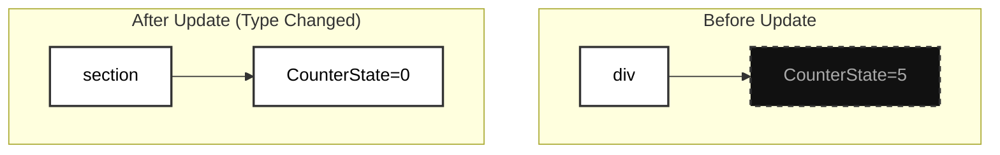

import Tabs from '@theme/Tabs';
import TabItem from '@theme/TabItem';

# Reconciliation Algorithm (Deep Dive)

Reconciliation is the process by which React updates the DOM. When a component's state or props change, React calculates the difference (the "diff") between the current Virtual DOM and the new Virtual DOM, and then executes the minimal set of mutations required to update the physical DOM tree.

This algorithm is the beating heart of React's `O(N)` performance guarantee.

:::info[Core Philosophy]
**Heuristic Assumptions.** A perfect algorithm to calculate the absolute minimum number of operations to transform one arbitrary tree into another has a time complexity of `O(N^3)`. React avoids this mathematically impossible bottleneck by making two heuristic assumptions:
1. Two elements of different **types** will produce different trees.
2. The developer can hint at which child elements may be stable across renders using a **key** prop.
:::

---

## 1. Type Differentiation

When React diffs two trees, it first compares the root elements. If the root elements have different types (e.g., passing from an `<a>` to a ``, or from `<Article>` to `<Comment>`), React instantly tears down the old tree entirely. 

When a tear-down occurs, the physical DOM nodes are destroyed. The component instances unmount, destroying their internal state.



Even if the children inside the `section` were visually identical to the ones in the `div`, React will destroy everything and rebuild it from scratch because the parent wrapper type changed.

---

## 2. DOM Node Updates (Same Type)

When comparing two React DOM elements of the same type, React looks at the attributes of both, keeps the exact same underlying physical DOM node, and only updates the changed attributes.

<Tabs groupId="lang" queryString>
<TabItem value="js" label="JavaScript">

```javascript
// Current Virtual DOM
const oldH1 = <h1 className="title" style={{ color: 'red' }}>Hello</h1>;

// New Virtual DOM
const newH1 = <h1 className="title" style={{ color: 'blue' }}>Hello</h1>;

// The Algorithm executing the update:
function reconcileDOMNode(oldNode, newNode) {
  if (oldNode.type === newNode.type) {
    const domElement = oldNode.stateNode;
    
    // React iterates over props to find diffs
    if (oldNode.props.style.color !== newNode.props.style.color) {
      domElement.style.color = newNode.props.style.color; // MUTATION
    }
    
    newNode.stateNode = domElement; // Re-use the existing physical element!
  }
}
```

</TabItem>
<TabItem value="ts" label="TypeScript">

```typescript
import { ReactElement } from 'react';

// Current Virtual DOM
const oldH1: ReactElement = <h1 className="title" style={{ color: 'red' }}>Hello</h1>;

// New Virtual DOM
const newH1: ReactElement = <h1 className="title" style={{ color: 'blue' }}>Hello</h1>;

// The Algorithm executing the update:
function reconcileDOMNode(oldNode: Fiber, newNode: Fiber) {
  if (oldNode.type === newNode.type) {
    const domElement = oldNode.stateNode as HTMLElement;
    
    if (oldNode.props.style.color !== newNode.props.style.color) {
      domElement.style.color = newNode.props.style.color; // MUTATION
    }
    
    newNode.stateNode = domElement; // Re-use the existing physical element!
  }
}
```

</TabItem>
</Tabs>

React will then iterate deeper, repeating this identical process on all children of the `h1` node.

---

## 3. List Reconciliation & Keys

By default, when recurring on the children of a DOM node, React just iterates over both lists of children at the same time and generates a mutation whenever there’s a difference.

If you add an element at the *end* of a list, the algorithm is fast. If you insert an element at the *beginning* of a list, the algorithm assumes every single element changed, completely failing to re-use nodes.

:::danger[The Index Anti-Pattern]
Never use `index` as a key if the list can be re-ordered. If a list is sorted, `Item 1` becomes `Item 2`. Because the key (`1`) stayed in the top visual position but the data changed, React will forcefully morph the old DOM element into the new data, leading to **severe bugs** where component state (like internal text inputs) is mapped to the completely wrong item.
:::

<Tabs groupId="lang" queryString>
<TabItem value="js" label="JavaScript">

```javascript
function PostFeed({ posts }) {
  // If a post is inserted at the top of the DB, and we used index as the key,
  // React would think post 0 changed from 'A' to 'B', and force a re-render.
  
  // Using the unique ID tells React: "Post 'A' didn't change, it just moved down 1 slot."
  return (
    <ul>
      {posts.map(post => (
        <li key={post.id}>
          <PostCard content={post.content} />
        </li>
      ))}
    </ul>
  );
}
```

</TabItem>
<TabItem value="ts" label="TypeScript">

```typescript
type Post = {
  id: string;
  content: string;
}

function PostFeed({ posts }: { posts: Post[] }) {
  // Using a rigid semantic unique identifier allows React to shift
  // pointers mathematically instead of destroying physical DOM.
  return (
    <ul>
      {posts.map((post) => (
        <li key={post.id}>
          <PostCard content={post.content} />
        </li>
      ))}
    </ul>
  );
}
```

</TabItem>
</Tabs>


---

## 4. Interview Prep: 4 Key Questions

### Q1: What is the algorithmic time complexity of the React Reconciliation?
**A:** Because of the heuristic rules (different types = tear down, keys = tracking siblings), React reduces an impossible `O(N^3)` tree transformation algorithm into a heavily optimized linear `O(N)` traversal algorithm.

### Q2: What happens during reconciliation if a parent component renders the exact same children types, but the parent's state changed?
**A:** React will still recursively re-render the children to check for prop differences. If you want to short-circuit this behavior (so React completely skips traversing that child branch), you must wrap the child in `React.memo()`.

### Q3: Why is using `Math.random()` as a React `key` disastrous for performance?
**A:** On every single render, `Math.random()` generates a new string. React's reconciler sees that a completely unknown "new" key has appeared and the old key has disappeared. It assumes the element was deleted and recreated. It will violently **destroy the physical DOM node** and recreate it from scratch every single time state changes.

### Q4: How does Reconciliation map to the Commit Phase?
**A:** Reconciliation *calculates* the differences (Render Phase). It produces a linked-list of "Effect Tags" (Create, Update, Delete) attached to Fiber nodes. The renderer then aggressively iterates through that list and fires the DOM APIs sequentially (Commit Phase).
