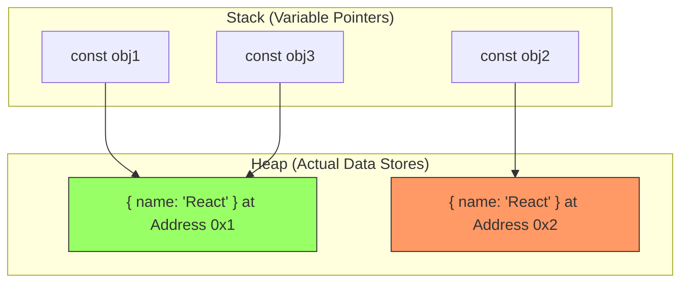

import Tabs from '@theme/Tabs';
import TabItem from '@theme/TabItem';

# Referential Equality

In JavaScript, understanding how the engine compares two variables is the single most important concept for mastering React performance. Most "unnecessary re-renders" are caused by a misunderstanding of **Referential Equality**.

:::info[Core Philosophy]
**Value vs. Address**. JavaScript compares simplified data (Primitives) by their actual contents, but compares complex data (Objects/Arrays) by their location in memory. 
:::

---

## 1. Easy: Primitives vs. Reference Types

### Value Equality (Primitives)
Strings, Numbers, Booleans, Null, and Undefined are compared by **Value**.

```javascript
const a = "hello";
const b = "hello";
console.log(a === b); // true (The content is identical)
```

### Reference Equality (Complex Types)
Objects, Arrays, and Functions are compared by **Memory Address**.

```javascript
const list1 = [1, 2];
const list2 = [1, 2];
console.log(list1 === list2); // false (They live in different boxes in RAM)
```

---

## 2. Intermediate: Memory Addresses & Heap

When you create an object, JavaScript allocates a unique space in the **Heap** and gives you a "pointer" (address) to it.



- `obj1 === obj2` is **false** because they point to different Heap addresses.
- `obj1 === obj3` is **true** because they point to the exact same Heap address.

---

## 3. Hard: Referential Equality in React

React uses `Object.is()` to determine if a state update should trigger a render.

<Tabs groupId="lang" queryString>
<TabItem value="js" label="JavaScript">

```javascript
const [user, setUser] = useState({ name: "Alice" });

// ❌ This WILL trigger a re-render
// Even though the data is the same, { ... } creates a NEW reference.
setUser({ name: "Alice" }); 

// ✅ This will NOT trigger a re-render
// React sees the reference is exactly the same, so it bails out.
setUser(user); 
```

</TabItem>
<TabItem value="ts" label="TypeScript">

```typescript
interface State { count: number; }

const [state, setState] = useState<State>({ count: 0 });

// Problem: Inline objects in render breaking children
return (
  <Child options={{ theme: 'dark' }} /> 
  // Every time Parent renders, 'options' is a NEW reference.
  // Child will re-render even if it's wrapped in React.memo!
);
```

</TabItem>
</Tabs>

---

## 4. Advanced: Object.is() vs. Strict Equality (===)

React specifically uses `Object.is`. While it's 99% the same as `===`, there are two critical differences you must know for edge-case debugging:

1. **NaN**: `NaN === NaN` is `false`, but `Object.is(NaN, NaN)` is `true`.
2. **Zero**: `+0 === -0` is `true`, but `Object.is(+0, -0)` is `false`.

---

## 5. Interview Prep: 4 Key Questions

### Q1: Why does `{} === {}` return false?
**A:** In JavaScript, the `{}` syntax is a constructor literal. Every time the engine encounters `{}`, it allocates a new, unique memory address in the Heap. Since `===` compares the memory addresses of objects, and these two addresses are distinct, it returns `false`.

### Q2: How do inline arrow functions in JSX break `React.memo`?
**A:** When you write `<Button onClick={() => handleClick()} />`, a brand new function is created in memory on every single render of the parent component. `React.memo` performs a shallow reference check on props. Since the reference of the `onClick` function changed, `React.memo` assumes the props are different and triggers a re-render of the child.

### Q3: Explain "Stability of References" in Custom Hooks.
**A:** If a custom hook returns an object `return { data, loading }`, and that object is created inside the hook body without `useMemo`, a new object reference is returned every time. Any component using that hook will have its `useEffect` or `useMemo` dependencies triggered constantly if they depend on that returned object.

### Q4: What is the most performant way to represent "Empty Data"?
**A:** Use a **Stable Constant**. Instead of initializing state with `useState([])`, define `const EMPTY_ARRAY = []` outside your component. Using `useState(EMPTY_ARRAY)` ensures that the initial reference is shared across all instances of that component, saving memory and preventing early-effect triggers.
