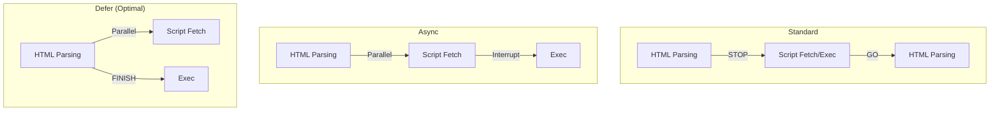

import Tabs from '@theme/Tabs';
import TabItem from '@theme/TabItem';

# Render Blocking Resources

A **Render Blocking Resource** is a file—usually a CSS stylesheet or a JavaScript script—that prevents the browser from displaying any content on the screen until that file has been fully downloaded, parsed, and executed.

:::info[Core Philosophy]
**Eliminate the Bottleneck**. To achieve a sub-second "First Contentful Paint," you must minimize the number of external resources that the browser requires before it can start drawing the page.
:::

---

## 1. Easy: What is Blocking?

By default, the browser is "conservative." It doesn't want to show you an ugly or broken page.

- **CSS is Render Blocking**: The browser won't show anything until it knows the colors, fonts, and layout roles defined in your CSS.
- **JS is Parser Blocking**: The browser stops reading the HTML file the moment it hits a `<script>` tag. It waits for the JS to run before it continues reading the rest of the HTML.

If you have a 2MB CSS file, your page will be a "White Screen" for several seconds while it downloads.

---

## 2. Medium: Script Execution Strategies

To stop JavaScript from blocking the parser, you can use the `async` or `defer` attributes.

1.  **Standard (`<script src="...">`)**: HTML parsing stops -> Script fetches -> Script executes -> HTML parsing continues.
2.  **`async`**: Script fetches in the background while HTML parsing continues. *Executes immediately* after it's finished, potentially interrupting the parser.
3.  **`defer`**: Script fetches in the background while HTML parsing continues. *Executes only after* the HTML is fully parsed.



---

## 3. Hard: Critical CSS Inlining

Since all CSS is blocking, how do we make pages load "instantly"? We use the **Critical CSS** pattern.

Instead of a single external `<link>`, we split the CSS:
- **Above-the-fold CSS**: The minimal styles needed for the top of the page. This is **Inlined** directly into a `<style>` tag in the `<head>`.
- **Non-critical CSS**: Background colors for the footer, modal styles, etc. This is loaded **Asynchronously**.

<Tabs groupId="lang" queryString>
<TabItem value="js" label="JavaScript">

```html
<!-- THE OPTIMIZED HEAD -->
<head>
  <!-- 1. Inline Critical Styles -->
  <style>
    body { font-family: sans-serif; }
    .hero { height: 100vh; background: #000; }
  </style>

  <!-- 2. Async Load standard CSS -->
  <link rel="stylesheet" href="full-styles.css" media="print" onload="this.media='all'">
</head>
```

</TabItem>
<TabItem value="ts" label="TypeScript">

```typescript
// Dynamically loading a script as non-blocking
const loadScriptAsync = (url: string): void => {
  const script = document.createElement('script');
  script.src = url;
  script.async = true;
  document.head.appendChild(script);
};

// This ensures the script doesn't block the initial parser
loadScriptAsync('/analytics.js');
```

</TabItem>
</Tabs>

---

## 4. Advanced: Speculative Parsing & Preload Hints

Modern browsers have a **Preload Scanner** (Speculative Parser). While the main thread is blocked by a script, a background process "scans" the rest of the HTML to find images and CSS to start downloading them early.

You can help this process using **Resource Hints**:
- `<link rel="preload">`: High priority. "Download this now, I'll need it in 2 seconds."
- `<link rel="preconnect">`: Pre-warms the TCP/TLS connection to a third-party domain (like Google Fonts).

---

## 5. Interview Prep: 4 Key Questions

### Q1: Compare `async` vs `defer` for script loading.
**A:** `async` is best for independent scripts (like tracking tags) that don't depend on other code. They execute as soon as they download, potentially out of order. `defer` is best for application logic. It downloads in parallel but strictly waits for the DOM to be fully parsed and executes scripts in the order they appear.

### Q2: Why is "Inlining all CSS" a bad performance practice, even though it's not render-blocking?
**A:** Because you lose the benefit of **Browser Caching**. If 100KB of CSS is inlined on every page, the user has to download that 100KB on every single click. If it's an external file, the browser downloads it once and reuses it from the local disk for all subsequent pages.

### Q3: What happens if a `<script>` is placed at the very bottom of the `<body>`?
**A:** It functionally behaves like a `defer` script (it doesn't block the parsing of the elements above it). However, `defer` in the `<head>` is still superior because it allows the browser to start *downloading* the script much earlier while it works on the HTML.

### Q4: How does the "MediaQuery" trick allow for non-blocking CSS?
**A:** By setting `<link rel="stylesheet" media="print" ...>`, you tell the browser: "This CSS is only for printing." The browser still downloads it at a low priority but **doesn't block the screen render**. When the download finishes, the `onload` event switches the `media` to `all`, making the styles active without the initial blocking delay.
