import Tabs from '@theme/Tabs';
import TabItem from '@theme/TabItem';

# Render Waterfalls

A **Render Waterfall** is a performance anti-pattern where a sequence of network requests are executed sequentially rather than in parallel. This usually happens when a child component must wait for a parent component to finish fetching its data before the child can even *begin* fetching its own data.

:::info[Core Philosophy]
**Parallelize by Default**. The network is the slowest part of any web application. If Request B does not depend on the data from Request A, they must be fetched at the exact same time.
:::

---

## 1. Easy: The Fetch-on-Render Anti-Pattern

The most common cause of waterfalls in React is calling `fetch` inside a `useEffect` hook. 

Because `useEffect` only runs *after* the component has rendered to the DOM, a deeply nested child component won't even mount (and thus won't start its fetch) until the parent has completely finished loading.

```mermaid
gantt
    title The Waterfall (Sequential)
    dateFormat  s
    axisFormat %S
    section Parent Component
    Mounts & Starts Fetch :a1, 0, 2s
    Finishes & Renders Child :after a1, 0s
    section Child Component
    Mounts & Starts Fetch :a2, after a1, 2s
    Finishes Rendering :after a2, 0s
```


*Total Time: 4 seconds.*

---

## 2. Medium: Fetch-Then-Render (Promise.all)

The immediate fix for a waterfall is to hoist the data fetching logic up to the highest common parent and execute the requests simultaneously using `Promise.all`.

This is called **Fetch-Then-Render**. We gather all the data first, and then we render the component tree.

```mermaid
gantt
    title Fetch-Then-Render (Parallel)
    dateFormat  s
    axisFormat %S
    section Parent Component
    Promise.all(Fetch A & Fetch B) :a1, 0, 2s
    Renders Parent & Child :after a1, 0s
```


*Total Time: 2 seconds.*

---

## 3. Hard: Implementation Strategies

<Tabs groupId="lang" queryString>
<TabItem value="js" label="JavaScript">

```javascript
// Anti-Pattern: The Waterfall
function Profile() {
  const [user, setUser] = useState(null);
  
  // 1. Fetch user data (takes 1s)
  useEffect(() => fetchUser().then(setUser), []);

  if (!user) return <Spinner />;
  
  // 2. Only after user is fetched does Posts mount and start fetching
  return <Posts userId={user.id} />; 
}
```

</TabItem>
<TabItem value="ts" label="TypeScript">

```typescript
// Better: Parallel fetching (Hoisting)
function Profile({ userId }: { userId: string }) {
  const [data, setData] = useState<{ user: any, posts: any } | null>(null);

  useEffect(() => {
    // 1. Fetch both simultaneously. Total time is max(time(User), time(Posts))
    Promise.all([
      fetchUser(userId),
      fetchPosts(userId)
    ]).then(([user, posts]) => setData({ user, posts }));
  }, [userId]);

  if (!data) return <Spinner />;
  
  return (
    <>
      <UserDetails user={data.user} />
      <PostList posts={data.posts} />
    </>
  );
}
```

</TabItem>
</Tabs>

---

## 4. Advanced: Render-As-You-Fetch (Suspense)

The problem with `Promise.all` is that you are bottlenecked by the *slowest* request. If `fetchUser` takes 100ms but `fetchPosts` takes 2000ms, the user sees a blank screen for 2000ms.

The modern paradigm is **Render-As-You-Fetch**. You kick off the network requests *before* the component even begins to render (e.g., at the router level or using a library like React Query or Relay). The component tree starts rendering immediately. When it hits a component that needs data, it "Suspends" until that specific piece of data is ready, allowing the rest of the UI to paint instantly.

---

## 5. Interview Prep: 4 Key Questions

### Q1: Why is `useEffect` considered bad for data fetching in large apps?
**A:** `useEffect` runs after the component is painted. This guarantees that the user will see a loading spinner (or a blank state) on the first render. Furthermore, if nested components fetch data in their own `useEffect` hooks, it creates a severe network waterfall where each level of the tree must wait for the level above it to finish loading before it can start its own fetch.

### Q2: What is "Hoisting" in the context of data fetching?
**A:** Hoisting is the process of moving the data fetching logic from child components up into a parent component. By fetching all necessary data at the top level (often using `Promise.all`), you parallelize the network requests and eliminate the waterfall. The data is then passed down to the children as props.

### Q3: What is the drawback of the "Fetch-Then-Render" pattern?
**A:** The main drawback is that you cannot render *anything* until *everything* has finished downloading. If you are fetching user details (fast) and a complex dashboard chart (slow) in the same `Promise.all`, the user cannot see their profile details until the slow chart data has also finished downloading.

### Q4: How do modern frameworks (like Next.js or Remix) solve waterfalls?
**A:** They solve it by moving data fetching out of the component lifecycle entirely. They use server-side routing mechanisms (`loader` functions or React Server Components) to fetch all required data on the server in parallel *before* generating the HTML. This ensures the client receives a fully populated HTML document instantly, without triggering any client-side cascading network requests.
